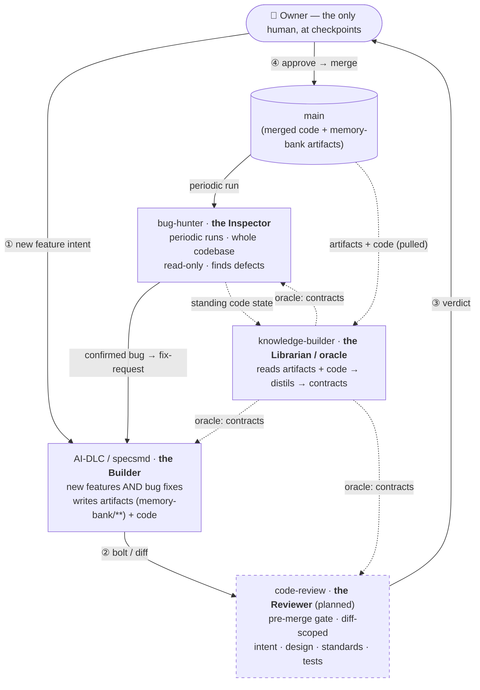
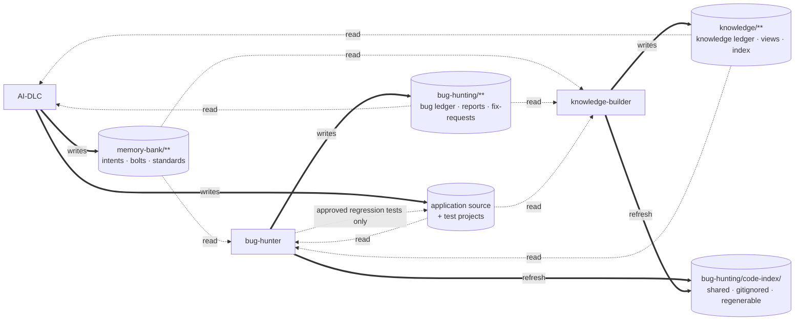
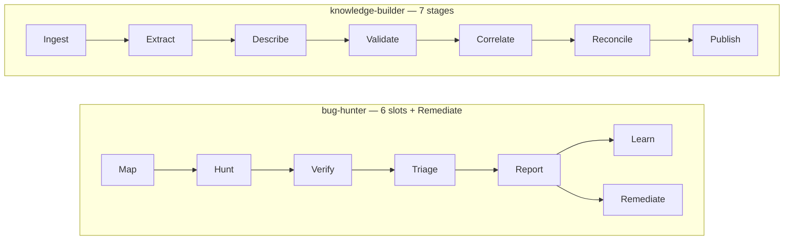
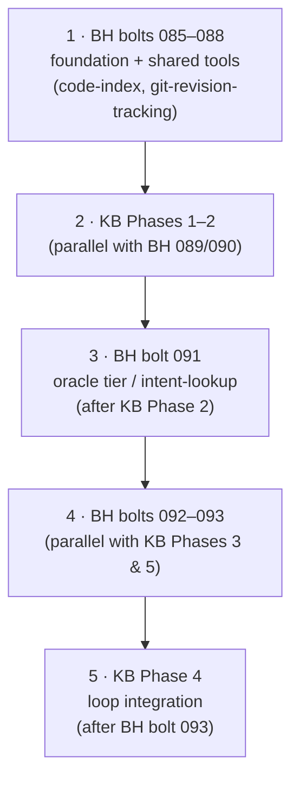
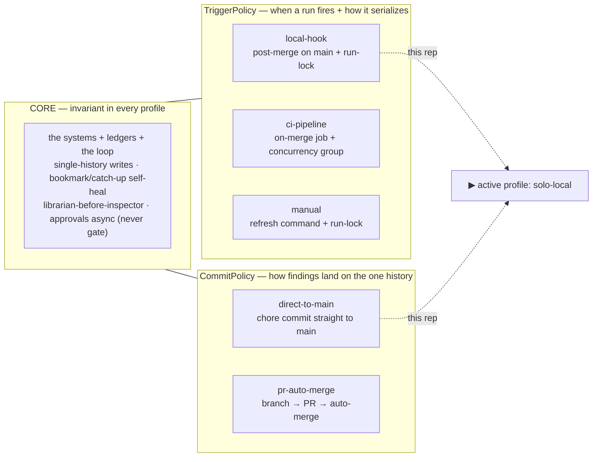
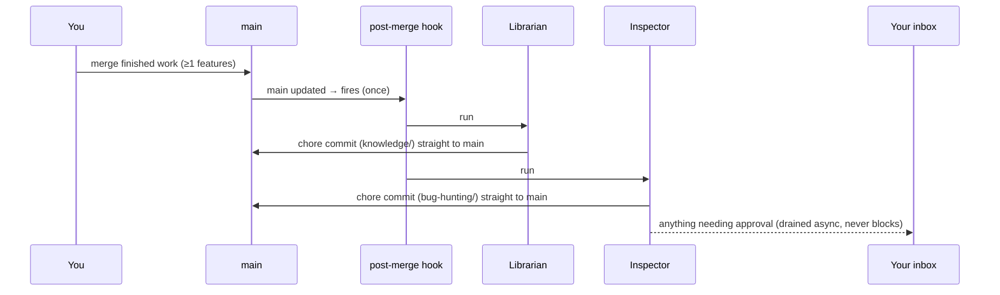
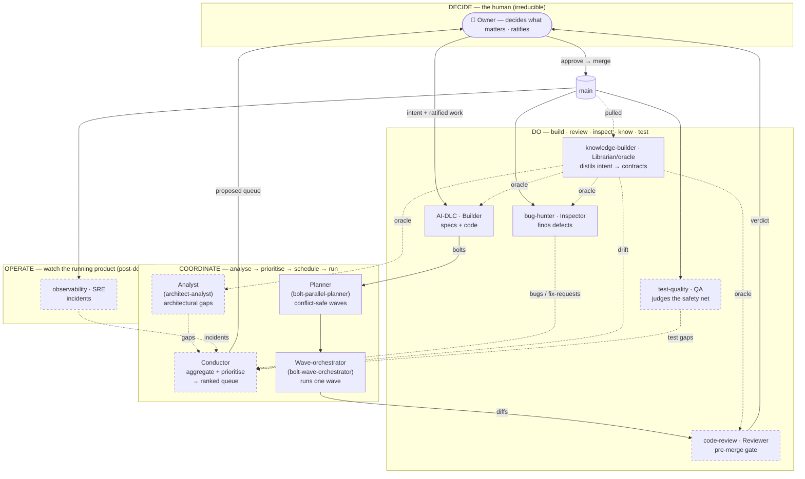

# Agent Systems — Architecture at a Glance

A visual summary of the closed-loop AI software organization. Specs of record: bug-hunter **v3.6**,
knowledge-builder **v3.5**, integration contract **v1.5** (see [README](README.md)). Diagrams are the
map; the guides are the territory.

---

## 1. The organization — four roles, one human



**Reading it.** The Builder serves *both* the proactive path (① owner intent → new feature) and the
reactive path (bug-hunter → fix-request → fix). It writes its **artifacts** (intents, requirements,
ADRs, stories, bolts) into its own store, `memory-bank/**`, plus the code — it does **not** write to
the oracle. The knowledge-builder is the **sole writer** of `knowledge/**`; it **pulls** those ratified
artifacts and the standing code state and *distils* them into contracts — for feature work and fix work
alike. (An oracle the Builder could write to wouldn't be an independent oracle — that firewall is the
point.) The oracle then flows back as read-only context to all three.

The **Reviewer** is dashed: a captured-but-deferred idea (see
[future-code-review-system.md](future/code-review-system.md)) — built only after the other three are
real. Everything else here is specced and ready to build.

> **The org is bigger than this diagram.** Beyond the Reviewer, three more systems are captured for
> later — a **Conductor** (coordinates *what to build next* across all the systems' signals),
> **Test-Quality** (judges the test suite), and **Observability** (watches the running product). The
> full decide→coordinate→do→operate picture and how they connect is in the
> **[future/](future/README.md)** folder — and drawn as one diagram in **§8** below.

---

## 2. The closed loop — bug → fix → verify → re-distil

The binding cycle, keyed end-to-end by a single `correlation_id` (Integration Contract §4):

```mermaid
sequenceDiagram
  participant BH as bug-hunter
  participant FR as bug-hunting/fix-requests/
  participant AIDLC as AI-DLC
  participant BOLT as memory-bank/bolts/
  participant KB as knowledge-builder

  BH->>FR: confirmed bug → fix-request (correlation_id, fix_status: open)
  Note over AIDLC: owner-driven inception reads fix-requests
  AIDLC->>BOLT: create bug-bolt (carries correlation_id) → fix → status: complete
  BH->>FR: run-open scan notices complete → fix_status: fix-reported
  BH->>BH: fix-verification re-runs the harvested proving test
  alt test passes (fix present at HEAD)
    BH->>FR: fix_status: verified-fixed (+ proof)
    KB->>KB: BOTH signals seen → re-distil the contract
  else test fails (fix present)
    BH->>FR: fix_status: fix-failed (re-checked next run)
  else no proving test
    BH->>FR: fix_status: closed-unverified (terminal; NO oracle entry — owner decision B)
  end
```

**Never closed on AI-DLC's word alone** — re-distillation requires *both* `bolt.md: complete` **and**
`verified-fixed` for the same `correlation_id`.

---

## 3. Storage & sole-writer map (Integration Contract §1)

Each store has exactly one writer; everyone may read. Cross-store writes never happen.



**Single-history (§1):** runs happen only in the designated integration worktree on `main`; other
worktrees are read-only on the stores. A **cross-system mutex** (each orchestrator's Open checks the
sibling's `.run-lock`) admits at most one active run. At close, each orchestrator runs a **store-scoped
diff + a forbidden-ground check** (nothing touched under app source / `memory-bank/` / `docs/` except
the one approved test file). The **code index is a gitignored build artifact** — never committed,
never audited, regenerated on demand.

---

## 4. The two pipelines (permanent slots / stages)



Both are **additive**: early phases put minimal implementations in every slot/stage; later phases fill
or extend at planned seams — never restructure.

---

## 5. Cross-system build interleave (Integration Contract §7)



KB **Phase 5 (Measure) may precede Phase 4 (Loop Integration)** — the eval doesn't exercise the fix
loop, so the oracle's accuracy is proven before anything trusts it in a loop.

---

## 6. Operating model — core + two pluggable policies (Integration Contract §5.5)

The systems are a **portable product**: the core is invariant; only the *operating context* varies,
along two independent policies you mix-and-match (composition, not a fork). A **profile** is one
`(TriggerPolicy, CommitPolicy)` pair, chosen in deployment config — the skills stay profile-agnostic.



**Profiles:** `solo-local` = `local-hook` + `direct-to-main` — **active here** (single operator, push
rights to `main`). `team-ci` = `ci-pipeline` + `pr-auto-merge` — captured for multi-operator /
protected-`main` contexts, **not built until a project needs it**. A profile is *valid* iff its
policies satisfy the invariant (trigger guarantees single-writer serialization; commit lands writes on
the one history).

### Steady-state run (the `solo-local` profile)



A trigger that fires mid-pass is ignored — the bookmark guarantees the running/next pass reaches
current `main` anyway.

---

## 7. External tools / plugins (the worker layer)

The agentic systems are **orchestration + integration + memory**; installed plugins are the reusable
**worker / methodology layer** they compose (the Tool/Skill/Agent nesting from the bug-hunter guide).
Deterministic external scanners are **tools fed through `tool-ingest`** — never judgment agents — and
are subject to the hunting-host posture (pinned, checksum-verified, egress-allowlisted).

| Plugin | Status | Used by |
|--------|--------|---------|
| `skill-creator` | installed | **every** component (build mandate) |
| `superpowers` | installed | systematic-debugging → BH Verify; TDD / writing-plans / executing-plans / verification-before-completion → AI-DLC construction; dispatching-parallel-agents + using-git-worktrees → wave execution |
| `pr-review-toolkit`, `code-review`, `code-simplifier` | installed | the future Reviewer; `code-simplifier` also sharpens BH `fix-proposal` |
| `github` | installed | the commit/PR loop, BH Optional B (issue-sync) + Optional C (ci-gate / PR comments) |
| `frontend-design`, `figma` | installed | Angular UI work — adjacent to the app, not the agentic loop |
| `caveman` | installed | unknown/custom — audit before relying on it |
| **`aikido`** (SAST · secrets · IaC) | *could install* | BH `tool-ingest` → `security-auditor` / `config-auditor` |
| **`42crunch`** (API security, OWASP API Top-10, BOLA/BFLA) | *could install* | BH `security-auditor` on the .NET API (matches the object-level-authz tests) |
| **`endor`** (supply-chain / dependency scan) | *could install* | BH `dependency-audit` (deterministic; reduces the live-advisory-provenance risk) |
| `agent-sdk-dev` | *could install* | only if any system graduates from skills to SDK-hosted agents |

Commercial scanners (`aikido`, `42crunch`, `endor`) are MCP-backed and need accounts/network — defer
until the bug-hunter's Phase 3 specialists are actually being built.

---

## 8. The full vision — the whole org, once the future systems land

The same closed loop as [§1](#1-the-organization--four-roles-one-human), grown to the complete
organisation: the **coordinate** layer that decides *what to do next*, the **operate** layer that
watches the running product, and Test-Quality alongside the doing-systems. **Solid = built or
specced-ready; dashed = planned / partial** (see the [future/](future/README.md) notes).



**Reading it.** It's still the §1 loop — build → review → merge → inspect/distil → feed back — but now
the feedback is *coordinated* instead of living in your head. Every signal (architectural gaps from the
**Analyst**, defects from the **Inspector**, intent drift from the **Librarian**, coverage holes from
**Test-Quality**, production incidents from **Observability**) aggregates at the **Conductor**, which
proposes one ranked queue. The Builder's output is scheduled by the **Planner** into conflict-safe
waves, run by the **Wave-orchestrator**, and gated by the **Reviewer** before it reaches `main`. Once
on `main`, the doing- and operate-systems act on it and produce the next round of signals — the cycle
closes itself.

The human compresses to **exactly two touch-points**: ratifying the Conductor's proposed queue
(*decide what matters*) and approving the Reviewer's verdict (*ratify*). Everything between is
automation. Note the two front doors collapse into one: with the Conductor in place, even the reactive
fix loop (a confirmed bug, a production incident) arrives as a *prioritised signal* rather than jumping
the queue — so nothing competes for the Builder without passing the same ratification.

> **This is the destination, not the next step.** Build order stays as the roadmap dictates (§5, then
> the Reviewer, then the Conductor once it has ≥2 systems to conduct, with Observability post-deploy).
> The diagram exists so the pieces are drawn whole before any of the later ones are built.
