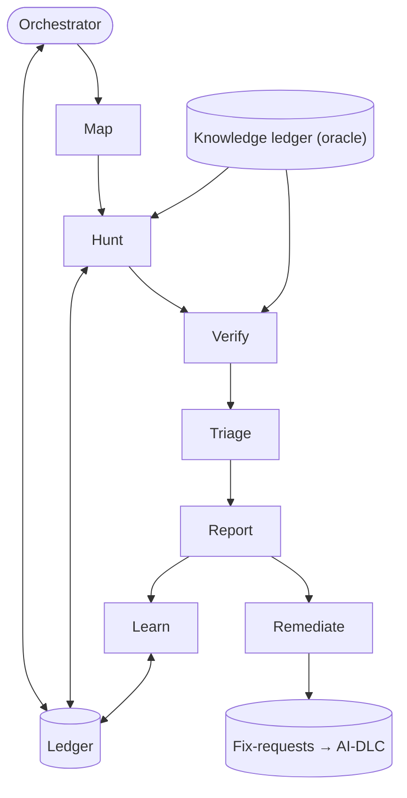

# Bug-Hunting Agent System — Complete Build Guide (v3.1, additive)

*A single reference for building the whole system as a series of additive phases. Each phase grows a
working system rather than rebuilding it: you start with the smallest complete skeleton and plug new
parts into stable seams. Includes the tutorial, the system architecture, shared conventions, the full
build order, and every construction prompt ("brief") for skill-creator.*

> **What v3.1 adds (changelog).** Interface alignment only — no new components, no slot changes. The
> cross-system interface is now normative in **`docs/agent-systems/integration-contract-v1.md`** (storage map, query
> envelope, flow identity, loop mailboxes, staleness, shared tools, build interleave, twin names) and
> wins over any brief here. Touched briefs: 12 (flow IDs are the cross-system identity), 24 (consume
> the contract envelope; record the oracle's `as_of_commit`), 24c (`contested` and unverified contracts
> don't raise confidence), 24d (warn on a stale oracle at run open), 31 (`verified-fixed` is written as
> `fix_status` on the fix-request record), 33 (records carry the `fix_status` lifecycle; bug-bolts carry
> the `correlation_id` in `bolt.md` frontmatter).

> **What v3 adds (changelog).** All additive — no brief is thrown away; changes are top-ups at intended
> seams. New behavior:
> - **`ledger-io`** is now **concurrency-safe** (single-writer merge so parallel hunters never clobber
>   each other) and stores a `correlation_id`.
> - **`bug-documentation`** sources `expected_behavior` from a real contract when one exists, and carries a
>   `correlation_id` for the fix loop.
> - **`report-rendering`** gains a **reporting floor**: High/Medium in the body, Low in an appendix, with
>   an optional top-N and per-run budget — so first contact isn't a false-positive flood.
> - **`triage-intake` (NEW)** is the human dismissal/approval channel the learning loop always assumed.
> - **`bug-verifier`** is **hardened**: it confirms the sandbox matches the analyzed commit and re-runs a
>   proof test to defeat flakiness before trusting it.
> - **`intent-lookup` (NEW)** reads the knowledge ledger's contracts as the oracle; hunters, the Verifier,
>   and scoring are extended to ground findings in those contracts (confidence rises on a contract
>   contradiction; a finding backed only by the model's prior is flagged, not trusted).
> - **`reachability`** uses a framework-aware "unknown" weight so reachable bugs aren't flattened in
>   metaprogramming-heavy stacks.
> - **`fix-verification`** is designated the loop's **verification gate**: it consumes AI-DLC's "fix done"
>   signal and, on a verified pass, emits the verified-fixed signal the knowledge builder waits on.
> - **`fix-proposal`** validates a patch against the surrounding suite, not just the proving test.
> - **`fix-request-emit` (NEW)** writes confirmed bugs to a fix-request store for AI-DLC, keyed by
>   `correlation_id`.
> - **Phase 1 output is labeled "unverified candidates"** so a stop-at-Phase-1 setup isn't mistaken for a
>   trustworthy bug report.

---

# Part I — Tutorial: how to use this document

## What you are building

A system of cooperating agents and skills that inspects a software application, finds real bugs,
documents them for a non-technical stakeholder / a developer / a tester, and — in later phases — confirms
them by execution, learns from your feedback, and helps you fix them. It runs in repeated "runs," each
aware of what prior runs found, writing a new report each time. From Phase 3 on it also grounds its
findings in an external **knowledge ledger** (the project's distilled intent/contracts) so it can tell a
real spec violation from the model's opinion.

## The core idea: a stable pipeline with slots

Every run flows through six fixed stages: **Map → Hunt → Verify → Triage → Report → Learn**, coordinated
by an **Orchestrator** that exists from the very first phase. These stages are permanent *slots*. Early
phases put minimal or placeholder implementations in some slots; later phases fill a slot or register a
new capability in one — **without rewriting what is already there.**

That is what makes growth additive: you mostly *add* new skills/agents and point an existing slot at
them. A few components gain small, planned extensions at seams we designed for. Those are top-ups at
intended seams — never rewrites, never throwaway parallel versions. Nothing built in an earlier phase is
discarded.

## The unit of work: a "brief"

Everything in Part II is a numbered **brief** — a self-contained prompt you paste into the
**`skill-creator`** skill, which builds one skill at a time and asks you about intent, triggering,
inputs/outputs, dependencies, and tests. Each brief pre-answers those. Anatomy: *what it enables*,
*when it triggers* (becomes the skill's description — keep it pushy so the system routes through it),
*the method to encode*, *output*, *dependencies* (build those first), and three *test prompts*. A few
briefs are **extensions**: re-open an existing skill and add a capability at a planned seam.

## The build loop

1. Take the next component in the master build order.
2. Paste its brief into `skill-creator`; build it; run its three test prompts; confirm; fix if needed.
3. Only then move on. After each phase, the whole system still runs end-to-end — just with more ability.

## Build only as far as your bottleneck demands

Phase 1 finds & documents bugs. Phase 2 makes them trustworthy. Phase 3 adds breadth, scale, and oracle
grounding. Phase 4 makes the system learn & measure itself. Phase 5 helps you fix and stay fixed. The
Optional add-ons connect it to outside tools. Stop wherever your real bottleneck stops asking for the
next phase.

## Master build order (dependency-ordered; build top to bottom)

```
PHASE 1 — Skeleton (smallest complete, end-to-end, skill-native system)
   1. ledger-io ......................... (—)                            [concurrency-safe; correlation_id]
   2. bug-documentation ................. (—)                            [expected_behavior sourcing; correlation_id]
   3. deduplication ..................... (ledger-io)
   4. report-rendering .................. (bug-documentation)            [Markdown + reporting floor]
   5. triage-intake ..................... (ledger-io)                    [NEW: human dismissals/approvals]
   6. general-hunter .................... (deduplication, bug-documentation)
   7. orchestrator [skeleton] ........... (all of the above)            [defines the 6 slots; reporting policy]

PHASE 2 — Trust (real verification + scoring)
   8. severity-scoring .................. (—)                            [severity × confidence]
   9. tool-ingest ....................... (—)
  10. Verifier (agent) ................. (bug-documentation, severity-scoring, tool-ingest)  [hardened; fills Verify]
  11. git-revision-tracking ............ (ledger-io)
      → orchestrator (extends): point Verify at the Verifier; Triage uses severity-scoring

PHASE 3 — Breadth & Scale (mapping, specialists, more bug classes, cost control, ORACLE)
  12. app-mapping ...................... (ledger-io)
  13. code-index ....................... (—)
  14. reachability ..................... (code-index, app-mapping)       [framework-aware unknown weight]
      → severity-scoring (extends): add reachability as a third factor
  15. flow-tracing ..................... (code-index, app-mapping)
  16. taint-analysis ................... (code-index)
  17. flow-tracer (agent) .............. (flow-tracing, deduplication, bug-documentation)
  18. file-sweeper (agent) ............. (code-index, deduplication, bug-documentation, tool-ingest)
  19. security-auditor (agent) ......... (taint-analysis, deduplication, bug-documentation)
  20. dependency-audit (agent) ......... (tool-ingest, deduplication, bug-documentation)     [CVEs]
  21. config-auditor (agent) ........... (tool-ingest, deduplication, bug-documentation)     [config/infra]
  22. concurrency-auditor (agent) ...... (flow-tracing, code-index, deduplication, bug-documentation)  [OPTIONAL]
  23. root-cause-clustering ............ (bug-documentation)                                  [triage]
  24. intent-lookup .................... (code-index)                    [NEW: reads the knowledge ledger oracle]
      → hunters (extend): surface "contradicts a contract" candidates
      → Verifier + severity-scoring (extend): confidence up on contract contradiction; flag model-only
      → orchestrator (extends): refresh map+index; dispatch specialists; reachability into verify;
        root-cause into triage; run-budget + incremental scan + cheap-first; oracle lookup; reporting floor

PHASE 4 — Learn & Measure
  25. suppression-learning ............. (ledger-io)                     [consumes triage-intake dismissals]
  26. bug-lifecycle .................... (ledger-io, git-revision-tracking)
  27. eval-corpus ...................... (ledger-io)
  28. eval-metrics ..................... (eval-corpus)
  29. Curator (agent) .................. (suppression-learning, bug-lifecycle, eval-corpus, eval-metrics)  [fills Learn]
      → orchestrator (extends): fill the Learn slot

PHASE 5 — Remediation & Regression Safety
  30. regression-harvest ............... (Verifier)                       [keep the proving test]
  31. fix-verification ................. (regression-harvest, bug-lifecycle)   [the loop's verification GATE]
  32. fix-proposal ..................... (Verifier, regression-harvest)    [validate vs surrounding suite]
  33. fix-request-emit ................. (bug-documentation, ledger-io)    [NEW: hand confirmed bugs to AI-DLC]

OPTIONAL — Integration (build only if you adopt CI or an issue tracker)
   A. report-rendering SARIF (extends report-rendering): also emit machine-readable SARIF
   B. issue-sync ........................ (report-rendering, bug-lifecycle)
   C. ci-gate ........................... (report-rendering, severity-scoring)
```

## Shared conventions (apply across many components)

- **The Integration Contract is normative (v3.1).** Cross-system interfaces — storage layout and the
  sole-writer map, the knowledge-ledger query envelope, flow identity, the loop-signal mailboxes,
  freshness/staleness rules, the shared deterministic tools (`code-index`, `git-revision-tracking`),
  the cross-system build interleave, and the twin-name discipline — live in
  `docs/agent-systems/integration-contract-v1.md` and win over any brief in this guide.
- **Agents are built as skills that define their procedure.** skill-creator builds skills, so each agent
  (general-hunter, Verifier, the specialists, Orchestrator, Curator) is a skill whose body is the agent's
  operating procedure. Under a separate agent runner, that body becomes its system prompt.
- **The six slots are permanent.** Map / Hunt / Verify / Triage / Report / Learn exist from Phase 1.
  Later phases fill or extend a slot; they never restructure the pipeline.
- **Candidate shape.** Hunters emit lightweight *candidates*, not finished records:
  `{hypothesis, category_guess, location:{file,start_line,end_line,symbol}, flow_position,
  evidence_snippet, source_hunter}`. The Verify slot confirms, scores, and documents them.
- **Hunters surface; Verify gates.** A hunter never drops a lead for seeming low-confidence — that is the
  Verify slot's call. Surface everything plausible.
- **Report at every confidence level, but not at equal prominence.** High, Medium, AND Low are reported;
  only candidates positively proven not to be bugs are omitted. "No new bugs found" is a valid run. But
  the report **floors** what it foregrounds — Low findings go to an appendix, never interleaved with
  confirmed High/Critical (see `report-rendering`).
- **Dedup before emitting.** Check candidates against the ledger's known / dismissed / suppressed sets so
  sequential runs go deeper.
- **Read-only on application source.** No component edits your app code. Allowed writes: the ledger, the
  code index, the sandbox, run reports, the fix-request store, and — only with your approval — new test
  files (Phase 5).
- **Concurrency-safe memory.** When parallel hunters write the ledger, writes go through a single-writer
  merge so nothing is lost and bug IDs never collide (see `ledger-io`).
- **Ground findings in real intent, not the model's prior.** From Phase 3, hunters and the Verifier query
  the knowledge ledger (`intent-lookup`) for the contracts relevant to a location/flow. A finding that
  contradicts a documented contract is high-confidence; a "logic bug" backed only by the model's intuition
  is reported but flagged "intent-unconfirmed."
- **Feedback has a front door.** Human dismissals and approvals enter through `triage-intake`, with
  provenance and a reason — which is the signal the learning loop later generalizes from.

## The sandbox (for execution-based confirmation, from Phase 2 on)

The Verify slot confirms bugs by *running* them where possible (a targeted failing test is best). That
needs a sandbox: a clean, isolated, throwaway container (Docker, or a managed microVM service) that can
run your tests — or, rarely, the whole app. **You provide the recipe once** (a `Dockerfile` /
`docker-compose.yml` / your CI config + seed test data); **the agent builds and destroys a fresh
container from it each run.** Keep the recipe as a fixed asset the Verifier reads. Lock down the
sandbox's outbound network; cap time/CPU/memory; never load real production data.

**Two robustness rules the Verifier enforces (v3):** (1) before trusting any sandbox result, confirm the
container actually builds the **commit under analysis** — a recipe that no longer builds the current code
is a reportable problem ("could not verify in sandbox"), never a silent fallback to static reasoning. (2)
A test used as *proof* is run **more than once**; a result that flickers is marked "confirmation
unreliable (flaky test)" rather than confidently confirmed or dropped.

## What the system produces

- **Ledger** (`bug-ledger.md` + a structured file): the persistent source of truth across runs.
- **Per-run report** (`bug-report-run-NN-<timestamp>.md`): a NEW Markdown file each run, bugs sorted by
  risk, each in the strict multi-audience schema, with Low findings in an appendix.
- **Fix-requests**: confirmed bugs written to a store for AI-DLC, keyed by `correlation_id` (Phase 5).
- **Regression tests** (Phase 5): the proving tests, saved into your suite.
- **Suggested patches** (Phase 5): diffs proposed for your review, never applied.
- **SARIF / tickets** (Optional): machine output and tracker integration, if you add them.

---

# Part I.5 — System architecture at a glance

## Three primitives (and how they nest)

- **Tool** — deterministic function, no judgment (run a linter, parse an AST, `git diff`, run a test).
- **Skill** — reusable procedure/knowledge; calls tools and other skills.
- **Agent** — goal-driven loop with judgment; orchestrates skills, tools, and sub-agents.

Agents include skills; skills include other skills and tools. That composition is what makes this a
*system*, not one big prompt.

## The pipeline and which phase fills each slot



| Stage | What runs in it | Phase |
|---|---|---|
| **Map** | `app-mapping`, `code-index` | P3 |
| **Hunt** | `general-hunter`; then `flow-tracer`, `file-sweeper`, `security-auditor`, `dependency-audit`, `config-auditor`, `concurrency-auditor` *(optional)*; all consult `intent-lookup` *(P3)* | P1 → P3 |
| **Verify** | `Verifier` + sandbox — confirms a bug by running a failing test; checks sandbox-vs-commit, defeats flakiness; raises confidence on a contract contradiction | P2 |
| **Triage** | `deduplication`, `root-cause-clustering`, `severity-scoring` *(+ reachability)* | P1 → P3 |
| **Report** | `report-rendering` — Markdown, floored *(+ SARIF optional)* | P1 |
| **Learn** | `Curator`: `suppression-learning` *(fed by `triage-intake`)*, `bug-lifecycle`, `eval-corpus`, `eval-metrics` | P4 |
| **Remediate** | `regression-harvest`, `fix-verification` *(the gate)*, `fix-proposal`, `fix-request-emit` | P5 |

The **Ledger** (P1) is the shared memory every stage reads and writes. The **knowledge ledger** (external,
read-only here) is the oracle that Hunt and Verify consult from P3. `git-revision-tracking` (P2) supports
Verify and Learn. In Remediate, `fix-verification` and `fix-proposal` reuse the test `regression-harvest`
keeps, and `fix-request-emit` hands confirmed bugs to AI-DLC.

## The phases

- **Phase 1 — Skeleton:** the smallest complete system. Orchestrator + one general hunter + the shared
  skills (memory, dedup, documentation, Markdown report, a human-feedback channel). Verify and Learn slots
  are placeholders; output is labeled *unverified candidates*.
- **Phase 2 — Trust:** fill the Verify slot with a real Verifier that confirms bugs by execution (and
  guards against recipe drift and flaky tests); add risk scoring; add deterministic-tool ingestion and
  commit tracking.
- **Phase 3 — Breadth & Scale:** add mapping/indexing, specialist hunters, new bug classes, reachability,
  root-cause grouping, cost controls, and **oracle grounding** against the knowledge ledger.
- **Phase 4 — Learn & Measure:** add the Curator and an eval harness; the suppression loop now feeds off a
  real dismissal channel.
- **Phase 5 — Remediation & Regression Safety:** keep the proving test, verify fixes by re-running it,
  propose patches (validated against the surrounding suite, never applied), and hand confirmed bugs to
  AI-DLC.
- **Optional — Integration:** machine-readable SARIF output, issue-tracker sync, and a CI gate.

---

# Part II — The Build Briefs

> Numbered per the master build order. Each "Prompt N" is one paste into `skill-creator`. Briefs marked
> "(extends ...)" mean: re-open that existing skill and add the described capability at its seam.

# Phase 1 — Skeleton

*Goal: the smallest complete system that runs end-to-end. Built as skill-creator skills on shared
conventions, with the Orchestrator and all six pipeline slots in place from the start. It already finds
and documents bugs and is aware of prior runs — the Verify and Learn slots are just placeholders, and its
output is explicitly labeled unverified.*

## Prompt 1 — Skill: `ledger-io`

Create a skill called `ledger-io`. **Enables:** safe, structured, **concurrency-safe** read/write access
to the system's shared memory — a "ledger" that persists across runs and is the single source of truth;
every other component reads/writes the ledger through this skill so the format stays consistent.
**Triggers:** whenever any component loads prior state, records a bug, updates coverage, records a
dismissal, or saves a suppression pattern — make the description pushy. **Method:** store a structured file
(`bug-ledger.json`) plus a generated `bug-ledger.md` human view, with sections: `application_map`;
`bug_index` (per bug: `id`, `signature`=path::symbol::bug_type, `severity`, `status`
New/Confirmed/Fixed/Dismissed, `risk_score`, `first_seen_run`, `last_seen_run`, `commit_sha`,
**`correlation_id`** linking a bug to its AI-DLC fix-bolt); `dismissed`; `suppression_patterns` (id +
description + match rule); `coverage` (per flow/file: last_examined_run, depth none/shallow/deep); `runs`
(per run: number, timestamp, commit_sha, counts by severity). Provide operations: `load` (tolerate
first-run empty), `next_bug_id` (stable, never reused, **atomic**), `upsert_bug`, `set_status`,
`record_dismissal`, `add_suppression_pattern`, `update_coverage`, `append_run_summary`,
`regenerate_markdown_view`. **Concurrency:** when more than one hunter runs at once, workers write to their
own staging files and a single coordinator merges them at run close — last-write-wins is only safe after
that single-writer merge, and IDs are assigned during the merge so two hunters can't collide. Writes must
never drop existing data. **Output:** the structured ledger + Markdown mirror. **Dependencies:** none.
**Tests:** (a) init a fresh ledger, add two bugs, show the Markdown view; (b) two staging files with
overlapping edits → merge with no lost data and no duplicate IDs; (c) load an existing ledger and list
never-examined files.

## Prompt 2 — Skill: `bug-documentation`

Create a skill called `bug-documentation`. **Enables:** turning a confirmed defect into one complete bug
record understandable by a non-technical stakeholder, a developer, AND a tester — captured as structured
data so it can render to Markdown (and later SARIF). The one canonical way bugs are written. **Triggers:**
whenever any component has a confirmed bug to record — pushy description. **Method / required fields**
(refuse to emit a record missing required fields): `id`, `signature`, `title` (plain one-liner),
`severity`, `category` (Security/Logic/Data integrity/Concurrency/Performance/Error handling/Validation/
UX/Compatibility/Dependency/Configuration), `confidence` (+ one-line why), `status`, `risk_score`,
`reachable` (true/false/unknown), `commit_sha`, **`correlation_id`** (set when the bug is handed to AI-DLC,
else empty); `plain_summary` (1-2 non-technical sentences); `location` (list of
{file,start_line,end_line,symbol}) + `flow_position`; `developer_detail` (`root_cause`,
`expected_behavior`, `actual_behavior`, `trigger_conditions`); `evidence` (snippet with file:line);
`reproduction` (`preconditions`, `steps[]`, `expected_result`, `actual_result`, `test_data`); `impact`;
`fix_direction` (one line, not implemented); `related` (bug IDs). **`expected_behavior` sourcing (v3):**
when a contract for this location exists in the knowledge ledger, cite it (statement + source ref) as the
basis for `expected_behavior`; when no contract exists, derive it from the model's reasoning and tag the
field "intent-unconfirmed." Validate that `plain_summary` has no jargon, `developer_detail` is technical,
and `reproduction` is runnable. **Output:** one structured record. **Dependencies:** none. **Tests:** (a)
produce a full record for a null-deref at checkout.py:88; (b) produce one missing reproduction (should be
flagged); (c) produce one whose `expected_behavior` cites a contract vs one tagged intent-unconfirmed.

## Prompt 3 — Skill: `deduplication`

Create a skill called `deduplication`. **Enables:** deciding whether a candidate is genuinely NEW or is a
duplicate of something already in the ledger, already dismissed, or covered by a learned suppression
pattern — so sequential runs go deeper instead of repeating. **Triggers:** before any candidate is
verified/reported — pushy. **Method:** compute the candidate `signature` (path::symbol::bug_type,
normalized so a moved line still matches); via `ledger-io` check: already in `bug_index` (duplicate → link
to existing ID, don't re-report)? in `dismissed` (drop)? matches a `suppression_pattern` (drop, note which)?
otherwise NEW. "Same area" is not "same bug" — only collapse true duplicates. (Note: `suppression_patterns`
is empty until Phase 4 populates it; this skill already honors it, so no change is needed later.)
**Output:** `{verdict: new|duplicate|dismissed|suppressed, matched_id_or_pattern, rationale}`.
**Dependencies:** `ledger-io`. **Tests:** (a) is this a duplicate of anything in the ledger; (b) matches a
dismissed signature → drop; (c) same line as BUG-0007 but a different defect → NEW.

## Prompt 4 — Skill: `report-rendering`

Create a skill called `report-rendering`. **Enables:** turning a run's confirmed, scored bug records into
the human-readable per-run Markdown report. **Triggers:** at the end of a run, once bugs are documented —
pushy. **Method:** write a NEW file `bug-report-run-<NN>-<YYYYMMDD-HHMM>.md` each run (never append/
overwrite a prior report). Structure: a Run Summary (scope, new-bug counts by severity, areas still
uncovered, and an explicit note if zero new bugs — a valid result); then bugs sorted by risk score
descending. **Reporting floor (v3):** the main body foregrounds **High and Medium** (and Critical)
findings, each rendered from its `bug-documentation` record with all three audience sections; **Low**
findings go into a separate "Also flagged — low confidence" appendix, never interleaved with the serious
ones. Support an optional cap (e.g. top-N by risk) and a per-run report budget so a first run on a mature
codebase isn't an undifferentiated wall — nothing is deleted (it all stays in the ledger), only the
prominence changes. Then an optional non-defect Observations section. (A machine-readable SARIF twin is
added later as an optional extension — not now.) **Output:** the run's Markdown report file.
**Dependencies:** `bug-documentation` records. **Tests:** (a) render a mix of High/Medium/Low and confirm
Low lands in the appendix; (b) render a zero-new-bugs run correctly; (c) confirm a second run writes a new
file rather than appending.

## Prompt 5 — Skill: `triage-intake` (NEW in v3)

Create a skill called `triage-intake`. **Enables:** the human's front door to the system — a defined,
provenance-carrying channel for the decisions a person makes after reading a report (dismiss this bug,
confirm it, approve a suppression pattern, approve a fix proposal, accept a self-close), so the learning
loop has a real input instead of assuming someone hand-edits the ledger. **Triggers:** whenever there are
human decisions to apply — at run start or after a report — pushy. **Method:** accept decisions in whatever
form is lowest-friction (a decisions field in the report, a small decisions file, or answering the agent's
questions at run start); validate each (does this bug ID exist, is this status change legal); attach
who / when / against-which-commit, and — crucially — the **reason** on a dismissal, since that reason is
the signal `suppression-learning` later generalizes from; then apply via `ledger-io`
(`record_dismissal`, `set_status`, `add_suppression_pattern`). A bare "dismissed" with no reason is
rejected. **Output:** applied decisions + an updated queue of anything still awaiting a person.
**Dependencies:** `ledger-io`. **Tests:** (a) dismiss BUG-0004 with a reason → recorded with provenance;
(b) approve a proposed suppression pattern → activated; (c) a dismissal with no reason → rejected.

## Prompt 6 — Agent: `general-hunter` (build as a skill defining its procedure)

Create a skill called `general-hunter` defining a single combined hunter's procedure. **Enables:** the
skeleton's one hunting capability — it scans the codebase both file-by-file (local defects) and along the
obvious flows (entry point downward), surfacing candidate bugs. **Triggers:** when the Orchestrator
dispatches the Hunt stage — pushy. **Method:** there is no formal application map yet (that arrives in
Phase 3), so identify obvious entry points by convention (routes/controllers/`main`/handlers) and trace
the main flows top-down, checking validation, auth, error handling, and state/transaction handling at each
hop; AND sweep files for local defects (null/None handling, boundaries, wrong operators, type coercion,
resource leaks, unhandled exceptions, hardcoded secrets). Run `deduplication` before emitting; surface
every plausible lead (do not self-censor); emit candidates in the shared shape with a rough
`category_guess`. Read-only on source. Update coverage in the ledger. **Note:** Phase 3 adds specialist
hunters the Orchestrator dispatches alongside/instead of this one, and adds `intent-lookup` so hunters can
also surface "contradicts a documented contract" candidates — you don't rewrite this; the Orchestrator
simply stops leaning on it and later wires the oracle in. **Output:** new candidates + coverage updates.
**Dependencies:** `deduplication`, `bug-documentation` (for candidate shape), `ledger-io`. **Tests:** (a)
scan this small repo and surface candidates; (b) only surface bugs not already in the ledger; (c) report
what was covered.

## Prompt 7 — Agent: `orchestrator` [skeleton] (build as a skill defining its procedure)

Create a skill called `orchestrator` defining the coordinator that runs one complete bug-hunting run over
the six fixed pipeline slots. This is the heart of the additive design: **define all six slots now**; most
are minimal in Phase 1 and are filled/extended by later phases without changing this structure.
**Enables:** running an end-to-end run and producing a report. **Triggers:** whenever a run starts —
pushy, so runs always go through the Orchestrator rather than calling hunters directly. **Method — the
pipeline:** (1) **Open:** load the ledger (`ledger-io`). [Map is minimal in Phase 1; Phase 3 fills it with
`app-mapping`+`code-index`.] (2) **Hunt:** dispatch `general-hunter` over the chosen scope; collect
candidates. (3) **Verify:** PASS-THROUGH in Phase 1 — accept candidates as-is, tagged `Confidence: Low` /
"unverified". [Phase 2 fills this slot with the Verifier.] (4) **Triage:** run `deduplication`; assign a
rough severity ordering. [Phase 2 adds real `severity-scoring`; Phase 3 adds `root-cause-clustering`.]
(5) **Report:** `report-rendering` writes a NEW Markdown report; "zero new bugs" is a valid run.
**Reporting policy (v3):** apply the report floor, and because Verify is a pass-through here, **label the
whole Phase 1 report "unverified candidates — high false-positive rate until Phase 2"** so a stop-at-Phase-1
setup is not mistaken for a trustworthy bug report. (6) **Learn:** empty slot in Phase 1; apply any human
decisions via `triage-intake` if present. [Phase 4 fills the rest with the Curator.] (7) **Close:** update
coverage + append the run summary via `ledger-io` (single-writer merge of any staged hunter output). Define
a per-run scope and a stopping condition. Read-only on source; never invent bugs to avoid an empty run,
never drop a plausible one. **Output:** a completed run (Markdown report + updated ledger). **Dependencies:**
all Phase 1 components. **Tests:** (a) run a first pass on a small repo and confirm the report is labeled
unverified; (b) run again, surfacing only new findings; (c) run where nothing new is found and produce the
empty report correctly.

---

# Phase 2 — Trust

*Goal: stop trusting hunches. Fill the Verify slot with a Verifier that confirms bugs by running them
(guarding against recipe drift and flaky tests), add a real risk score, ingest deterministic-tool output,
and pin runs to a commit. Nothing from Phase 1 is rewritten — the Orchestrator just points its Verify and
Triage slots at the new pieces.*

## Prompt 8 — Skill: `severity-scoring`

Create a skill called `severity-scoring`. **Enables:** assigning each bug a severity and category and a
composite risk score so findings triage in priority order, not as a flat list. **Triggers:** whenever a
confirmed bug needs scoring — pushy. **Method:** **Severity** by worst-case impact (Critical = data loss /
security breach / crash on a core flow; High = core feature wrong for common inputs; Medium = edge-case or
non-core; Low = minor/rare). **Category** from the fixed list. **Risk score** = `severity × confidence`,
mapped to numeric weights (e.g. severity 4/3/2/1, confidence 1.0/0.6/0.3) and normalized to 0-100;
document the weights so they can be tuned. Explain why this beats raw severity (a Low-confidence Critical
shouldn't outrank a certain High). **Note:** a third factor, reachability, is added in Phase 3, and Phase 3
also lets contract-corroboration raise the `confidence` input — leave the formula easy to extend.
**Output:** `{severity, category, risk_score, scoring_rationale}`. **Dependencies:** consumes `confidence`
from the Verifier. **Tests:** (a) score a High-impact, High-confidence bug; (b) score a Critical-impact,
Low-confidence bug and explain why it ranks below the first; (c) re-score and sort five bugs.

## Prompt 9 — Skill: `tool-ingest`

Create a skill called `tool-ingest`. **Enables:** running/reading deterministic analysis tools (linters,
type-checkers, SAST scanners, failing tests) and normalizing their findings into the system's candidate
shape — so cheap exact tools find the cheap bugs and the LLM hunters spend budget only on the semantic
ones. **Triggers:** at the start of a hunt or verification pass — pushy. **Method:** accept common formats
(compiler/linter text, type-checker JSON, SARIF, test-runner output); per finding produce a normalized
candidate with `source_tool`, `rule_id`, `location`, `raw_message`, first-pass `category`/`severity` guess;
dedupe identical findings across tools; mark these clearly as **tool-originated candidates** that still go
through the Verify slot (a warning is a lead, not a confirmed bug). **Output:** a list of normalized
candidates. **Dependencies:** none. **Tests:** (a) normalize eslint+tsc output; (b) ingest a SARIF file and
dedupe against linter output; (c) turn a failing pytest log into candidates with locations.

## Prompt 10 — Agent: `Verifier` (build as a skill defining its procedure) — fills the Verify slot

Create a skill called `bug-verifier` defining the Verifier's procedure. **Enables:** taking candidates and
deciding which are real by actively trying to *confirm* them — the quality gate that turns hypotheses into
trustworthy findings. **Triggers:** after hunting, before triage, on every candidate — pushy. **Method:**
(1) try to **disprove** each candidate (handled elsewhere? guarded? intended?); drop it ONLY if you can
affirmatively prove it is not a bug. (2) where a sandbox/test runner is available, attempt **dynamic
confirmation**: write and run a small failing test (or run the repro) that demonstrates the defect — a bug
you can trigger is worth far more than one you suspect; record whether it succeeded. **Sandbox robustness
(v3):** before trusting a sandbox result, confirm the container builds the **commit under analysis** — if
the recipe is stale or the build fails, mark the candidate "could not verify in sandbox" and report the
broken environment, rather than silently degrading to static reasoning; and run any proof test **more than
once**, marking a flickering result "confirmation unreliable (flaky test)." (3) reconcile against
deterministic findings via `tool-ingest`. (4) set `reachable` = unknown for now [Phase 3 wires in the
`reachability` skill]. (5) assign `confidence` (High if dynamically confirmed or tool-corroborated; Medium
for strong static reasoning; Low for plausible-but-unconfirmed) and **report at every level** — Low is
never suppressed, only proven-non-bugs are dropped. [Phase 3 lets a contradiction with a documented
contract raise confidence, and tags a finding backed only by the model's prior as "intent-unconfirmed."]
(6) hand survivors to `severity-scoring`, then write each via `bug-documentation`. **Read-only:** may run
code in the sandbox but never edits app source; its only writes are the sandbox, ledger, and report.
**Output:** confirmed, scored, documented records + a per-candidate verification note. **Dependencies:**
`bug-documentation`, `severity-scoring`, `tool-ingest`; ledger via `ledger-io`; `deduplication`. **Tests:**
(a) verify a candidate null-deref by writing a failing test, run it twice, set confidence accordingly;
(b) a candidate that's actually guarded → disprove and drop; (c) a sandbox that won't build the current
commit → mark "could not verify" and flag the environment, not Low-confidence-static.

## Prompt 11 — Skill: `git-revision-tracking`

Create a skill called `git-revision-tracking`. **Enables:** pinning each run to a commit, and keeping the
ledger from rotting as code changes — detecting bugs whose code was fixed or moved. (Also the foundation
for incremental scanning in Phase 3 and fix-verification in Phase 5.) **Triggers:** at run start (capture
SHA) and when reconciling prior bugs — pushy. **Method:** record the current commit SHA into run metadata
via `ledger-io`; for each open prior bug, diff its file region between the old and current commit — if the
offending code is gone/changed as described, propose marking it `Fixed` (note the fixing commit); if the
code merely moved, update its location so the signature still resolves. **Propose, don't auto-close** —
surface changes for a human or the Curator. **Output:** updated locations + proposed status changes with
diff evidence. **Dependencies:** `ledger-io`; git tooling. **Tests:** (a) capture the current SHA into run
metadata; (b) BUG-0003's code was deleted → propose Fixed with evidence; (c) BUG-0005 moved 40 lines →
update its location.

## Prompt 11b — `orchestrator` (extends): wire in verification & scoring

Re-open the `orchestrator` skill and extend two slots (no restructuring): **Verify** — replace the Phase 1
pass-through with a call to the `bug-verifier`, so candidates are now confirmed by execution before
reporting (and the report drops the blanket "unverified" label, keeping per-finding confidence instead).
**Triage** — after `deduplication`, call `severity-scoring` so bugs are ordered by real risk instead of a
rough guess. Also capture the commit SHA at run open via `git-revision-tracking`, and at run close run its
reconciliation to propose fixed/moved updates. **Tests:** (a) run a pass and confirm candidates now carry
confidence + risk scores; (b) confirm low-confidence bugs are still reported, in the appendix; (c) confirm
a deleted bug's code is proposed as Fixed at close.

---

# Phase 3 — Breadth & Scale

*Goal: see more, scan smarter, control cost, and ground findings in real intent. Add a real map and a
searchable index, split hunting into specialists, add two whole new bug classes, group symptoms by root
cause, make runs cheap via incremental scanning, and read the knowledge ledger as an oracle. The
Orchestrator's slots are extended at their seams — never rebuilt.*

## Prompt 12 — Skill: `app-mapping`

Create a skill called `app-mapping`. **Enables:** building/refreshing the application map the system plans
against. **Triggers:** at run start or when the map is stale — pushy. **Method:** via `ledger-io`, record
entry points (routes/controllers, UI actions, CLI, jobs, event handlers, public APIs); modules and their
dependency edges; the list of end-to-end flows (each an ordered list of components entry→data layer); and
external dependencies. Tag each flow with a **risk class** (auth, money, data-write = high; read-only =
lower) so the Orchestrator can prioritize. On refresh, diff and update rather than overwrite.
**Cross-system identity (v3.1):** the published flow IDs are the shared flow identity both systems use —
the knowledge builder's `ledger-query` resolves flow queries through this map
(`docs/agent-systems/integration-contract-v1.md` §3); keep flow IDs stable across refreshes. **Output:**
the `application_map` section + a summary of changes. **Dependencies:** `ledger-io`. **Tests:** (a) map this
repo's entry points and flows; (b) tag flows by risk class; (c) a new payment route was added → refresh and
show the diff.

## Prompt 13 — Skill: `code-index`

Create a skill called `code-index`. **Enables:** a searchable inventory of symbols and references so agents
retrieve just the relevant slice of a large codebase instead of holding it all in context. **Triggers:**
at run start, and whenever a component must locate a symbol / find callers / pull a definition — pushy.
**Method:** build a symbol/reference index (a ctags-style map + grep-backed search is a fine baseline;
richer call-graph if tooling allows). Operations: `find_symbol`, `find_callers`, `find_callees`,
`definition_of`, `search_text`, `slice_around(location, context_lines)`. Keep it incremental (re-index only
changed files when given a SHA). Be honest about resolution limits (dynamic dispatch, reflection).
**Output:** the index + query results. **Dependencies:** none. **Tests:** (a) index this repo and find
where `chargeCard` is defined and who calls it; (b) 20 lines of context around auth.py:140; (c) re-index
only files changed in the latest commit.

## Prompt 14 — Skill: `reachability`

Create a skill called `reachability`. **Enables:** determining whether a suspect location is actually
reachable from a real entry point — the single biggest false-positive filter (a bug in dead code is low
priority). **Triggers:** whenever a candidate needs its `reachable` flag before scoring/reporting — pushy.
**Method:** given a target location and the application map, trace backwards through the call graph /
references to see whether any known entry point reaches it; return `reachable` / `unreachable` / `unknown`
(unknown when the graph can't be resolved — a valid, honest answer; don't guess `reachable`, don't drop the
bug). Include the shortest entry→target path as evidence when reachable. **Framework-aware unknown (v3):**
in metaprogramming-heavy stacks (DI, decorators, route registration via metaprogramming, event buses,
reflection, serialization-driven calls) static reachability is frequently "unknown"; detect such a stack
and do **not** let the "unknown" weight systematically down-rank genuinely reachable bugs — calibrate the
penalty to the stack so the signal isn't flattened. **Output:** `{reachable, path, rationale}`.
**Dependencies:** `code-index`, `app-mapping`. **Tests:** (a) is utils/legacy.py:200 reachable;
(b) only-called-by-a-deleted-route → unreachable; (c) invoked via reflection in a DI-heavy app → unknown
without down-ranking everything.

## Prompt 14b — `severity-scoring` (extends): add reachability

Re-open `severity-scoring` and add **reachability** as the third factor: `risk = severity × confidence ×
reachability`, with weights (e.g. reachable 1.0 / unknown 0.4 / unreachable 0.1), and honor the
framework-aware unknown weight from `reachability` so dynamic stacks aren't flattened. The formula was
built to extend, so this is a small change. Update the rationale to explain that an unreachable Critical
should rank below a reachable High. **Tests:** (a) re-score a reachable High vs an unreachable Critical and
confirm the order flips appropriately.

## Prompt 15 — Skill: `flow-tracing`

Create a skill called `flow-tracing`. **Enables:** tracing a single flow from its highest entry point down
through each layer, inspecting the handoffs where integration/state bugs hide — the shared procedure the
flow and (optional) concurrency hunters run. **Triggers:** whenever an agent must walk one flow rigorously
— pushy. **Method:** given a flow from the map and the `code-index`, follow the real call path; at each hop
check input validation/sanitization, authn/authz, layer **contracts** (types, nullability, units,
invariants), error propagation vs swallowing, **state/transaction** correctness (partial writes, missing
rollback, ordering), and unhappy paths (timeouts, empty/malformed results, dependency failure). Emit a
candidate per suspect handoff, tagging `flow_position`. One flow at a time; summarize coverage to the
ledger. **Output:** candidates + coverage note. **Dependencies:** `code-index`, `app-mapping`. **Tests:**
(a) trace checkout and flag any handoff that drops an error; (b) trace password-reset and check authz per
step; (c) find where a transaction can partially commit.

## Prompt 16 — Skill: `taint-analysis`

Create a skill called `taint-analysis`. **Enables:** tracking untrusted data from sources (request params,
headers, uploads, external responses) to dangerous sinks (SQL/command execution, file paths, HTML output,
deserialization, redirects) — the procedure the security hunter runs. **Triggers:** whenever a flow/file
needs a security data-flow check — pushy. **Method:** identify sources and sinks via `code-index`; trace
whether tainted data reaches a sink without adequate sanitization/encoding for that sink type; account for
sanitizers (mark data clean once correctly handled) so safe flows aren't flagged. For each unsanitized
source→sink path emit a candidate with the path as evidence and a precise `category_guess` (SQL injection,
command injection, XSS, path traversal, SSRF, insecure deserialization, open redirect). Surface `unknown`
paths rather than guessing. **Output:** candidates with source→sink evidence. **Dependencies:** `code-index`.
**Tests:** (a) does any request param reach a SQL query unsanitized; (b) trace an upload handler for path
traversal; (c) confirm an escaped-before-output value is NOT a finding.

## Prompt 17 — Agent: `flow-tracer` (build as a skill defining its procedure)

Create a skill called `flow-tracer-agent`. **Enables:** the top-down hunt — iterating flows in priority
order, surfacing integration/contract/state candidates. **Triggers:** when the Orchestrator dispatches a
top-down hunt — pushy. **Method:** take assigned flows (highest risk class first); run `flow-tracing` on
each; run `deduplication` before emitting; emit candidates only (no confirm/score — that's the Verifier);
update coverage. Surface every plausible lead; read-only. **Output:** candidates + coverage. **Dependencies:**
`flow-tracing`, `deduplication`, `bug-documentation`, `ledger-io`, `code-index`. **Tests:** (a) hunt the
three highest-risk flows; (b) skip flows already in the ledger; (c) report coverage and depth.

## Prompt 18 — Agent: `file-sweeper` (build as a skill defining its procedure)

Create a skill called `file-sweeper-agent`. **Enables:** the exhaustive bottom-up pass for local defects.
**Triggers:** when the Orchestrator dispatches a per-file sweep — pushy. **Method:** take assigned files
(skip/shallow-pass deeply-covered ones); pull deterministic findings via `tool-ingest` first; then inspect
for null handling, boundaries, wrong operators, type coercion, resource leaks, unhandled exceptions, dead
code hiding logic errors, hardcoded secrets, unsafe API usage; `deduplication` before emitting; candidates
only; update coverage. **Output:** candidates + coverage. **Dependencies:** `code-index`, `tool-ingest`,
`deduplication`, `bug-documentation`, `ledger-io`. **Tests:** (a) sweep five files; (b) ingest linter
output first then add what it missed; (c) skip already-deep files and report which.

## Prompt 19 — Agent: `security-auditor` (build as a skill defining its procedure)

Create a skill called `security-auditor-agent`. **Enables:** a specialized security pass — data-flow
(taint), authn/authz, secret exposure, common vuln classes. **Triggers:** when the Orchestrator dispatches
a security hunt — pushy. **Method:** for assigned flows/files run `taint-analysis`; separately check
authn/authz at each protected entry point and step (missing checks, broken object-level authorization,
privilege escalation); scan for exposed secrets and insecure config in code; check injection/XSS/SSRF/path
traversal/insecure deserialization/weak crypto/open redirects; `deduplication` before emitting; candidates
only with precise `category_guess` and data-flow evidence; read-only. **Output:** security candidates +
coverage. **Dependencies:** `taint-analysis`, `deduplication`, `bug-documentation`, `ledger-io`,
`code-index`. **Tests:** (a) security pass over auth & payment flows; (b) check object-level authz on every
load-by-ID endpoint; (c) find hardcoded secrets or weak crypto.

## Prompt 20 — Agent: `dependency-audit` (build as a skill defining its procedure)

Create a skill called `dependency-audit-agent`. **Enables:** catching vulnerable or dangerously outdated
third-party libraries — one of the most common real-world vulnerability sources, which code-only analysis
misses entirely. **Triggers:** during the hunt, on the dependency manifests — pushy. **Method:** read the
project's dependency files and lockfiles (package.json, requirements.txt, go.mod, pom.xml, Gemfile, etc.),
resolve the actually-installed versions, and check them against a **live** vulnerability source (OSV,
GitHub Advisory, or the ecosystem's own `npm audit` / `pip-audit` via `tool-ingest`) — query at run time
since advisory data changes daily. For each vulnerable/outdated dependency emit a candidate with the
library, current version, the advisory/CVE id, the affected range, and the fixed version; `category` =
Dependency; `deduplication` before emitting. The Verifier confirms these largely by version-matching
(high confidence). Read-only. **Output:** dependency candidates. **Dependencies:** `tool-ingest`,
`deduplication`, `bug-documentation`, `ledger-io`. **Tests:** (a) audit this project's dependencies against
current advisories; (b) report the fixed version for each hit; (c) ignore a dependency already in the
dismissed set.

## Prompt 21 — Agent: `config-auditor` (build as a skill defining its procedure)

Create a skill called `config-auditor-agent`. **Enables:** finding bugs that live in configuration and
infrastructure files rather than code — a class the other hunters skip. **Triggers:** during the hunt, on
the non-code files — pushy. **Method:** inspect env/config files, Dockerfiles, docker-compose, CI configs,
and any infrastructure-as-code (Terraform, Kubernetes manifests). Check for committed secrets,
overly-permissive settings (binding to 0.0.0.0, debug mode on, wildcard CORS, world-readable permissions),
default/weak credentials, exposed ports, and missing security headers. Lean on deterministic scanners
(gitleaks, hadolint, checkov, tfsec) via `tool-ingest`, plus reasoning; `category` = Configuration;
`deduplication` before emitting; read-only. **Output:** config/infra candidates. **Dependencies:**
`tool-ingest`, `deduplication`, `bug-documentation`, `ledger-io`. **Tests:** (a) audit the Dockerfile and
compose file; (b) find any committed secret or debug-on setting; (c) flag a wildcard CORS configuration.

## Prompt 22 — Agent: `concurrency-auditor` (OPTIONAL — build only if you use async/threads/multi-process)

Create a skill called `concurrency-auditor-agent`. **Skip this for a strictly single-threaded codebase.**
Build it only if you adopt threads, async/await, event loops, multiple processes, or have transactions
where concurrent requests touch shared state. **Enables:** finding races, deadlocks, and ordering bugs.
**Method:** identify shared mutable state, async/parallel code, locks, and transactional regions (via
`code-index`/`flow-tracing`); look for data races, non-atomic check-then-act (TOCTOU), missing/inconsistent
locking, lock-ordering deadlocks, transaction-vs-external-effect races, and unsafe lazy init;
`deduplication` before emitting; candidates only, describing the triggering interleaving as evidence.
Note: these bugs are hard to confirm by execution, so the Verifier will usually mark them Medium confidence
("reasoned, not reproduced"). **Dependencies:** `flow-tracing`, `code-index`, `deduplication`,
`bug-documentation`. **Tests:** (a) find check-then-act races in an inventory decrement; (b) lock-ordering
deadlocks across two services; (c) a transaction racing with the email it sends.

## Prompt 23 — Skill: `root-cause-clustering` (triage)

Create a skill called `root-cause-clustering`. **Enables:** grouping many findings that stem from one
underlying cause into a single bug with multiple locations — cutting noise and inflated counts.
**Triggers:** during triage, after dedup — pushy. **Method:** cluster candidates that share a root cause
(the same unchecked function called from many places; the same missing validation across endpoints;
findings on one data-flow origin). Represent each cluster as ONE bug record with multiple `location`
entries and a single root-cause `developer_detail`, rather than N separate bugs. Be conservative — only
cluster when the cause is genuinely shared; distinct defects stay separate. **Output:** clustered bug
records. **Dependencies:** `bug-documentation` (multi-location). **Tests:** (a) cluster twelve null-deref
reports that all trace to one unchecked helper; (b) keep two unrelated bugs at the same file separate;
(c) show the single clustered record with all locations.

## Prompt 24 — Skill: `intent-lookup` (NEW in v3) — the oracle read

Create a skill called `intent-lookup`. **Enables:** grounding findings in the project's real intent by
reading the external **knowledge ledger** — so the system can tell a genuine spec violation from the
model's own opinion about what "correct" looks like. **Triggers:** during Hunt (to find spec
contradictions) and during Verify (to weight confidence), whenever a candidate or location needs its
governing intent — pushy. **Method:** query the knowledge builder's `ledger-query` interface (normative
envelope: `docs/agent-systems/integration-contract-v1.md` §2) for the contracts relevant to a location / flow / symbol;
each hit carries at minimum `{statement, contract_kind, confidence, status, source_ref}` — the full
envelope also exposes `verification`, `auto_activated`, `ratification_depth`, `decision`, and `scope`
for weighting (v3.1). Record the oracle's `as_of_commit` from the envelope into run metadata via
`ledger-io` (v3.1). Respect the knowledge ledger's classification: only `intent_contracts` are treated
as authority (never the current-state map or advisory entries), and **superseded** contracts and contracts
with `status` not yet `done` are returned tagged so consumers don't over-rely on them; a **`contested`**
contract is never treated as live authority (v3.1). Read-only on the
knowledge ledger. **Output:** the relevant contracts for a target, tagged by kind/confidence/status.
**Dependencies:** `code-index` (to resolve locations); the knowledge ledger's query interface. **Tests:**
(a) fetch the contracts governing `checkout.py`; (b) confirm a superseded contract is returned flagged, not
as live authority; (c) confirm current-state/advisory entries are never returned as contracts.

## Prompt 24b — hunters (extends): surface contract contradictions

Re-open the hunters (`general-hunter`, `flow-tracer-agent`, `file-sweeper-agent`, `security-auditor-agent`,
and the others) and add one capability at their seam: when examining a location, call `intent-lookup` and,
if the code contradicts a documented contract (e.g. the contract says "return 404 on missing", the code
returns 200 with null), surface that as a candidate with the contradicted contract as evidence. This finds
real logic bugs the model couldn't have invented on its own. Still emit candidates only; still dedup first.
**Tests:** (a) a flow that violates a documented behavioral contract → surfaced with the contract cited;
(b) a flow with no governing contract → behaves exactly as before; (c) a flow consistent with its contract
→ not flagged.

## Prompt 24c — `bug-verifier` + `severity-scoring` (extends): contract-corroborated confidence

Re-open `bug-verifier` and extend step (5): when a finding **contradicts a documented contract**
(`intent-lookup`), raise its `confidence` (a real contract violation is strong evidence, second only to a
dynamic repro); when a "logic bug" is backed **only** by the model's prior with no governing contract, tag
it `intent-unconfirmed` and keep it at Low/Medium — reported, but marked a judgment call. This flows
straight into `severity-scoring` through the existing `confidence` factor; no formula change is needed.
**Weighting guards (v3.1, per the Integration Contract):** a **`contested`** contract does not raise
confidence at all (treat it as advisory until a human resolves it), and a contract whose `verification`
is `not-checked` corroborates more weakly than an `entailed` one.
**Tests:** (a) a contract-contradicting finding scores higher than an equivalent contract-less one;
(b) an intent-unconfirmed finding is still reported, tagged; (c) a dynamically-confirmed finding still
outranks a merely contract-corroborated one.

## Prompt 24d — `orchestrator` (extends): map, specialists, root-cause, reachability, cost control, oracle

Re-open the `orchestrator` and extend its slots (no restructuring): **Map** — at run open, refresh
`app-mapping` and `code-index`, capture the knowledge ledger's `as_of_commit`, and **warn if the oracle
is stale** beyond the threshold (`docs/agent-systems/integration-contract-v1.md` §5) before relying on oracle results
(v3.1). **Hunt** — dispatch the specialist hunters (`flow-tracer`, `file-sweeper`,
`security-auditor`, `dependency-audit`, `config-auditor`, plus `concurrency-auditor` if built) over the
chosen scope, prioritizing high-risk flows first, with `intent-lookup` available so they can raise
contract-contradiction candidates; the `general-hunter` is now a fallback. **Verify** — pass `reachability`
results and `intent-lookup` results into the Verifier/scoring. **Triage** — run `root-cause-clustering`
after dedup and before scoring. **Cost control** — add a per-run budget; default to **incremental
scanning** (examine only files changed since the last commit via `git-revision-tracking`, with occasional
full sweeps); order work **cheap-first** (run deterministic tools via `tool-ingest` before the LLM hunters,
and only spin a sandbox for candidates that survive cheaper checks); cap sandbox time and concurrent
hunters. **Report** — keep the reporting floor. **Tests:** (a) a run that scans only the latest diff and
says so; (b) a run that dispatches the security hunter only on high-risk flows; (c) confirm a
contract-contradiction finding is reported with its contract cited.

---

# Phase 4 — Learn & Measure

*Goal: make the system improve itself. The Curator fills the Learn slot — learning suppression patterns
from your dismissals and self-closing fixed bugs — and an eval harness measures whether changes actually
help. The dismissals it learns from now arrive through the `triage-intake` channel built in Phase 1.*

## Prompt 25 — Skill: `suppression-learning`

Create a skill called `suppression-learning`. **Enables:** turning one-off dismissals into reusable
suppression patterns so whole classes of false positives stop recurring. **Triggers:** after a run with new
dismissals, driven by the Curator — pushy. **Method:** read the `dismissed` findings via `ledger-io` (now
populated with reasons by `triage-intake`); find what they share (same rule_id, category within a package,
presence of a sanitizer/annotation, framework idiom — the dismissal reasons are strong signal); propose
candidate patterns (human-readable description + a precise match rule `deduplication` can apply).
**Validate every proposed pattern against the `Confirmed` set** — if it would also have suppressed a
genuine confirmed bug it is too broad; reject or narrow it. Report each pattern's blast radius. Patterns
are **proposed, not auto-activated** — surface for approval via `triage-intake`, then store approved ones
via `ledger-io`. An over-broad suppression silently hides real bugs, which is worse than a false positive.
**Output:** proposed patterns with description, match rule, blast radius, and a no-true-bug-suppressed
confirmation. **Dependencies:** `ledger-io`. **Tests:** (a) five @NonNull null-check dismissals → propose a
pattern; (b) verify it wouldn't have hidden a Confirmed bug; (c) show a pattern's blast radius.

## Prompt 26 — Skill: `bug-lifecycle`

Create a skill called `bug-lifecycle`. **Enables:** managing each bug's status over time — confirming,
dismissing, self-closing when fixed, updating when code moves, and catching regressions. **Triggers:** at
run-close and during curation — pushy. **Method:** define allowed transitions: `New → Confirmed |
Dismissed`; `Confirmed → Fixed` (when `git-revision-tracking` shows the code is gone/changed as described —
attach the fixing commit; from Phase 5, `fix-verification` re-runs the proving test first); `Fixed →
Reopened` (a fixed signature reappears — flag as a high-priority regression); location updates when code
moved. Self-closing **proposes with evidence** and either auto-applies with an audit trail or requires
confirmation (configurable) — never silently. Apply approved transitions via `ledger-io`. **Output:**
applied/proposed status changes + a flagged regression list. **Dependencies:** `ledger-io`,
`git-revision-tracking`. **Tests:** (a) code removed → propose Fixed with evidence; (b) a fixed signature
returns → flag regression; (c) function moved → update location, keep Confirmed.

## Prompt 27 — Skill: `eval-corpus`

Create a skill called `eval-corpus`. **Enables:** maintaining a ground-truth set of known bugs — the answer
key the system is measured against, so you can tell whether a change actually improved anything.
**Triggers:** when setting up/updating evaluation, driven by the Curator — pushy. **Method:** maintain a
corpus from two sources — labeled real bugs (historical confirmed bugs with location/type/severity) and
seeded synthetic bugs (deliberately injected defects in a test fixture/branch with known answers). Each
entry has expected location, type/category, expected severity, and a **hit matcher** (signature/location
proximity + category match). Keep seeded bugs strictly in fixtures, never shippable code. Support adding/
retiring/versioning entries. **Output:** the corpus file + hit-matcher. **Dependencies:** `ledger-io`.
**Tests:** (a) build a corpus from ten historical confirmed bugs; (b) add three seeded SQL-injection bugs
in the fixture; (c) retire an obsolete entry.

## Prompt 28 — Skill: `eval-metrics`

Create a skill called `eval-metrics`. **Enables:** scoring a run against the corpus to produce precision,
recall, F1, and false-positive rate, tracked over runs. **Triggers:** after a run, driven by the Curator —
pushy. **Method:** compare the run's reported bugs against `eval-corpus` via its hit matcher. Count true
positives, false negatives (→ **recall**), and false positives — with this nuance encoded carefully: a
reported bug NOT in the corpus is **not** automatically a false positive (the corpus is incomplete), so
measure **recall against the seeded corpus** (reliable) and proxy **precision by the human-dismissal rate**
(a reported bug a human dismissed is a real false positive). Compute F1; record each run's metrics and a
trend (improving/flat/regressing) so a drop after a change is visible. State each metric's limits — and, to
keep the signal from being swamped, pin the model and temperature for eval runs so a metric change can be
attributed to a real change rather than run-to-run variance. **Output:** per-run metrics + trend.
**Dependencies:** `eval-corpus`; run results via `ledger-io`. **Tests:** (a) score this run's recall against
the corpus; (b) compute FP rate from dismissals and explain why corpus-misses aren't counted as FPs;
(c) show the precision/recall trend over five runs.

## Prompt 29 — Agent: `Curator` (build as a skill defining its procedure) — fills the Learn slot

Create a skill called `curator-agent`. **Enables:** after each run (or on a schedule), learning from your
feedback, keeping the ledger honest, and measuring quality. **Triggers:** at run-close after reporting, or
on a schedule — pushy. **Method:** (1) **Learn:** pull new dismissals (captured by `triage-intake`); run
`suppression-learning`; present proposed patterns for approval (each validated against the Confirmed set);
activate approved ones so future runs stop re-reporting those classes. (2) **Reconcile:** run
`bug-lifecycle` — self-close fixed bugs with evidence, update moved locations, flag regressions.
(3) **Measure:** run `eval-corpus` + `eval-metrics`; record this run's precision/recall/FP-rate and trend;
if a recent change coincides with a drop, call it out. (4) **Summarize:** a short health report — FP-rate
and recall trends, open-bug counts by severity, new patterns activated, regressions, and any
recommendation. Read-only on source; writes the ledger + summary. **Output:** a curation summary + updated
ledger. **Dependencies:** `suppression-learning`, `bug-lifecycle`, `eval-corpus`, `eval-metrics`,
`ledger-io`. **Tests:** (a) curate after a run (learn dismissals + reconcile fixed bugs); (b) record metrics
and say if quality is trending down; (c) produce the health summary.

## Prompt 29b — `orchestrator` (extends): fill the Learn slot

Re-open the `orchestrator` and point its **Learn** slot (empty since Phase 1) at the `curator-agent`, run
at the end of each run after reporting. No other change. **Tests:** (a) confirm a run ends by curating;
(b) confirm activated suppression patterns reduce repeats on the next run.

---

# Phase 5 — Remediation & Regression Safety

*Goal: close the loop on fixing. Keep the proving test as a permanent regression test, verify fixes by
re-running it (the gate that closes your bug→fix loop), propose patches validated against the surrounding
suite, and hand confirmed bugs to AI-DLC. The system stays read-only on your app code; the only new write
is test files, and only with your approval.*

## Prompt 30 — Skill: `regression-harvest`

Create a skill called `regression-harvest`. **Enables:** keeping the small failing test the Verifier wrote
to prove a bug, saving it into your test suite as a permanent tripwire so the bug can't silently return.
**Triggers:** after a bug is confirmed by dynamic confirmation — pushy. **Method:** take the Verifier's
proving test, clean it up, tag it with the bug ID, and **propose** adding it to your test suite (write it
to the suite only with your approval — this is the one allowed new-file write; never alter existing app
code). If a bug was confirmed only statically (no runnable test), record that no regression test exists.
**Output:** a proposed/approved regression test file linked to the bug ID. **Dependencies:** `Verifier`.
**Tests:** (a) harvest the failing test for a confirmed null-deref and link it to the bug; (b) handle a
statically-only-confirmed bug (note: no test); (c) confirm it never edits application source.

## Prompt 31 — Skill: `fix-verification` (extends `bug-lifecycle`) — the loop's verification GATE

Create a skill called `fix-verification`, and extend `bug-lifecycle` to use it. **Enables:** closing bugs on
proof rather than appearance — instead of trusting that code changed near the bug, re-run the bug's
harvested regression test against the current code in the sandbox. **This is the gate that authorizes
closing a bug, including in the bug→fix→re-distil loop.** **Triggers:** when `bug-lifecycle` is about to
mark a bug `Fixed`, and when AI-DLC signals that a fix-bolt for a `correlation_id` is done (its bug-bolt's
`bolt.md` in `memory-bank/bolts/` reaching `status: complete` — v3.1) — pushy.
**Method:** if the bug has a harvested test, run it in the sandbox against the current commit (applying the
sandbox-vs-commit and flaky-test guards): passes → confirm `Fixed`; still fails → keep `Confirmed` and note
the fix didn't work. If there is no test, fall back to the existing `git-revision-tracking` heuristic and
mark the closure "unverified." **On a verified pass, write `fix_status: verified-fixed` (+ `verified_at`,
`proof_test_ref`) onto the bug's fix-request record in `bug-hunting/fix-requests/` (v3.1)** — that record
field IS the verified-fixed signal (carrying the `correlation_id`) the knowledge builder waits on before
re-distilling the fixed bug's contract (`docs/agent-systems/integration-contract-v1.md` §4); on a fix that fails its
test, write `fix_status: fix-failed`; never close on AI-DLC's word alone. Extend `bug-lifecycle`'s "mark Fixed" step to call this
first. **Output:** a verified Fixed/Confirmed status with the test result as evidence, plus the
verified-fixed signal. **Dependencies:** `regression-harvest`, `bug-lifecycle`, sandbox. **Tests:** (a) a
fix that makes the test pass → confirm Fixed and emit verified-fixed; (b) a "fix" that doesn't → stay
Confirmed, no signal; (c) no test → fall back and mark unverified.

## Prompt 32 — Skill: `fix-proposal`

Create a skill called `fix-proposal`. **Enables:** going one step past describing a bug to drafting a
suggested fix you can review, tweak, or reject — saving the first-draft effort while leaving every decision
to you. **Triggers:** after a bug is confirmed, optionally — pushy. **Method:** draft a minimal patch
(a diff) addressing the root cause, with a short rationale. Where the bug has a harvested test, **validate
the patch in the sandbox**: apply it there and run **not just the bug's own test but the relevant
surrounding suite** (at minimum the tests touching the same module) — only label a patch "validated" if the
bug's test now passes **and** nothing else newly breaks; if running the wider set isn't feasible, downgrade
the label to "passes its own test, broader impact unchecked" rather than implying full validation. **Never
apply the patch to the real repository** — attach it to the bug record / report as a proposal only.
**Output:** a proposed diff + validation result, attached to the bug. **Read-only on the real source**
(sandbox only). **Dependencies:** `Verifier`, `regression-harvest`, sandbox. **Tests:** (a) propose a fix
for a confirmed off-by-one and validate it against the harvested test plus the module's suite; (b) present
an unvalidated proposal when no test exists; (c) a patch that fixes its own test but breaks a sibling test
→ not labeled validated.

## Prompt 33 — Skill: `fix-request-emit` (NEW in v3)

Create a skill called `fix-request-emit`. **Enables:** handing a confirmed bug to AI-DLC so it can write a
formal bug-bolt and fix it — closing the loop through a store rather than a direct call, and keyed so the
loop resolves on the same bug. **Triggers:** when a bug reaches `Confirmed` and is selected for remediation
— pushy. **Method:** assign (or reuse) a `correlation_id` on the bug via `ledger-io`; write a fix-request
record into the shared fix-request store that AI-DLC reads, containing the bug's `plain_summary`,
`developer_detail`, `reproduction`, `evidence`, `location`, severity, any `fix_direction`, the
contradicted contract (if any), the `correlation_id`, and the **`fix_status` lifecycle field** (`open` at
creation; later `fix-reported` / `verified-fixed` / `fix-failed`, written by `fix-verification` —
`docs/agent-systems/integration-contract-v1.md` §4) (v3.1). By AI-DLC convention, the bug-bolt created from this
request carries the `correlation_id` in its `bolt.md` frontmatter (v3.1). Make it **idempotent** — if a fix-request for
this bug already exists, update rather than duplicate. Do not call AI-DLC directly and do not act on the
fix; the loop closes later when `fix-verification` writes `verified-fixed` for the same `correlation_id`.
Read-only on app source. **Output:** a fix-request record (or update) keyed by `correlation_id`.
**Dependencies:** `bug-documentation`, `ledger-io`; the fix-request store. **Tests:** (a) emit a fix-request
for a confirmed bug with a fresh `correlation_id`; (b) re-run and update the existing request, not
duplicate it; (c) confirm it never calls AI-DLC or edits source.

---

# Optional — Integration (build only if you adopt CI or an issue tracker)

*A one-person team with no production rarely needs these yet. Build them if/when you start using a tracker
or CI. They plug into the Report stage and the bug lifecycle.*

## Optional A — `report-rendering` (extends): also emit SARIF

Re-open `report-rendering` and add a second output beside the Markdown: a `run-NN.sarif` file where each
bug becomes one SARIF `result` (ruleId = category; level from severity: Critical/High → error, Medium →
warning, Low → note; message = plain_summary; locations from the record; risk_score/confidence/reachable/
bug-id/correlation_id in `properties`). The two outputs must describe the same bugs. **Tests:** (a) render
the SARIF twin of a 3-bug run and confirm counts agree.

## Optional B — Skill: `issue-sync`

Create a skill called `issue-sync`. **Enables:** pushing confirmed bugs into your issue tracker as tickets
and closing them when fixed. **Method (tool-agnostic — Jira/Linear/GitHub Issues):** for each NEW Confirmed
bug create a ticket (title from plain_summary, body from the record, priority from severity, labels from
category); record the bug-id ↔ ticket-id link in the ledger so it's **idempotent** (update, never
duplicate); when `bug-lifecycle` marks Fixed → close the ticket; Reopened → reopen. **Dependencies:**
`report-rendering`, `bug-lifecycle`, `ledger-io`; the tracker connector. **Tests:** (a) create tickets for
3 new bugs; (b) re-run and update instead of duplicating; (c) a Fixed bug → close its ticket.

## Optional C — Skill: `ci-gate`

Create a skill called `ci-gate`. **Enables:** letting CI pass/fail a build on the run's findings.
**Method:** apply a configurable policy (default: fail on any NEW Critical/High; warn on new Medium; ignore
Low); compare against a baseline (prior run/commit) so only newly-introduced bugs fail the build; emit a
status, exit code, and a short PR-comment summary of blocking findings. **Dependencies:** `report-rendering`,
`severity-scoring`; baseline via `ledger-io`. **Tests:** (a) one new High → fail with summary; (b) all
findings pre-existing → pass; (c) set the policy to also fail on Medium and re-evaluate.

---

# Done

You now have an additive build of the entire system, updated with v3's oracle grounding, fix loop,
feedback channel, concurrency-safe memory, reporting floor, and hardened verification. Build top to bottom
in the master order: after Phase 1 you have a working, sequential-aware bug hunter; each later phase fills
or extends a slot without rewriting what's there. Test each component with skill-creator before moving on,
and stop at whichever phase your real bottleneck stops demanding the next.
