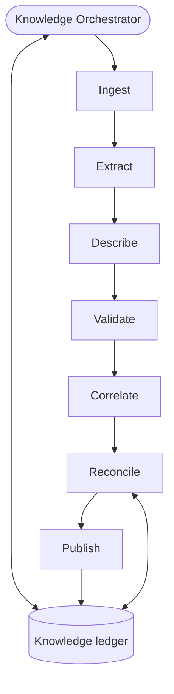

# Knowledge-Builder System — Complete Build Guide (v1, additive)

*A single reference for building the knowledge builder as a series of additive phases, in the same
shape as the bug-hunter guide. The knowledge builder is the neutral third system: it reads your code
and all AI-DLC artifacts and distils them into one queryable **knowledge ledger** — the shared source
of truth that the bug-hunter consumes as its oracle and that AI-DLC reads back for context. It is the
**sole writer** of that ledger. Includes the tutorial, the architecture, shared conventions, the full
build order, and every construction prompt ("brief") for skill-creator.*

---

# Part I — Tutorial: how to use this document

## What you are building

A system of cooperating agents, skills, and tools that reads two things — your **codebase** and the
**AI-DLC artifacts** (intents, units, bolts, ADRs, requirements, `catalog.yaml`) — and maintains a single
**knowledge ledger**. The ledger is the project's distilled, centralized memory: what the system is
*supposed* to do, what it *currently* does, and what is still just *research*. It serves two consumers
through one store and never by talking to them directly: the **bug-hunter** reads intent/contracts as its
oracle, and **AI-DLC** reads it back for context when writing and implementing specs. The knowledge
builder is the neutral party in a separation of powers — neither AI-DLC nor the bug-hunter is allowed to
author the ledger, because the system being built should not certify its own intent and the system
checking against it should not grade against its own notes.

## The core idea: a stable distillation pipeline with stages

Every distillation run flows through seven fixed stages: **Ingest → Extract → Describe → Validate →
Correlate → Reconcile → Publish**, coordinated by a **Knowledge Orchestrator** that exists from the first
phase. These stages are permanent *slots*. Early phases put minimal implementations in some slots; later
phases fill or extend a slot — without rewriting what is already there. Growth is additive: you mostly
*add* skills/agents and point an existing stage at them.

## The single most important rule: the three-way classification

Most distillation systems get this wrong by collapsing everything into "documentation." The knowledge
ledger keeps three kinds of fact strictly apart, and **never lets them blur**:

- **Intent & contracts (the oracle).** What the code *should* do. Sourced only from human-authored
  artifacts (requirements, ADRs, intent/bolt design docs, `catalog.yaml` standards). This is the only
  bucket the bug-hunter is allowed to treat as truth.
- **Current-state map (reference only).** What the code *does* today, derived from reading the code.
  Useful for humans and for feeding the bug-hunter's map/index — but **never an oracle**. If a current
  behavior is a bug and it leaks into the intent side, the bug is enshrined as intended and the
  bug-hunter will never flag it again.
- **Advisory / research knowledge (context only).** Findings that are neither a contract nor a
  description of shipped code — chiefly **spike-bolt output**, which is knowledge, not code. A spike's
  recommendation is not something the code is obligated to satisfy; it becomes a contract *only* if a
  later ADR or intent adopts it (the human checkpoint at the end of a spike is that promotion gate).

Getting this wrong produces a false-positive factory: e.g. the EU-expansion spikes (bolts 076–083 under
intent 034) would otherwise generate "code doesn't match the recommendation" findings against code that
was never meant to implement them.

## The unit of work: a "brief"

Everything in Part II is a numbered **brief** — a self-contained prompt you paste into the
**`skill-creator`** skill, which builds one skill at a time and asks you about intent, triggering,
inputs/outputs, dependencies, and tests. Each brief pre-answers those. Anatomy: *what it enables*,
*when it triggers* (becomes the skill's description — keep it pushy so the system routes through it),
*the method to encode*, *output*, *dependencies* (build those first), and three *test prompts*. A few
briefs are **extensions**: re-open an existing skill and add a capability at a planned seam.

## The build loop

1. Take the next component in the master build order.
2. Paste its brief into `skill-creator`; build it; run its three test prompts; confirm; fix if needed.
3. Only then move on. After each phase the whole system still runs end-to-end — just with more ability.

## Build only as far as your bottleneck demands

Phase 1 ingests artifacts and produces a queryable, firewalled ledger. Phase 2 makes its entries
trustworthy (confidence + status). Phase 3 keeps it honest over time (drift, incremental, approval).
Phase 4 closes the bug→fix→re-distil loop. Stop wherever your real bottleneck stops asking for the next
phase.

## Master build order (dependency-ordered; build top to bottom)

```
PHASE 1 — Skeleton (ingest → a queryable, three-way ledger, end-to-end)
   1. knowledge-ledger-io ............... (—)
   2. artifact-ingest ................... (knowledge-ledger-io)          [reads/normalizes AI-DLC + tags types]
   3. intent-extraction ................. (artifact-ingest, knowledge-ledger-io)   [THE CORE: normalize to contract-kinds]
   4. current-state-description ......... (knowledge-ledger-io; reuses code-index) [reference only]
   5. firewall-validation ............... (knowledge-ledger-io)          [the three-way guard]
   6. ledger-query ...................... (knowledge-ledger-io)          [indexed retrieval / serve]
   7. distiller-agent ................... (3,4,5, knowledge-ledger-io)
   8. knowledge-orchestrator [skeleton] . (all of the above)            [defines the 7 stages]

PHASE 2 — Trust (confidence + implementation status + supersession)
   9. confidence-tiering ................ (knowledge-ledger-io)          [grounded in source structure]
  10. status-correlation ............... (artifact-ingest, knowledge-ledger-io; reuses git-revision-tracking) [bolt-type-aware]
  11. supersession-tracking ............ (knowledge-ledger-io)          [ADR-2 supersedes ADR-1]
  12. reconciler-agent ................. (5,9,10,11, knowledge-ledger-io)   [fills Validate + Correlate]
      → knowledge-orchestrator (extends): wire confidence/status/supersession; dispatch the reconciler

PHASE 3 — Maintenance (drift, incremental, approval, backfill-vs-steady-state)
  13. drift-reconciliation ............. (knowledge-ledger-io; reuses git-revision-tracking)
  14. approval-intake .................. (knowledge-ledger-io)          [human-in-the-loop seam, store-mediated]
      → knowledge-orchestrator (extends): backfill mode vs incremental mode; approval gating

PHASE 4 — Loop Integration (correlation IDs, serve AI-DLC, close the fix loop)
  15. correlation-tracking ............. (knowledge-ledger-io)          [bug-id ↔ bolt-id ↔ commit]
      → knowledge-orchestrator (extends): serve AI-DLC; consume "bolt finished"; re-distil finished
        bug-bolts only after the bug-hunter's verification gate confirms the fix

OPTIONAL
   A. ledger-health-report (extends ledger-query): a human summary (coverage, low-confidence entries
      awaiting approval, supersession churn, drift)
   B. shared-tooling note: reuse the bug-hunter's code-index and git-revision-tracking (deterministic
      tools only — never share the judgment agents)
```

## Shared conventions (apply across many components)

- **Agents are built as skills that define their procedure.** skill-creator builds skills, so each agent
  (distiller, reconciler, orchestrator) is a skill whose body is the agent's operating procedure.
- **The seven stages are permanent.** Ingest / Extract / Describe / Validate / Correlate / Reconcile /
  Publish exist from Phase 1. Later phases fill or extend a stage; they never restructure the pipeline.
- **Three-way classification, never blurred.** Intent/contract = oracle; current-state = reference;
  advisory = context only. The `firewall-validation` skill enforces this on every entry.
- **Parse what's structured, distil what's prose, infer from code last — and confidence follows the
  source.** Structured, human-authored sources (`catalog.yaml` standards, the formal requirements
  categories, the typed Intent/Bolt/Unit fields) are *parsed* and entered at **high** confidence. Prose
  artifacts (spike reports, freeform descriptions) are *distilled* at **medium** confidence. Facts
  inferred from code are **low** / reference-only. Confidence is not a separate guess; it falls out of how
  structured the source was.
- **Normalize Intent Type to a contract-kind; never hardcode the freeform vocabulary.** The team combines
  and extends labels freely ("brown-field / refactor + security hardening", "ops / brown-field", etc.).
  What matters is the *behavioral implication*, mapped to a small fixed set of contract-kinds (below).
- **Traceability is mandatory.** Every entry links back to its source (artifact id + path:line, or the
  code location for reference facts). An assertion with no traceable source is not allowed on the intent
  side.
- **Propose, don't auto-activate.** Inferred intent and drift updates are *proposed* and surfaced for
  approval, then stored once approved (`approval-intake`). The ledger never silently rewrites a
  human-authored fact.
- **Read-only on the repo and on AI-DLC artifacts.** The knowledge builder never edits code or specs.
  Its only writes are the knowledge ledger and its own index.
- **Sole writer of the knowledge ledger.** AI-DLC and the bug-hunter read it; they do not write it.
- **Query-first.** Consumers pull the slice relevant to a location/flow via `ledger-query`; nobody loads
  the whole ledger. This is what keeps it working at 800 bolts, not 80.
- **Backfill vs incremental.** The first run is a one-time **backfill** over all existing artifacts and
  bolts (today ~83 across 34 intents). Steady-state runs are **incremental** — re-distil only artifacts
  and code changed since the last commit/run.
- **Concurrency-safe I/O.** `knowledge-ledger-io` must tolerate more than one writer at a time without
  losing data (single-writer merge at the Publish stage is the simplest correct model).

### The contract-kinds (what `intent-extraction` normalizes to)

| AI-DLC work nature | Contract kind | How the bug-hunter uses it |
|---|---|---|
| New Feature / Enhancement | **Positive behavioral** ("should do X") | Check the implementation against the spec'd behavior |
| Bug Fix (defect-fix) | **Negative invariant / regression guard** ("X must never happen again") | Highest value; pairs with the harvested regression test |
| Refactor (structural / test / frontend, "zero behaviour change") | **Behavioral-invariance** ("behavior identical to the pre-bolt commit") | Diff before/after via git-revision-tracking |
| Infrastructure / ops | **Config / platform** | Routed to the config-auditor |
| "security hardening" + requirements security category + `catalog.yaml` standards | **Security standard** | Routed to the security-auditor; usually high confidence (structured) |
| Spike / research | **Advisory** (not a contract) | Not used as oracle; promotable only if adopted into an ADR/intent |

The coming **agent/skill system creation** intent type slots in for free: it is a positive behavioral
contract scoped to agent/skill artifacts ("this skill should do X when triggered by Y"). Because we
normalize rather than enumerate, no new vocabulary value requires reworking the extractor.

## The knowledge ledger (what it stores)

A structured file (`knowledge-ledger.json`) plus a generated `knowledge-ledger.md` human view, with
sections:

- `intent_contracts` — per entry: `id`, `contract_kind`, `statement`, `source_ref` (artifact id +
  path:line), `intent_id`, `bolt_id`, `unit_layer`, `status` (planned/partial/done — meaning per bolt
  type), `confidence` (high/medium/low + one-line why), `security_flag`, `consumer_routing`
  (general/flow/security/config), `supersedes` / `superseded_by`, `correlation_id` (loop link).
- `current_state_map` — descriptive facts about the code, each tagged `reference_only: true`, with the
  code location and the commit it was read at.
- `advisory_knowledge` — spike findings and other non-binding knowledge, each `promotable_via` (the
  ADR/intent that would turn it into a contract) and `promoted: true/false`.
- `coverage` — per artifact/bolt/file: `last_examined_run`, `last_commit`, `depth`.
- `runs` — per run: number, timestamp, commit_sha, mode (backfill/incremental), counts by contract-kind.

Writes are last-write-wins **after** a single-writer merge, and must never drop existing data.

## What the system produces

- **Knowledge ledger** (`knowledge-ledger.json` + `knowledge-ledger.md`): the persistent, centralized
  source of truth across runs, serving the bug-hunter and AI-DLC.
- **Per-run curation summary**: what was ingested, new/changed contracts by kind, low-confidence entries
  awaiting approval, supersessions, drift, and coverage.
- **Proposed entries** (Phase 3): inferred intent and drift updates surfaced for human approval.

---

# Part I.5 — Architecture at a glance

## Three primitives (and how they nest)

- **Tool** — deterministic function, no judgment (parse a bolt file, query a symbol index, `git diff`).
- **Skill** — reusable procedure/knowledge; calls tools and other skills.
- **Agent** — goal-driven loop with judgment; orchestrates skills, tools, and sub-agents.

The **distiller** (agent) uses `intent-extraction` (skill), which uses `artifact-ingest` (skill), which
uses the AI-DLC artifact formats (tool-level parsing). On every entry it calls `firewall-validation`
(skill). That composition is what makes this a *system*, not one big prompt — and it is why the knowledge
builder is not a monolith.

## The pipeline and which phase fills each stage



| Stage | What runs in it | Phase |
|---|---|---|
| **Ingest** | `artifact-ingest` — read + normalize AI-DLC artifacts and code-adjacent files; tag Intent/Bolt/Unit type | P1 |
| **Extract** | `intent-extraction` — human-authored artifacts → intent/contracts (normalized to contract-kinds); spikes → advisory | P1 |
| **Describe** | `current-state-description` — code → reference facts (tagged not-oracle) | P1 |
| **Validate** | `firewall-validation` — enforce the three-way separation + traceability | P1 |
| **Correlate** | `status-correlation`, `confidence-tiering`, `supersession-tracking` | P1 → P2 |
| **Reconcile** | `drift-reconciliation`, `approval-intake`, `correlation-tracking` | P1 → P4 |
| **Publish** | `ledger-query` write + serve; single-writer merge | P1 |

The **knowledge ledger** is the shared memory every stage reads and writes across runs. The bug-hunter's
`code-index` and `git-revision-tracking` are reused as deterministic tools (Describe, Correlate,
Reconcile). The **distiller** owns Extract + Describe; the **reconciler** owns Validate + Correlate +
Reconcile; the **orchestrator** runs the whole pass and Publishes.

## The phases

- **Phase 1 — Skeleton:** the smallest complete system. Orchestrator + distiller + the shared skills
  (ledger I/O, ingest, intent extraction, current-state description, firewall, query). It already
  produces a queryable, firewalled ledger end-to-end. Correlate/Reconcile are minimal.
- **Phase 2 — Trust:** fill Correlate with real confidence tiers, implementation status read from bolt
  stage artifacts, and supersession; add the reconciler.
- **Phase 3 — Maintenance:** keep the ledger honest over time — drift detection, incremental scanning vs
  backfill, and the human approval seam.
- **Phase 4 — Loop Integration:** correlation IDs, serving AI-DLC, and closing the bug→fix→re-distil
  loop — re-distilling a finished bug-bolt only after the bug-hunter's verification gate confirms the fix.

---

# Part II — The Build Briefs

> Numbered per the master build order. Each "Prompt N" is one paste into `skill-creator`. Briefs marked
> "(extends ...)" mean: re-open that existing skill and add the described capability at its seam.

# Phase 1 — Skeleton

*Goal: the smallest complete system that ingests your artifacts and produces a queryable knowledge ledger
with the three-way firewall intact, end-to-end. Built as skill-creator skills on the shared conventions,
with the Orchestrator and all seven stages in place from the start.*

## Prompt 1 — Skill: `knowledge-ledger-io`

Create a skill called `knowledge-ledger-io`. **Enables:** safe, structured, concurrency-safe read/write
access to the knowledge ledger — the system's shared memory and single source of truth; every other
component reads/writes through this skill so the format stays consistent. **Triggers:** whenever any
component loads prior state, records or updates a contract, records a reference fact, records advisory
knowledge, updates coverage, or appends a run summary — make the description pushy. **Method:** store a
structured `knowledge-ledger.json` plus a generated `knowledge-ledger.md` human view, with the sections
defined in the guide (`intent_contracts`, `current_state_map`, `advisory_knowledge`, `coverage`, `runs`).
Provide operations: `load` (tolerate first-run empty), `next_entry_id` (stable, never reused),
`upsert_contract`, `upsert_reference_fact`, `upsert_advisory`, `set_status`, `set_confidence`,
`mark_superseded`, `update_coverage`, `append_run_summary`, `regenerate_markdown_view`. **Concurrency:**
support more than one writer without losing data — the recommended model is that workers write to their
own staging files and a single coordinator merges at Publish (last-write-wins is only safe after a
single-writer merge); `next_entry_id` allocation must be atomic. Writes must never drop existing data.
**Output:** the structured ledger + Markdown mirror. **Dependencies:** none. **Tests:** (a) init a fresh
ledger, add two contracts and one reference fact, show the Markdown view; (b) two staging files with
overlapping edits → merge with no lost entries and no duplicate IDs; (c) load an existing ledger and list
contracts with `confidence: low`.

## Prompt 2 — Skill: `artifact-ingest`

Create a skill called `artifact-ingest`. **Enables:** reading and normalizing the AI-DLC artifacts into a
common internal shape, tagged by type, so the rest of the system never parses raw files. **Triggers:** at
the start of any distillation pass, on the artifacts and code-adjacent files in scope — pushy.
**Method:** read AI-DLC artifacts under `.specsmd/aidlc/` and the project — intents and their
`inception-log.md` (the **Type** field: work-nature × lifecycle), `units.md` (Unit Type:
backend/frontend), `bolt.md` (the `type:` field: `ddd-construction-bolt` / `simple-construction-bolt` /
`spike-bolt`), the stage artifacts (`ddd-01/02/03`, ADRs, `implementation-plan`/walkthroughs,
`spike-exploration.md`/`spike-report.md`), `requirements` (note the formal **security** category), and
`catalog.yaml` (standards). For each, emit a normalized record carrying `artifact_id`, `intent_id`,
`bolt_id`, `unit_layer`, `intent_type_raw`, `bolt_type`, `source_ref` (path + line span), and whether the
source is **structured** (YAML/typed fields/formal categories) or **prose**. Do not interpret intent yet —
this stage only reads and tags. Read-only. **Output:** a list of normalized, type-tagged artifact records.
**Dependencies:** `knowledge-ledger-io` (to record coverage). **Tests:** (a) ingest one `ddd-construction`
bolt and confirm its stage artifacts and `bolt_type` are tagged; (b) ingest a `spike-bolt` and confirm it
is tagged `bolt_type: spike` and `prose`; (c) parse `catalog.yaml` standards and tag them `structured`.

## Prompt 3 — Skill: `intent-extraction`

Create a skill called `intent-extraction`. **Enables:** turning human-authored artifacts into normalized
**intent/contract** entries — the oracle side of the ledger — and classifying non-binding output as
advisory. This is the core of the whole system. **Triggers:** during the Extract stage, on every
human-authored artifact record from `artifact-ingest` — pushy. **Method:** for each artifact, read the
normalized `intent_type_raw` and `bolt_type` and the actual requirements/ADR/design text, and **normalize
to a contract-kind** (never to the freeform label): New Feature/Enhancement → *positive behavioral*; Bug
Fix/defect-fix → *negative invariant / regression guard*; Refactor in any flavor (incl. "zero behaviour
change") → *behavioral-invariance*; Infrastructure/ops → *config/platform*; "security hardening" +
requirements security category + `catalog.yaml` standards → *security standard*. **Spike-bolt output is
classified advisory, not a contract** — record it in `advisory_knowledge` with `promotable_via` pointing
at the ADR/intent that would adopt it. Emit each contract with `statement`, `contract_kind`, `source_ref`
(traceable), `consumer_routing` (general/flow/security/config), and `security_flag`. Preserve the original
label for traceability. Refuse to emit an intent entry with no traceable human source. Read-only.
**Output:** intent/contract entries + advisory entries, written via `knowledge-ledger-io`.
**Dependencies:** `artifact-ingest`, `knowledge-ledger-io`. **Tests:** (a) a refactor intent with "zero
behaviour change" → a behavioral-invariance contract; (b) the 8 spike bolts under intent 034 → all
classified advisory, zero contracts; (c) a `catalog.yaml` security standard → a security-standard contract
routed to the security consumer.

## Prompt 4 — Skill: `current-state-description`

Create a skill called `current-state-description`. **Enables:** producing the **reference-only** map of
what the code actually does today — useful for humans and for the bug-hunter's own map/index, but never an
oracle. **Triggers:** during the Describe stage, on the code in scope — pushy. **Method:** using the
bug-hunter's `code-index` tool, summarize what exists and what it does (entry points, modules, key flows,
notable behaviors) and write each fact to `current_state_map` with `reference_only: true`, the code
location, and the commit it was read at. **Never phrase a current-state fact as intent**, and never write
to `intent_contracts`. Read-only. **Output:** reference facts in `current_state_map`. **Dependencies:**
`knowledge-ledger-io`; reuses `code-index`. **Tests:** (a) describe one module's behavior and confirm it
lands in `current_state_map` tagged reference-only; (b) confirm nothing from this skill ever writes
`intent_contracts`; (c) re-describe after a commit and update the location/commit.

## Prompt 5 — Skill: `firewall-validation`

Create a skill called `firewall-validation`. **Enables:** enforcing the three-way separation that the
whole oracle depends on — the structural defense against baking bugs into intent. **Triggers:** during the
Validate stage, on every entry before Publish — pushy. **Method:** for each candidate entry, verify the
classification is correct and consistent: an entry on the **intent** side must trace to a human-authored
source (reject otherwise); a description of **current code behavior** must never sit on the intent side
(quarantine and flag if it does); **advisory** entries must not be treated as contracts. Flag any entry
whose `contract_kind` doesn't match its source, and any intent entry that merely restates current code.
**Output:** a pass/quarantine verdict per entry, with rationale; quarantined entries surfaced, never
silently dropped. **Dependencies:** `knowledge-ledger-io`. **Tests:** (a) a current-state fact mislabeled
as intent → quarantined with reason; (b) an intent entry with no source → rejected; (c) a spike
recommendation labeled as a contract → reclassified advisory.

## Prompt 6 — Skill: `ledger-query`

Create a skill called `ledger-query`. **Enables:** indexed retrieval so consumers (the bug-hunter, AI-DLC)
pull only the slice of the ledger relevant to a location or flow, instead of loading the whole thing —
this is what keeps the system scalable as bolts accumulate. **Triggers:** whenever a consumer asks for the
contracts/intent relevant to a file, symbol, flow, or intent/bolt id; and at Publish to write merged
entries — pushy. **Method:** build a lightweight index keyed by code location, flow, and intent/bolt id;
operations `contracts_for(location|flow|intent_id)`, `reference_for(location)`, `advisory_for(intent_id)`,
`write_merged(entries)`. Keep it incremental (re-index only changed entries when given a SHA). Return
contract-kind and confidence with every hit so consumers can weight them. **Output:** the index + query
results; merged writes at Publish. **Dependencies:** `knowledge-ledger-io`. **Tests:** (a) return all
contracts relevant to `checkout.py`; (b) return only `done`, high-confidence contracts for a flow; (c)
re-index only entries changed since the last commit.

## Prompt 7 — Agent: `distiller-agent` (build as a skill defining its procedure)

Create a skill called `distiller-agent` defining the distiller's procedure. **Enables:** the build pass —
turning ingested artifacts and code into candidate ledger entries, with the firewall applied. **Triggers:**
when the Orchestrator dispatches Extract + Describe — pushy. **Method:** over the artifacts and code in
scope, run `intent-extraction` (human-authored → contracts/advisory) and `current-state-description` (code
→ reference); run `firewall-validation` on every candidate before handing it on; emit candidate entries
only (the Orchestrator Publishes). Surface everything plausible; quarantine, never silently drop. Read-only
on the repo and artifacts. **Output:** candidate entries + a coverage note. **Dependencies:**
`intent-extraction`, `current-state-description`, `firewall-validation`, `knowledge-ledger-io`. **Tests:**
(a) distil one intent's bolts into contracts + reference facts; (b) confirm a mislabeled entry is
quarantined by the firewall before emission; (c) report what was covered.

## Prompt 8 — Agent: `knowledge-orchestrator` [skeleton] (build as a skill defining its procedure)

Create a skill called `knowledge-orchestrator` defining the coordinator that runs one complete
distillation pass over the seven fixed stages. This is the heart of the additive design: **define all
seven stages now**; most are minimal in Phase 1 and are filled by later phases without changing this
structure. **Enables:** running an end-to-end pass and producing/serving the ledger. **Triggers:** whenever
a distillation run starts — pushy, so runs always go through the Orchestrator. **Method — the pipeline:**
(1) **Open:** load the ledger (`knowledge-ledger-io`); choose mode — Phase 1 is **backfill** over all
artifacts (later phases add incremental). (2) **Ingest:** `artifact-ingest` over the scope. (3) **Extract**
+ (4) **Describe:** dispatch `distiller-agent`. (5) **Validate:** ensure `firewall-validation` ran on every
candidate. (6) **Correlate:** MINIMAL in Phase 1 — pass entries through with `status: unknown`,
`confidence: medium` default. [Phase 2 fills this with status/confidence/supersession.] (7) **Reconcile:**
empty in Phase 1. [Phases 3–4 fill it.] (8) **Publish:** single-writer merge, then `ledger-query` writes
and indexes; append the run summary. Read-only on repo/artifacts; never invent intent, never let a
description reach the intent side. **Output:** a completed pass (updated, queryable ledger + run summary).
**Dependencies:** all Phase 1 components. **Tests:** (a) run a first backfill pass on the repo + artifacts
and produce a queryable ledger; (b) query the ledger for one flow's contracts; (c) confirm the three-way
sections are populated correctly and nothing crossed the firewall.

---

# Phase 2 — Trust

*Goal: make each entry trustworthy. Add confidence grounded in source structure, implementation status
read from bolt stage artifacts, and supersession. Add the reconciler. The Orchestrator just fills its
Correlate stage — nothing from Phase 1 is rewritten.*

## Prompt 9 — Skill: `confidence-tiering`

Create a skill called `confidence-tiering`. **Enables:** assigning each entry a confidence grounded in how
structured and human-authored its source was, so the bug-hunter can weight contracts instead of trusting
them flatly. **Triggers:** during Correlate, on every entry — pushy. **Method:** assign **high** to entries
parsed from structured, human-authored sources (`catalog.yaml` standards, formal requirements categories,
typed fields); **medium** to entries distilled from prose (descriptions, spike reports promoted into
ADRs); **low** / reference-only to anything inferred from code. Record a one-line rationale citing the
source type. Flag low-confidence or inferred intent entries for human approval (consumed in Phase 3).
**Output:** `{confidence, rationale}` per entry. **Dependencies:** `knowledge-ledger-io`. **Tests:** (a) a
`catalog.yaml` standard → high with rationale; (b) a prose-distilled behavior → medium; (c) a
code-inferred behavior on the intent side → low + flagged for approval.

## Prompt 10 — Skill: `status-correlation`

Create a skill called `status-correlation`. **Enables:** deriving each contract's implementation status by
reading the bolt's stage artifacts, so unbuilt intent doesn't generate false "missing behavior" findings
and partial work is visible. **Triggers:** during Correlate, per contract linked to a bolt — pushy.
**Method:** read which stage artifacts exist for the bolt, **bolt-type-aware**: for a
`ddd-construction-bolt`, presence of `ddd-01/02/03` and test walkthroughs marks progress through Domain
Model → Technical Design → Implement → Test; for a `simple-construction-bolt`, the implementation-plan and
walkthroughs; for a `spike-bolt`, status is research-complete + human checkpoint (there is **no** code
status — never mark a spike "implemented"). Correlate to commits via `git-revision-tracking`. Set `status`
= planned / partial / done accordingly, and record what evidence determined it. **Output:** `{status,
evidence}` per contract. **Dependencies:** `artifact-ingest`, `knowledge-ledger-io`; reuses
`git-revision-tracking`. **Tests:** (a) a ddd-bolt with `ddd-01/02` but no test walkthrough → partial; (b)
a spike-bolt → research-complete, not "implemented"; (c) a fully-tested simple-bolt → done with evidence.

## Prompt 11 — Skill: `supersession-tracking`

Create a skill called `supersession-tracking`. **Enables:** keeping the oracle current when decisions
reverse — so the bug-hunter never checks code against a contract you already overturned. **Triggers:**
during Correlate, whenever a new ADR/intent may revise an earlier one — pushy. **Method:** detect when an
artifact supersedes an earlier decision (an ADR that replaces a prior ADR, an intent that revises an
earlier contract); mark the old entry `superseded_by` and the new one `supersedes`; the superseded entry
stays in the ledger for history but is excluded from oracle queries. Be conservative — only mark genuine
supersession, not mere related work. **Output:** supersession links applied via `knowledge-ledger-io`.
**Dependencies:** `knowledge-ledger-io`. **Tests:** (a) ADR-2 replaces ADR-1 → ADR-1 marked superseded and
dropped from oracle queries; (b) two related-but-independent contracts → both kept active; (c) confirm a
superseded entry is still visible in history but not returned by `contracts_for`.

## Prompt 12 — Agent: `reconciler-agent` (build as a skill defining its procedure)

Create a skill called `reconciler-agent` defining the reconciler's procedure. **Enables:** keeping the
ledger honest — applying validation, status, confidence, and supersession over the candidate entries (and,
in later phases, drift and loop bookkeeping). **Triggers:** when the Orchestrator dispatches Correlate (and
later Reconcile) — pushy. **Method:** over the entries from the distiller, run `firewall-validation` (final
gate), `confidence-tiering`, `status-correlation`, and `supersession-tracking`; assemble each entry's final
metadata; surface anything flagged for approval rather than activating it. Read-only on repo/artifacts.
**Output:** finalized, metadata-complete entries + an approval queue. **Dependencies:**
`firewall-validation`, `confidence-tiering`, `status-correlation`, `supersession-tracking`,
`knowledge-ledger-io`. **Tests:** (a) finalize a batch of contracts with status + confidence; (b) confirm
low-confidence inferred intent is queued for approval, not activated; (c) confirm a superseded contract is
excluded from the active set.

## Prompt 12b — `knowledge-orchestrator` (extends): wire in trust

Re-open `knowledge-orchestrator` and fill the **Correlate** stage (no restructuring): after the distiller
emits candidates, dispatch the `reconciler-agent` to run confidence, status, and supersession, then
Publish the finalized entries. **Tests:** (a) run a pass and confirm entries now carry status + confidence;
(b) confirm superseded contracts drop out of queries; (c) confirm flagged entries appear in the approval
queue.

---

# Phase 3 — Maintenance

*Goal: keep the ledger honest over time. Add drift detection, the split between a one-time backfill and
steady-state incremental scanning, and the human approval seam. The Orchestrator fills its Reconcile stage
and gains an incremental mode — never rebuilt.*

## Prompt 13 — Skill: `drift-reconciliation`

Create a skill called `drift-reconciliation`. **Enables:** detecting when code or artifacts have changed
under the ledger and proposing updates, so the distilled view doesn't rot into a confidently-wrong
oracle. **Triggers:** during Reconcile, at run start when a new commit is present — pushy. **Method:** via
`git-revision-tracking`, diff changed files/artifacts since the ledger's last commit; for each affected
entry, propose an update (re-extract a changed contract, refresh a moved reference fact, flag a contract
whose backing artifact changed). **Propose, don't auto-overwrite** human-authored facts — surface changes
for approval. Detect when a finished bolt warrants re-distillation. **Output:** proposed updates with diff
evidence. **Dependencies:** `knowledge-ledger-io`; reuses `git-revision-tracking`. **Tests:** (a) a changed
requirement → propose re-extracting its contract with diff evidence; (b) a moved symbol → propose updating
the reference fact's location; (c) confirm no human-authored contract is silently overwritten.

## Prompt 14 — Skill: `approval-intake`

Create a skill called `approval-intake`. **Enables:** the human-in-the-loop seam — ingesting decisions on
proposed (inferred) intent and drift updates, store-mediated, so approvals have provenance and the ledger
only activates what a human signed off on. **Triggers:** when there are queued proposals awaiting a
decision — pushy. **Method:** read the approval queue; accept decisions (approve / reject / edit) however
is lowest-friction for the operator (a decisions field, a small file, or answering at run start); validate
each (does the entry exist, is the change legal), attach who/when/against-which-commit, and apply approved
ones via `knowledge-ledger-io`. Capture the *reason* on rejections — it is signal for future tiering.
**Output:** applied decisions + an updated queue. **Dependencies:** `knowledge-ledger-io`. **Tests:** (a)
approve a proposed inferred contract → activated with provenance; (b) reject one with a reason → recorded,
not activated; (c) edit a proposed statement → the edited version stored.

## Prompt 14b — `knowledge-orchestrator` (extends): incremental mode + approval gating

Re-open `knowledge-orchestrator` and extend two things (no restructuring): **mode** — default to
**incremental** (ingest + distil only artifacts/code changed since the last commit via
`git-revision-tracking`, with occasional full backfills), keeping the one-time backfill as an explicit
mode for first runs and big migrations; **Reconcile** — run `drift-reconciliation` then `approval-intake`
before Publish, so inferred intent and drift updates are gated by a human. **Tests:** (a) an incremental
run that re-distils only the latest diff and says so; (b) a backfill run over everything; (c) confirm
inferred entries are not activated until approved.

---

# Phase 4 — Loop Integration

*Goal: close the bug→fix→re-distil loop. Thread correlation IDs, serve AI-DLC its context, and re-distil a
finished bug-bolt only after the bug-hunter's verification gate confirms the fix. The Orchestrator gains
serving and loop hooks at its Publish/Reconcile seams.*

## Prompt 15 — Skill: `correlation-tracking`

Create a skill called `correlation-tracking`. **Enables:** threading a single identity through the loop —
bug id ↔ bug-bolt id ↔ commit — so the loop closes on the same entity and a finished bug-bolt can trigger
re-distillation and status closure. **Triggers:** when a bug-derived bolt is created, implemented, or
finished — pushy. **Method:** maintain the link between a bug-hunter `correlation_id`, the AI-DLC bug-bolt
it produced, and the commit(s) that implemented it; record on the relevant contract entry; know when the
bug-bolt is **finished** (via its stage artifacts + the bug-hunter's verified-fixed signal) so the
Orchestrator re-distils it. Do not close anything on AI-DLC's word alone — closure requires the
bug-hunter's verification. **Output:** correlation links + a "ready to re-distil" signal per finished
bug-bolt. **Dependencies:** `knowledge-ledger-io`. **Tests:** (a) link a bug-bolt to its source bug's
correlation id; (b) mark a bug-bolt finished only after the verified-fixed signal; (c) emit "ready to
re-distil" for a finished, verified bug-bolt.

## Prompt 15b — `knowledge-orchestrator` (extends): serve AI-DLC and close the loop

Re-open `knowledge-orchestrator` and extend its serving and Reconcile hooks (no restructuring): **serve
AI-DLC** — expose `ledger-query` so AI-DLC can read relevant intent/contracts as context when it writes and
implements specs; **close the loop** — at Reconcile, consume `correlation-tracking`'s "ready to re-distil"
signals and re-distil finished bug-bolts (turning the fixed bug's negative-invariant into a permanent
contract), updating status — **only** for bolts the bug-hunter's verification gate has confirmed fixed.
**Tests:** (a) AI-DLC queries the ledger for a flow's contracts and gets the current, non-superseded set;
(b) a verified-fixed bug-bolt is re-distilled and its contract activated; (c) an unverified "fix" is **not**
re-distilled or closed.

---

# Optional

## Optional A — `ledger-query` (extends): ledger-health-report

Re-open `ledger-query` and add a human summary output: coverage (artifacts/bolts examined and depth),
entries awaiting approval, recent supersessions, drift proposals, and counts by contract-kind and
confidence. **Tests:** (a) produce a health report after a run and confirm the counts agree with the
ledger.

## Optional B — Shared tooling note

Reuse the bug-hunter's `code-index` and `git-revision-tracking` as deterministic tools in
`current-state-description`, `status-correlation`, and `drift-reconciliation` — sharing judgment-free tools
is good hygiene. **Never** share the judgment agents (distiller, reconciler, orchestrator) with the
bug-hunter; the separation of powers depends on them staying distinct.

---

# Done

You now have an additive build of the knowledge builder. Build top to bottom in the master order: after
Phase 1 you have a working system that distils your artifacts and code into a queryable, firewalled
ledger; each later phase fills or extends a stage without rewriting what's there. Test each component with
skill-creator before moving on, and stop at whichever phase your real bottleneck stops demanding the next.
