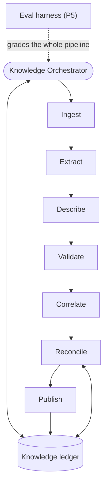

# Knowledge-Builder System — Complete Build Guide (v2, additive)

*A single reference for building the knowledge builder as a series of additive phases, in the same
shape as the bug-hunter guide. The knowledge builder is the neutral third system: it reads your code
and all AI-DLC artifacts and distils them into one queryable **knowledge ledger** — the shared source
of truth that the bug-hunter consumes as its oracle and that AI-DLC reads back for context. It is the
**sole writer** of that ledger. Includes the tutorial, the architecture, shared conventions, the full
build order, every construction prompt ("brief") for skill-creator, and — new in v2 — the normative
**Integration Contract** both systems build against.*

> **What v2 changes (changelog).** All additive or corrective — no concept from v1 is discarded; the
> fixes close the gaps found in the v1 review (IDs below refer to that review):
> - **Appendix A — the Integration Contract** is now normative: pinned storage layout, the exact
>   `ledger-query` request/response envelope, the loop-signal mailboxes, the sole-writer map, the
>   cross-system build interleave, and the twin-name discipline. *(A2, A5, A6, C3)*
> - **`ledger-query` returns everything tagged, hides nothing**: superseded / parked / not-done
>   contracts are returned with explicit tags; exclusion only via an `active_only` filter — matching
>   what the bug-hunter's `intent-lookup` already expects. Symbol-keyed lookup added. *(A1, A2)*
> - **`contract-anchoring` (NEW)** maps contracts to the code they govern (`code_refs[]`) — the
>   missing component that makes `contracts_for(file)` answerable at all. *(A3)*
> - **"Human-authored" → "human-ratified"**: admissibility now keys on checkpoint approval evidence
>   (inception checkpoints, ADR owner decisions, triage actions), with an explicit provenance chain
>   for bug-derived contracts. *(A4)*
> - **`extraction-verification` (NEW)** — the second reader: every important entry is checked for
>   entailment against its cited source before it can become oracle truth. *(B1)*
> - **Contract identity**: every contract carries a `contract_signature`; re-runs update in place
>   (revisions), never duplicate. Revision ≠ supersession, and the guide now says how. *(B2)*
> - **Status fixed**: one enum (`planned | partial | done | parked | unknown`), a stated evidence
>   hierarchy, a legacy fallback for artifact-less shipped intents, and parked handling. Spikes no
>   longer have contract status at all. *(B3)*
> - **Adoption-polarity + checkability rules**: rejected alternatives become advisory
>   `decision-context`, never contracts; deliverable/process requirements become advisory `process`
>   entries, never contracts. *(B4)*
> - **Corrected source map**: artifacts live under `memory-bank/**` (including
>   `memory-bank/standards/decision-index.md`, the real ADR register); `catalog.yaml` is dropped as a
>   standards source; `docs/` is an advisory-only source class. *(B5)*
> - **Backfill is chunked, resumable, prioritized** — and the concurrency machinery finally has a
>   job: optional parallel per-intent distiller workers. The orchestrator gains an explicit per-run
>   scope + stopping condition. *(B6)*
> - **Approval gets a policy and a floor**, and **`tiering-feedback` (NEW)** learns from your
>   rejections — the bug-hunter's reporting-floor and suppression-learning lessons, ported. *(B7)*
> - **Phase 5 — Measure (NEW)**: `eval-fixtures` (a golden mini-intent + poison pack) and
>   `distillation-eval` (extraction precision/recall, firewall leak rate, anchoring accuracy, with
>   pinned model/temp and trends). The poison pack also makes the firewall tests falsifiable. *(B8, C8)*
> - **Contradiction duty**: the reconciler detects contradictory active contracts and marks both
>   `contested` for human resolution. *(B9)*
> - Plumbing: one write path (`ledger-query` is read-only) *(C1)*; atomic publish + `as_of_commit` /
>   `ledger_version` freshness stamps + an integrity hash against out-of-band writes *(C2)*;
>   `schema_version` *(C4)*; spike-promotion bookkeeping actually happens *(C5)*; `consumer_routing`
>   cut, `security_flag` kept with real consumers *(C6)*; current-state charter narrowed — the
>   bug-hunter's `app-mapping` owns code-shape truth *(C7)*; secret scrubbing before anything enters
>   the ledger *(C9)*; `unit_layer` defined *(C10)*; sharded human views *(C11)*; run cadence and
>   staleness warnings *(C12)*.

---

# Part I — Tutorial: how to use this document

## What you are building

A system of cooperating agents, skills, and tools that reads two things — your **codebase** and the
**AI-DLC artifacts** (intents, units, bolts, ADRs, requirements, standards) — and maintains a single
**knowledge ledger**. The ledger is the project's distilled, centralized memory: what the system is
*supposed* to do, what it *currently* does, and what is still just *research*. It serves two consumers
through one store and never by talking to them directly: the **bug-hunter** reads intent/contracts as
its oracle, and **AI-DLC** reads it back for context when writing and implementing specs. The knowledge
builder is the neutral party in a separation of powers — neither AI-DLC nor the bug-hunter is allowed
to author the ledger, because the system being built should not certify its own intent and the system
checking against it should not grade against its own notes.

## The core idea: a stable distillation pipeline with stages

Every distillation run flows through seven fixed stages: **Ingest → Extract → Describe → Validate →
Correlate → Reconcile → Publish**, coordinated by a **Knowledge Orchestrator** that exists from the
first phase. These stages are permanent *slots*. Early phases put minimal implementations in some
slots; later phases fill or extend a slot — without rewriting what is already there. Growth is
additive: you mostly *add* skills/agents and point an existing stage at them. (Phase 5's eval harness
sits *around* the pipeline, not inside it — it runs the whole pipeline against fixtures and grades the
result.)

## The single most important rule: the three-way classification

Most distillation systems get this wrong by collapsing everything into "documentation." The knowledge
ledger keeps three kinds of fact strictly apart, and **never lets them blur**:

- **Intent & contracts (the oracle).** What the code *should* do. Sourced only from **human-ratified**
  artifacts — artifacts that passed a human checkpoint: inception checkpoint approvals recorded in the
  inception log, an ADR owner decision, or a triage-intake confirmation/approval. (v2 note: in an
  AI-DLC repo nearly every artifact is *agent-written*; what makes it admissible is the recorded human
  **ratification**, not authorship.) This is the only bucket the bug-hunter may treat as truth.
- **Current-state map (reference only).** What the code *does* today, derived from reading the code.
  Useful for humans and for drift detection — but **never an oracle**. If a current behavior is a bug
  and it leaks into the intent side, the bug is enshrined as intended and the bug-hunter will never
  flag it again.
- **Advisory / research knowledge (context only).** Findings that are neither a contract nor a
  description of shipped code: **spike-bolt output**, **rejected alternatives** from ADRs (recorded as
  `decision-context` — knowing what was *deliberately not done* prevents false "missing feature"
  findings), **deliverable/process requirements** (docs to write, research to run), and planning
  documents under `docs/`. Advisory knowledge becomes a contract *only* if a later ratified ADR or
  intent adopts it — and when that happens, the promotion is recorded on both entries.

Getting this wrong produces a false-positive factory: e.g. the EU-expansion spikes (bolts 076–083
under intent 034) would otherwise generate "code doesn't match the recommendation" findings against
code that was never meant to implement them — and an ADR's *rejected* option could be enforced as if
it had been chosen.

## The unit of work: a "brief"

Everything in Part II is a numbered **brief** — a self-contained prompt you paste into the
**`skill-creator`** skill, which builds one skill at a time and asks you about intent, triggering,
inputs/outputs, dependencies, and tests. Each brief pre-answers those. Anatomy: *what it enables*,
*when it triggers* (becomes the skill's description — keep it pushy so the system routes through it,
**and** include the twin-name disclaimer from Appendix A§6 wherever a confusable sibling exists),
*the method to encode*, *output*, *dependencies* (build those first), and three *test prompts*. A few
briefs are **extensions**: re-open an existing skill and add a capability at a planned seam.

## The build loop

1. Take the next component in the master build order.
2. Paste its brief into `skill-creator`; build it; run its three test prompts; confirm; fix if needed.
3. Only then move on. After each phase the whole system still runs end-to-end — just with more ability.

## Build order across systems (read this before Phase 1)

Two tools are **shared deterministic tools** with no home system: `code-index` and
`git-revision-tracking`. They are built once, on the bug-hunter track, and reused here as judgment-free
tools (the separation of powers concerns *judgment* agents, not parsers and diffs). That creates a
hard cross-system order, spelled out in Appendix A§5:

1. **Bug-hunter bolts 085–088 first** (they produce `git-revision-tracking` and `code-index`).
2. Then **this guide's Phases 1–2**, in parallel with bug-hunter 089/090 if you like.
3. Then the **bug-hunter's oracle tier** (its bolt 091 / `intent-lookup`), which needs `ledger-query`
   — minimum after this guide's Phase 1, recommended after Phase 2 (so tags, status, and anchors are
   real).
4. This guide's **Phase 4 requires the bug-hunter's Phase 5** (the fix-request store and the
   `fix_status` field it writes). Phases 3 and 5 here have no cross-dependency.

## Build only as far as your bottleneck demands

Phase 1 ingests artifacts and produces a queryable, firewalled ledger. Phase 2 makes its entries
trustworthy (verification + confidence + status + anchors + supersession). Phase 3 keeps it honest
over time (drift, incremental, approval, learning from rejections). Phase 4 closes the
bug→fix→re-distil loop. Phase 5 measures whether any of it is actually accurate. Stop wherever your
real bottleneck stops asking for the next phase — but do not skip Phase 5 if anyone is trusting the
oracle.

## Master build order (dependency-ordered; build top to bottom)

```
PHASE 1 — Skeleton (ingest → a queryable, three-way ledger, end-to-end)
   1. knowledge-ledger-io ............... (—)                            [signatures; atomic publish; schema_version; sharded views; integrity hash]
   2. artifact-ingest ................... (knowledge-ledger-io)          [memory-bank paths; ratification evidence; legacy tolerance]
   3. intent-extraction ................. (artifact-ingest, knowledge-ledger-io)   [THE CORE: adoption-polarity; checkability; scrub]
   4. current-state-description ......... (knowledge-ledger-io; SHARED TOOL: code-index) [reference only; narrowed charter]
   5. firewall-validation ............... (knowledge-ledger-io)          [ratification-based; poison-trap tested]
   6. ledger-query ...................... (knowledge-ledger-io)          [Integration Contract envelope; tagged returns; READ-ONLY]
   7. distiller-agent ................... (3,4,5, knowledge-ledger-io)   [parallel-worker capable]
   8. knowledge-orchestrator [skeleton] . (all of the above)            [7 stages; scope+stopping; chunked resumable backfill]

PHASE 2 — Trust (verification + confidence + status + anchors + supersession)
   9. confidence-tiering ................ (knowledge-ledger-io)          [grounded in source structure]
  10. status-correlation ............... (artifact-ingest, knowledge-ledger-io; SHARED TOOL: git-revision-tracking) [evidence hierarchy; legacy fallback; parked]
  11. supersession-tracking ............ (knowledge-ledger-io)          [tag, never hide; revision ≠ supersession]
  12. contract-anchoring ............... (status-correlation; SHARED TOOLS: code-index, git-revision-tracking)  [NEW: contracts → code_refs]
  13. extraction-verification .......... (artifact-ingest, knowledge-ledger-io)   [NEW: the second reader]
  14. reconciler-agent ................. (5,9,10,11,12,13, knowledge-ledger-io)   [fills Validate + Correlate; + contradiction duty]
      → knowledge-orchestrator (extends): wire verification/confidence/status/anchoring/supersession; dispatch the reconciler

PHASE 3 — Maintenance (drift, incremental, approval, learning)
  15. drift-reconciliation ............. (knowledge-ledger-io; SHARED TOOL: git-revision-tracking)  [+ re-anchoring proposals]
  16. approval-intake .................. (knowledge-ledger-io)          [disposition policy; digest floor; provenance]
  17. tiering-feedback ................. (approval-intake, knowledge-ledger-io)   [NEW: learn from rejections]
      → knowledge-orchestrator (extends): backfill mode vs incremental mode; approval gating

PHASE 4 — Loop Integration (correlation IDs, serve AI-DLC, close the fix loop)
  18. correlation-tracking ............. (knowledge-ledger-io)          [defined mailboxes: bolt.md + fix_status]
      → knowledge-orchestrator (extends): serve AI-DLC; consume both loop signals; re-distil verified fixes only

PHASE 5 — Measure (NEW: is the oracle actually right?)
  19. eval-fixtures .................... (—)                            [golden mini-intent + poison pack + answers manifest]
  20. distillation-eval ................ (eval-fixtures, the whole pipeline)  [precision/recall; firewall leak rate; pinned eval runs]
      → knowledge-orchestrator (extends): eval hook after backfills and material changes

OPTIONAL
   A. ledger-health-report (extends ledger-query): human summary (coverage, approval queue, contested,
      supersession churn, drift, staleness)
   B. shared-tooling hygiene note: deterministic tools shared; judgment agents never shared
```

## Shared conventions (apply across many components)

- **Agents are built as skills that define their procedure.** skill-creator builds skills, so each
  agent (distiller, reconciler, orchestrator) is a skill whose body is the agent's operating procedure.
- **The seven stages are permanent.** Ingest / Extract / Describe / Validate / Correlate / Reconcile /
  Publish exist from Phase 1. Later phases fill or extend a stage; they never restructure the pipeline.
- **Three-way classification, never blurred.** Intent/contract = oracle; current-state = reference;
  advisory = context only. `firewall-validation` enforces this on every entry, using **ratification**
  (checkpoint evidence), not authorship.
- **Parse what's structured, distil what's prose, infer from code last — and confidence follows the
  source.** Structured, ratified sources (`memory-bank/standards/*` including `decision-index.md`,
  the formal requirements categories, the typed Intent/Bolt/Unit fields) are *parsed* and entered at
  **high** confidence. Prose artifacts (spike reports, freeform descriptions) are *distilled* at
  **medium** confidence. Facts inferred from code are **low** / reference-only. Confidence is not a
  separate guess; it falls out of how structured the source was.
- **Normalize Intent Type to a contract-kind; never hardcode the freeform vocabulary.** The team
  combines and extends labels freely ("brown-field / refactor + security hardening", "ops /
  brown-field", etc.). What matters is the *behavioral implication*, mapped to a small fixed set of
  contract-kinds (below).
- **Adoption polarity and checkability.** Only *adopted* decisions yield contracts. Rejected /
  considered alternatives → advisory `decision-context` (`rejected: true`). Deliverable/process
  requirements (docs, research outputs, workflow steps) → advisory `process`. A contract `statement`
  must be checkable: subject + behavior + condition; vague statements are flagged at extraction.
- **Identity is mandatory.** Every contract carries a `contract_signature`
  (`source_artifact_id :: source_anchor :: contract_kind`). Upserts key on the signature: re-running
  extraction over unchanged sources creates **zero** new entries; changed wording bumps `revision`
  (history kept). **Revision** = same decision, wording/source drifted. **Supersession** = a different
  decision replaced it.
- **Traceability is mandatory.** Every entry links back to its source (artifact id + path:line, or the
  code location for reference facts) and carries its ratification evidence. An assertion with no
  traceable, ratified source is not allowed on the intent side.
- **Disposition policy (propose, don't flood).** High-confidence ratified entries auto-activate.
  Medium-confidence non-security entries auto-activate with an `auto_activated` audit tag (revocable).
  The human queue receives only: security-flagged entries below high confidence, inferred intent,
  drift against ratified facts, and contested pairs. The queue is presented as a per-intent digest
  with a session cap. The ledger never silently rewrites a human-ratified fact.
- **Read-only on the repo and on AI-DLC artifacts.** The knowledge builder never edits code or specs.
  Its only writes live under `knowledge/` (see Appendix A§1).
- **Sole writer of the knowledge ledger.** AI-DLC and the bug-hunter read it; they do not write it.
  `knowledge-ledger-io` records a content hash per publish and warns on load if the file changed out
  of band.
- **Secret hygiene.** Evidence snippets are scrubbed (keys, tokens, connection strings) before they
  enter the ledger; a source that appears to contain a live secret is quarantined and surfaced — that
  is a finding in its own right.
- **Query-first.** Consumers pull the slice relevant to a location/flow/symbol via `ledger-query`;
  nobody loads the whole ledger. This is what keeps it working at 800 bolts, not 80.
- **Backfill vs incremental — chunked, resumable, prioritized.** The first run is a one-time
  **backfill** over all existing artifacts and bolts (today ~94 bolts across 35 intents). Its unit of
  work is **one intent**; coverage records `distilled@commit` per intent so a restart skips covered
  ones; priority order: standards + decision-index → active intents → shipped → parked/legacy last; a
  per-run budget knob caps intents per pass. Steady-state runs are **incremental** — re-distil only
  artifacts and code changed since the last commit/run.
- **Concurrency-safe I/O — with an actual job.** Backfill MAY run N parallel distiller workers (one
  intent each); workers write staging files and a single coordinator merges at Publish (last-write-wins
  is only safe after that single-writer merge); `next_entry_id` allocation is atomic.
- **Twin-name discipline.** Two systems share one skill namespace. Every description here names its
  system and disowns its sibling (the four confusable pairs are listed in Appendix A§6).
- **Cadence.** Incremental run after each merged bolt (or batched daily); full backfill only for first
  runs and schema migrations. `ledger-query` warns when the ledger's `as_of_commit` trails repo HEAD
  beyond a threshold.

### The contract-kinds (what `intent-extraction` normalizes to)

| AI-DLC work nature | Contract kind | How the bug-hunter uses it |
|---|---|---|
| New Feature / Enhancement | **Positive behavioral** ("should do X") | Check the implementation against the spec'd behavior |
| Bug Fix (defect-fix) | **Negative invariant / regression guard** ("X must never happen again") | Highest value; pairs with the harvested regression test |
| Refactor (structural / test / frontend, "zero behaviour change") | **Behavioral-invariance** ("behavior identical to the pre-bolt commit") | Diff before/after via git-revision-tracking |
| Infrastructure / ops | **Config / platform** | Checked by its config-auditor |
| "security hardening" + the requirements security category + `memory-bank/standards/*` | **Security standard** | Checked by its security-auditor; usually high confidence (structured + ratified) |
| Spike / research | **Advisory** (not a contract) | Not used as oracle; promotable only if adopted into a ratified ADR/intent |
| Docs-only / process work (briefs, reports, workflow) | **Advisory `process`** (not a contract) | Not used as oracle |

The **agent/skill system creation** intent type slots in for free: it is a positive behavioral
contract scoped to agent/skill artifacts ("this skill should do X when triggered by Y"). Because we
normalize rather than enumerate, no new vocabulary value requires reworking the extractor.

## The knowledge ledger (what it stores)

Everything lives under **`knowledge/`** (Appendix A§1): a structured `knowledge/knowledge-ledger.json`
plus generated per-section human views under `knowledge/ledger-views/` (sharded — only changed shards
regenerate). Top level: `schema_version` (starts at 1; loaders refuse a newer major), `ledger_version`
(monotonic, bumped per publish), `as_of_commit`, `published_at`.

- `intent_contracts` — per entry: `id`, `contract_signature`, `revision`, `history[]`,
  `contract_kind`, `statement`, `source_ref` (artifact id + path:line),
  `ratification {ratified, evidence}`, `intent_id`, `bolt_id`, `unit_layer`
  (`backend | frontend | docs | tooling | infra | unknown`), `status`
  (`planned | partial | done | parked | unknown`) + `status_evidence`, `confidence`
  (high/medium/low + one-line why), `verification` (entailment verdict from the second reader),
  `security_flag`, `code_refs[]` (`{file, symbol?, anchor_confidence, evidence}`) + `unanchored`,
  `supersedes` / `superseded_by`, `contested`, `promoted_from`, `correlation_id` (loop link).
- `current_state_map` — behavioral observations about the code (for drift detection and firewall
  context — the bug-hunter's `app-mapping` owns code-shape truth), each tagged `reference_only: true`,
  with the code location and the commit it was read at. Evidence scrubbed.
- `advisory_knowledge` — spike findings (`research_complete: true` when the spike closed), rejected
  alternatives (`rejected: true`, kind `decision-context`), process/deliverable requirements (kind
  `process`), and `docs/` planning knowledge; each `promotable_via` (the ADR/intent that would adopt
  it), `promoted: true/false`, and `promoted_to` (the contract id) once adopted.
- `coverage` — per intent/artifact/file: `last_examined_run`, `distilled@commit`, `depth`.
- `runs` — per run: number, timestamp, commit_sha, mode (backfill/incremental/eval), counts by
  contract-kind and disposition, `content_hash`, and (Phase 5) eval metric snapshots.

Writes are last-write-wins **after** a single-writer merge, published atomically (temp file + rename),
and must never drop existing data.

## What the system produces

- **Knowledge ledger** (`knowledge/knowledge-ledger.json` + sharded views): the persistent,
  centralized source of truth across runs, serving the bug-hunter and AI-DLC.
- **Per-run curation summary**: what was ingested, new/changed contracts by kind and disposition,
  entries awaiting approval (digest), supersessions, contested pairs, drift, coverage, staleness.
- **Proposed entries** (Phase 3): inferred intent, drift updates, re-anchorings, and tiering-rule
  proposals surfaced for human approval.
- **Eval reports** (Phase 5): extraction precision/recall, firewall leak rate, anchoring accuracy,
  trends across runs.

---

# Part I.5 — Architecture at a glance

## Three primitives (and how they nest)

- **Tool** — deterministic function, no judgment (parse a bolt file, query a symbol index, `git diff`).
- **Skill** — reusable procedure/knowledge; calls tools and other skills.
- **Agent** — goal-driven loop with judgment; orchestrates skills, tools, and sub-agents.

The **distiller** (agent) uses `intent-extraction` (skill), which uses `artifact-ingest` (skill), which
uses the AI-DLC artifact formats (tool-level parsing). On every entry the **reconciler** (agent) runs
the firewall, the second reader, tiering, status, anchoring, supersession, and contradiction duty.
That composition is what makes this a *system*, not one big prompt — and it is why the knowledge
builder is not a monolith.

## The pipeline and which phase fills each stage



| Stage | What runs in it | Phase |
|---|---|---|
| **Ingest** | `artifact-ingest` — read + normalize AI-DLC artifacts under `memory-bank/**`; tag types + ratification | P1 |
| **Extract** | `intent-extraction` — ratified artifacts → contracts (adoption-polarity, checkability); everything else → advisory | P1 |
| **Describe** | `current-state-description` — code → reference facts (tagged not-oracle; drift/firewall context only) | P1 |
| **Validate** | `firewall-validation` — three-way separation + ratification + traceability | P1 |
| **Correlate** | `confidence-tiering`, `status-correlation`, `supersession-tracking`, `contract-anchoring`, `extraction-verification`, contradiction duty | P1 → P2 |
| **Reconcile** | `drift-reconciliation`, `approval-intake`, `tiering-feedback`, `correlation-tracking` | P1 → P4 |
| **Publish** | `knowledge-ledger-io.publish` (atomic, single-writer merge) → `ledger-query.reindex` | P1 |

The **knowledge ledger** is the shared memory every stage reads and writes across runs. The shared
deterministic tools (`code-index`, `git-revision-tracking`) serve Describe, Correlate, and Reconcile.
The **distiller** owns Extract + Describe; the **reconciler** owns Validate + Correlate + Reconcile;
the **orchestrator** runs the whole pass and Publishes. The **eval harness** (P5) is not a stage: it
runs the pipeline against fixtures and grades the output.

## The phases

- **Phase 1 — Skeleton:** the smallest complete system. Orchestrator + distiller + the shared skills
  (ledger I/O, ingest, intent extraction, current-state description, firewall, query). It already
  produces a queryable, firewalled ledger end-to-end. Correlate/Reconcile are minimal.
- **Phase 2 — Trust:** fill Correlate for real: entailment verification (the second reader),
  confidence tiers, bolt-type-aware implementation status, code anchoring, supersession, and
  contradiction duty; add the reconciler.
- **Phase 3 — Maintenance:** keep the ledger honest over time — drift detection (including
  re-anchoring), incremental scanning vs chunked backfill, the human approval seam with a disposition
  policy, and learning from rejections.
- **Phase 4 — Loop Integration:** correlation IDs with defined mailboxes, serving AI-DLC, and closing
  the bug→fix→re-distil loop — re-distilling a finished bug-bolt only after the bug-hunter's
  verification gate confirms the fix.
- **Phase 5 — Measure:** the answer key and the report card — golden fixtures, poison pack, extraction
  precision/recall, firewall leak rate, anchoring accuracy, trends.

---

# Part II — The Build Briefs

> Numbered per the master build order. Each "Prompt N" is one paste into `skill-creator`. Briefs marked
> "(extends ...)" mean: re-open that existing skill and add the described capability at its seam.
> Every brief's description must follow the twin-name discipline (Appendix A§6).

# Phase 1 — Skeleton

*Goal: the smallest complete system that ingests your artifacts and produces a queryable knowledge
ledger with the three-way firewall intact, end-to-end. Built as skill-creator skills on the shared
conventions, with the Orchestrator and all seven stages in place from the start.*

## Prompt 1 — Skill: `knowledge-ledger-io`

Create a skill called `knowledge-ledger-io`. **Enables:** safe, structured, concurrency-safe read/write
access to the knowledge ledger — the system's shared memory and single source of truth; every other
component reads/writes through this skill so the format stays consistent. **Triggers:** whenever any
knowledge-builder component loads prior state, records or updates a contract, records a reference fact,
records advisory knowledge, updates coverage, or appends a run summary — make the description pushy,
and state plainly: *this is the KNOWLEDGE ledger; NOT the bug ledger — bugs use `ledger-io`.*
**Method:** store `knowledge/knowledge-ledger.json` plus generated per-section human views under
`knowledge/ledger-views/` (sharded; regenerate only changed shards), with the sections and fields
defined in the guide (`intent_contracts` incl. `contract_signature`/`revision`/`history[]`/
`ratification`/`code_refs[]`/`contested`, `current_state_map`, `advisory_knowledge`, `coverage`,
`runs`) and top-level `schema_version` (start at 1; warn-and-stop on a newer major), `ledger_version`
(monotonic), `as_of_commit`, `published_at`. Provide operations: `load` (tolerate first-run empty;
verify the recorded content hash and warn "out-of-band write detected" on mismatch), `next_entry_id`
(stable, never reused, **atomic**), `find_by_signature`, `upsert_contract` (**keys on
`contract_signature`**: same signature updates in place and bumps `revision`, keeping the prior
statement in `history[]` — never a duplicate entry), `upsert_reference_fact`, `upsert_advisory`,
`set_status`, `set_confidence`, `mark_superseded`, `mark_contested`, `update_coverage`,
`append_run_summary`, `publish(staged_entries)` (single-writer merge of staging files → write to a
temp file → atomic rename → bump `ledger_version`, stamp `as_of_commit`/`published_at`, record the
content hash in `runs`), `regenerate_views(changed_sections)`. **Concurrency:** parallel workers write
their own staging files; only `publish` merges (last-write-wins is only safe after that single-writer
merge); IDs are assigned during the merge. Writes must never drop existing data. **Output:** the
structured ledger + sharded views. **Dependencies:** none. **Tests:** (a) init a fresh ledger, add two
contracts and one reference fact, show a regenerated view shard; (b) two staging files with
overlapping edits, one containing a re-extraction of an existing contract → merged with no lost
entries, no duplicate IDs, and the re-extraction updating the same signature with a revision bump;
(c) hand-edit the JSON out of band, then `load` → tamper warning citing the hash mismatch.

## Prompt 2 — Skill: `artifact-ingest`

Create a skill called `artifact-ingest`. **Enables:** reading and normalizing the AI-DLC artifacts
into a common internal shape, tagged by type and **ratification**, so the rest of the system never
parses raw files. **Triggers:** at the start of any distillation pass, on the artifacts in scope —
pushy; *this ingests AI-DLC ARTIFACTS; NOT tool output — tool findings use the bug-hunter's
`tool-ingest`.* **Method:** discover artifact locations from the schema
(`.specsmd/aidlc/memory-bank.yaml`) and read them under **`memory-bank/`**: intents and their
`inception-log.md` (the **Type** field and the **Decision Log / checkpoint approvals** — this is the
ratification evidence), `requirements.md` (note the formal **security** category and the FR/NFR
structure), `units.md` + unit briefs (`unit_type` → `unit_layer`:
`backend | frontend | docs | tooling | infra | unknown`), `memory-bank/bolts/*/bolt.md` (the `type:`
field: `ddd-construction-bolt` / `simple-construction-bolt` / `spike-bolt`; plus stage artifacts —
`ddd-01/02/03`, ADRs, implementation plans/walkthroughs, spike reports), **`memory-bank/standards/`**
(`tech-stack.md`, `coding-standards.md`, `system-architecture.md`, and **`decision-index.md` — the ADR
register**), and `memory-bank/story-index.md` + `project.yaml` for cross-checks. `docs/` (planning
briefs, analyses) is ingested as an **advisory-only source class** — it is never a contract source
(it gets ratified only via the intents it spawns). Do **not** treat `.specsmd/aidlc/**` as artifacts
(templates and schema live there); do **not** use `catalog.yaml` as a standards source. For each
artifact, emit a normalized record carrying `artifact_id`, `intent_id`, `bolt_id`, `unit_layer`,
`intent_type_raw`, `bolt_type`, `source_ref` (path + line span), whether the source is **structured**
or **prose**, and `ratification {ratified, evidence}` (checkpoint approvals from the inception log,
ADR owner decisions; bolts inherit their intent's ratification). **Legacy tolerance:** artifacts that
predate current conventions (intents with no stories/bolts, missing sections) are tagged
`legacy: true` and still ingested; an unparseable file is quarantined with a reason, never a crash.
Do not interpret intent yet — this stage only reads and tags. Read-only. **Output:** a list of
normalized, type-tagged, ratification-tagged artifact records. **Dependencies:** `knowledge-ledger-io`
(to record coverage). **Tests:** (a) ingest one `ddd-construction` bolt → stage artifacts and
`bolt_type` tagged, ratification evidence cites its intent's checkpoint record; (b) ingest a legacy
intent that shipped without stories/bolts → tagged `legacy: true`, no crash; (c) ingest
`memory-bank/standards/decision-index.md` → structured, ratified ADR records (and confirm
`catalog.yaml` was not ingested as standards).

## Prompt 3 — Skill: `intent-extraction`

Create a skill called `intent-extraction`. **Enables:** turning ratified artifacts into normalized
**intent/contract** entries — the oracle side of the ledger — and classifying everything non-binding
as advisory. This is the core of the whole system. **Triggers:** during the Extract stage, on every
artifact record from `artifact-ingest` — pushy. **Method:** for each artifact, read the normalized
`intent_type_raw`, `bolt_type`, ratification, and the actual requirements/ADR/design text, then:
(1) **normalize to a contract-kind** (never to the freeform label): New Feature/Enhancement →
*positive behavioral*; Bug Fix/defect-fix → *negative invariant / regression guard*; Refactor in any
flavor (incl. "zero behaviour change") → *behavioral-invariance*; Infrastructure/ops →
*config/platform*; "security hardening" + the requirements security category +
`memory-bank/standards/*` → *security standard*. (2) **Adoption polarity:** extract contracts only
from **adopted** decisions; rejected/considered alternatives become advisory `decision-context`
entries (`rejected: true`) — never contracts. (3) **Checkability:** an FR whose acceptance criteria
point at documents/reports/process steps (deliverable/process work) becomes an advisory `process`
entry — never a contract; a contract `statement` must be checkable (subject + behavior + condition);
flag vague statements. (4) **Spike-bolt output is advisory, not a contract** — record it in
`advisory_knowledge` with `promotable_via`; when a later ratified ADR/intent adopts a spike
recommendation, set the advisory's `promoted: true` + `promoted_to` and the new contract's
`promoted_from`. (5) Compute the `contract_signature`
(`source_artifact_id :: source_anchor :: contract_kind`) so re-extraction is idempotent. (6) Scrub
secrets from any quoted evidence. Emit each contract with `statement`, `contract_kind`, `source_ref`,
`ratification`, and `security_flag`. Preserve the original label for traceability. Refuse to emit an
intent entry with no traceable **ratified** source. Read-only. **Output:** intent/contract entries +
advisory entries, written via `knowledge-ledger-io`. **Dependencies:** `artifact-ingest`,
`knowledge-ledger-io`. **Tests:** (a) a refactor intent with "zero behaviour change" → a
behavioral-invariance contract with a checkable statement and a signature; (b) an ADR recording one
chosen option and one rejected-by-default option → exactly one contract (the chosen) plus one advisory
`decision-context` entry (`rejected: true`) — and re-running over the unchanged ADR creates zero new
entries; (c) a research intent's FR whose acceptance criteria name a findings document → advisory
`process`, zero contracts (the 034 spike bolts all classify advisory).

## Prompt 4 — Skill: `current-state-description`

Create a skill called `current-state-description`. **Enables:** producing the **reference-only**
record of what the code actually does today — behavioral observations used for drift detection and
firewall context. (Scope note: the bug-hunter's `app-mapping` owns code-shape truth — entry points,
modules, flows; this skill does **not** duplicate that map.) **Triggers:** during the Describe stage,
on the code in scope — pushy. **Method:** using the shared `code-index` tool, record notable
*behavioral* observations (what a flow does at a decision point, an error-handling behavior, a
default) and write each to `current_state_map` with `reference_only: true`, the code location, and the
commit it was read at; scrub secrets from snippets. **Never phrase a current-state fact as intent**,
and never write to `intent_contracts`. Read-only. **Output:** reference facts in `current_state_map`.
**Dependencies:** `knowledge-ledger-io`; SHARED TOOL: `code-index`. **Tests:** (a) describe one
module's behavior → lands in `current_state_map` tagged reference-only with location + commit; (b)
**poison trap:** feed it an instruction to record "the checkout SHOULD return 200 on missing items"
(intent phrasing) → the skill rephrases as an observation or refuses, and the entry cannot land in
`intent_contracts` (firewall catches it if attempted); (c) re-describe after a commit → location/commit
updated on the same fact, not duplicated.

## Prompt 5 — Skill: `firewall-validation`

Create a skill called `firewall-validation`. **Enables:** enforcing the three-way separation that the
whole oracle depends on — the structural defense against baking bugs into intent. **Triggers:** during
the Validate stage, on every entry before Publish — pushy. **Method:** for each candidate entry,
verify the classification is correct and consistent: an entry on the **intent** side must carry
**ratification evidence** (checkpoint approval, ADR owner decision, or — for bug-derived negative
invariants — the complete chain: bug Confirmed + human triage action + `verified-fixed`; reject
otherwise); a description of **current code behavior** must never sit on the intent side (quarantine
and flag); **advisory** entries must not be treated as contracts; flag any entry whose `contract_kind`
doesn't match its source, any intent entry that merely restates current code, and any rejected
alternative posing as a contract. **Output:** a pass/quarantine verdict per entry, with rationale;
quarantined entries surfaced, never silently dropped. **Dependencies:** `knowledge-ledger-io`.
**Tests (use concrete poison artifacts — create them inline; Phase 5 formalizes them into the fixture
pack):** (a) a fabricated current-state observation labeled as intent → quarantined with reason;
(b) an assertion with no ratified source → rejected; (c) a bug-derived negative invariant WITH its
full chain → admitted; the same entry missing the `verified-fixed` link → held, not admitted.

## Prompt 6 — Skill: `ledger-query`

Create a skill called `ledger-query`. **Enables:** indexed retrieval so consumers (the bug-hunter's
`intent-lookup`, AI-DLC) pull only the slice of the ledger relevant to a target, instead of loading
the whole thing — this is what keeps the system scalable as bolts accumulate. **READ-ONLY:** this
skill never writes ledger content; Publish writes via `knowledge-ledger-io`, then calls `reindex`.
**Triggers:** whenever a consumer asks for the contracts/intent relevant to a file, line, **symbol**,
flow, or intent/bolt id — pushy; *this serves the KNOWLEDGE ledger; NOT bug lookups — bugs use the
bug-hunter's `ledger-io`.* **Method:** maintain a lightweight index keyed by code location (built
from each contract's `code_refs[]`), symbol, flow, and intent/bolt id. Operations:
`contracts_for(target)` where target is one of file_path (± line) | symbol | flow_id | intent_id |
bolt_id, with `filter: all (default) | active_only`; `reference_for(location)`;
`advisory_for(intent_id)`; `reindex(changed_ids)`. **Return the full envelope per hit** (Appendix
A§2): `{id, statement, contract_kind, confidence, confidence_rationale, status, active,
superseded_by, contested, unanchored, source_ref, code_refs, security_flag}` with envelope-level
`{as_of_commit, ledger_version}` — superseded, parked, and not-yet-done contracts are **returned
tagged, never hidden** (exclusion only under `active_only`). Warn in the envelope when `as_of_commit`
trails repo HEAD beyond a threshold (staleness). Keep the index incremental. **Output:** query
results in the normative envelope. **Dependencies:** `knowledge-ledger-io`. **Tests:** (a) return all
contracts relevant to a file via its `code_refs`, including one superseded entry tagged
`superseded_by` + `active: false`; (b) the same query with `filter: active_only` → only active,
`done`, non-contested entries; (c) `reindex` after a publish touches only changed entries, and the
envelope carries the new `ledger_version` + `as_of_commit`.

## Prompt 7 — Agent: `distiller-agent` (build as a skill defining its procedure)

Create a skill called `distiller-agent` defining the distiller's procedure. **Enables:** the build
pass — turning ingested artifacts and code into candidate ledger entries, with the firewall applied.
**Triggers:** when the Orchestrator dispatches Extract + Describe — pushy. **Method:** over the
artifacts and code in scope (in backfill: **one intent per worker**, writing to its own staging
file), run `intent-extraction` (ratified → contracts/advisory) and `current-state-description` (code
→ reference); run `firewall-validation` on every candidate before handing it on; emit candidate
entries only (the Orchestrator Publishes). Surface everything plausible; quarantine, never silently
drop. Read-only on the repo and artifacts. **Output:** candidate entries (staged) + a coverage note.
**Dependencies:** `intent-extraction`, `current-state-description`, `firewall-validation`,
`knowledge-ledger-io`. **Tests:** (a) distil one intent's bolts into contracts + advisory + reference
facts in a staging file; (b) confirm a mislabeled entry is quarantined by the firewall before
emission; (c) two workers distil two different intents concurrently → two clean staging files, merged
loss-free by Publish.

## Prompt 8 — Agent: `knowledge-orchestrator` [skeleton] (build as a skill defining its procedure)

Create a skill called `knowledge-orchestrator` defining the coordinator that runs one complete
distillation pass over the seven fixed stages. This is the heart of the additive design: **define all
seven stages now**; most are minimal in Phase 1 and are filled by later phases without changing this
structure. **Enables:** running an end-to-end pass and producing a queryable ledger. **Triggers:**
whenever a distillation run starts — pushy, so runs always go through the Orchestrator; *this is the
KNOWLEDGE orchestrator; NOT the bug-hunting `orchestrator`.* **Method — the pipeline:** (1) **Open:**
load the ledger (`knowledge-ledger-io`); choose mode — Phase 1 is **backfill**, which is **chunked
and resumable**: unit of work = one intent; coverage records `distilled@commit` per intent so a
restart skips covered ones; priority order standards + decision-index → active intents → shipped →
parked/legacy; honor a per-run budget (max intents per pass); define the run's **scope and stopping
condition** explicitly. (2) **Ingest:** `artifact-ingest` over the scope. (3) **Extract** +
(4) **Describe:** dispatch `distiller-agent` (optionally N parallel workers, one intent each).
(5) **Validate:** ensure `firewall-validation` ran on every candidate. (6) **Correlate:** MINIMAL in
Phase 1 — pass entries through with `status: unknown`, `confidence: medium` default. [Phase 2 fills
this.] (7) **Reconcile:** empty in Phase 1. [Phases 3–4 fill it.] (8) **Publish:**
`knowledge-ledger-io.publish` (single-writer merge, atomic swap, version bump, content hash) →
`ledger-query.reindex(changed_ids)`; append the run summary. Read-only on repo/artifacts; never
invent intent, never let a description reach the intent side. **Output:** a completed pass (updated,
queryable ledger + run summary). **Dependencies:** all Phase 1 components. **Tests:** (a) run a
budgeted backfill pass (e.g. 5 intents), interrupt, re-run → it resumes from coverage without
re-distilling; (b) query the ledger for one flow's contracts and get the normative envelope; (c)
confirm the three-way sections are populated correctly, quarantines are surfaced in the run summary,
and nothing crossed the firewall.

---

# Phase 2 — Trust

*Goal: make each entry trustworthy. Verify statements against their sources, ground confidence in
source structure, read implementation status from evidence (not just paperwork), anchor contracts to
code, track supersession without hiding history, and put a reconciler on contradiction duty. The
Orchestrator just fills its Correlate stage — nothing from Phase 1 is rewritten.*

## Prompt 9 — Skill: `confidence-tiering`

Create a skill called `confidence-tiering`. **Enables:** assigning each entry a confidence grounded in
how structured and ratified its source was, so the bug-hunter can weight contracts instead of trusting
them flatly. **Triggers:** during Correlate, on every entry — pushy. **Method:** assign **high** to
entries parsed from structured, ratified sources (`memory-bank/standards/*` incl. `decision-index.md`,
formal requirements categories, typed Intent/Bolt/Unit fields); **medium** to entries distilled from
prose (descriptions, spike reports promoted into ADRs); **low** / reference-only to anything inferred
from code. Record a one-line rationale citing the source type. Apply any approved `tiering-feedback`
rules (Phase 3). Flag for the approval queue per the disposition policy (security-flagged below high;
inferred intent). **Output:** `{confidence, rationale}` per entry. **Dependencies:**
`knowledge-ledger-io`. **Tests:** (a) a `decision-index.md` ADR decision → high with rationale; (b) a
prose-distilled behavior → medium; (c) a code-inferred behavior on the intent side → low + flagged for
approval.

## Prompt 10 — Skill: `status-correlation`

Create a skill called `status-correlation`. **Enables:** deriving each contract's implementation
status from an explicit **evidence hierarchy**, so unbuilt intent doesn't generate false "missing
behavior" findings, partial work is visible, and this repo's messy history doesn't poison the oracle.
**Triggers:** during Correlate, per contract linked to a bolt/intent — pushy. **Method:** status enum
is `planned | partial | done | parked | unknown`. Evidence hierarchy, strongest wins (record
`status_evidence`): (1) `verified-fixed` (bug-derived contracts); (2) **commit correlation** — a
completion commit referencing the bolt exists and the code is present at HEAD (via the shared
`git-revision-tracking`); (3) bolt stage artifacts, **bolt-type-aware** (ddd: `ddd-01/02/03` + test
report mark progress; simple: implementation plan + walkthroughs); (4) `bolt.md` frontmatter status;
(5) story-index markers. **Spikes have no contract status** — they produce advisory entries
(`research_complete: true`), never "implemented." **Parked:** deprioritization notes (story-index,
intent notes) → `parked` (excluded from `active`, still returned tagged). **Legacy fallback:** intents
with no bolts/stories — if commits referencing the intent exist and the code is present → `done`
(`status_evidence: legacy-commits`); otherwise queue the intent for a one-time human classification
during backfill (a bounded list). **Output:** `{status, status_evidence}` per contract.
**Dependencies:** `artifact-ingest`, `knowledge-ledger-io`; SHARED TOOL: `git-revision-tracking`.
**Tests:** (a) a ddd-bolt with `ddd-01/02` but no test report → `partial` with the artifact evidence;
(b) a legacy shipped intent with no stories/bolts but commits + live code → `done (legacy-commits)`;
(c) a parked intent's contract → `parked`, `active: false`, still returned tagged by queries.

## Prompt 11 — Skill: `supersession-tracking`

Create a skill called `supersession-tracking`. **Enables:** keeping the oracle current when decisions
reverse — so the bug-hunter never treats an overturned contract as live authority, while history stays
visible. **Triggers:** during Correlate, whenever a new ADR/intent may revise an earlier one — pushy.
**Method:** detect when an artifact supersedes an earlier decision (an ADR that replaces a prior ADR,
an intent that revises an earlier contract); mark the old entry `superseded_by` and the new one
`supersedes`. **Tag, never hide:** superseded entries remain in the ledger AND are returned by queries
tagged (`superseded_by` set, `active: false`); they are excluded only under `filter: active_only`.
Distinguish **supersession** (a different decision replaced this one — new signature) from
**revision** (the same decision's wording/source drifted — same signature, `revision` bump via
`upsert_contract`). Be conservative — only mark genuine supersession, not mere related work.
**Output:** supersession links applied via `knowledge-ledger-io`. **Tests:** (a) ADR-2 replaces ADR-1
→ ADR-1 `superseded_by` set and returned **tagged** by `contracts_for` (default filter), absent under
`active_only`; (b) two related-but-independent contracts → both active; (c) a reworded version of the
same decision → revision bump on the same entry, NOT a supersession pair.

## Prompt 12 — Skill: `contract-anchoring` (NEW in v2)

Create a skill called `contract-anchoring`. **Enables:** connecting contracts to the code they
govern — the `code_refs[]` that make `contracts_for(file|symbol)` answerable at all. Without anchors,
the oracle can only answer by intent/bolt id; with them, the bug-hunter's hunters and Verifier can ask
"what governs the code I'm looking at?" **Triggers:** during Correlate, per contract after status; and
on re-anchoring proposals from drift — pushy. **Method:** derive `code_refs[]` per contract by
(1) bolt → implementing commits (completion records and commit messages referencing the bolt id, via
the shared `git-revision-tracking`); (2) commits → files touched; (3) unit→module heuristics from
`unit_layer` and unit naming; (4) optional symbol-level narrowing via the shared `code-index`
(keyword search on the statement's subjects). Each ref carries `{file, symbol?, anchor_confidence:
high|medium|low, evidence}`. A contract that cannot be anchored gets `code_refs: []` +
`unanchored: true` — still valid, still queryable by intent/flow/bolt, honestly marked. Anchoring is
evidence-based and never blocks publication. **Output:** `code_refs[]` (or `unanchored`) per contract,
applied via `knowledge-ledger-io`; `ledger-query` builds its location/symbol index from these.
**Dependencies:** `status-correlation` (commit evidence); SHARED TOOLS: `code-index`,
`git-revision-tracking`; `knowledge-ledger-io`. **Tests:** (a) a shipped bolt's contract anchors to
the files its completion commits touched, with evidence; (b) a planned (unbuilt) contract →
`unanchored: true`, still returned by intent-id queries; (c) after a file rename, a re-anchoring
proposal updates the refs (driven by drift in Phase 3).

## Prompt 13 — Skill: `extraction-verification` (NEW in v2 — the second reader)

Create a skill called `extraction-verification`. **Enables:** verifying that each extracted statement
is actually **entailed by** its cited source — the guard against a miscopied or over-interpreted card
becoming oracle truth and silently inflating the bug-hunter's confidence. **Triggers:** during
Correlate, on candidate intent entries — **mandatory** for `security_flag` entries, high-confidence
entries, and all negative invariants; **sampled** (~20%) for the rest to control cost; never sample
out a mandatory class — pushy. **Method:** in a clean context, read ONLY the entry's `source_ref` span
(± a small window) and judge: does the source entail the statement? Verdict `entailed |
partially-entailed | not-entailed`, with a suggested corrected statement where applicable.
Dispositions: `not-entailed` → quarantine (surfaced, never dropped); `partially-entailed` → downgrade
confidence one tier + queue for approval with the suggested correction; `entailed` → record the
verdict on the entry (`verification`). **Output:** verdicts + dispositions per entry.
**Dependencies:** `artifact-ingest` (source access), `knowledge-ledger-io`. **Tests:** (a) a seeded
entry whose statement says "must return 404" while the cited source says "must return 400" →
`not-entailed`, quarantined with the discrepancy quoted; (b) a faithful entry → `entailed`, verdict
recorded; (c) a `security_flag` entry in a large batch → always verified (sampling never skips it).

## Prompt 14 — Agent: `reconciler-agent` (build as a skill defining its procedure)

Create a skill called `reconciler-agent` defining the reconciler's procedure. **Enables:** keeping the
ledger honest — applying validation, verification, status, confidence, anchoring, supersession, and
**contradiction duty** over the candidate entries (and, in later phases, drift and loop bookkeeping).
**Triggers:** when the Orchestrator dispatches Correlate (and later Reconcile) — pushy. **Method:**
over the entries from the distiller, run `firewall-validation` (final gate),
`extraction-verification` (per its mandatory/sampling policy), `confidence-tiering`,
`status-correlation`, `contract-anchoring`, and `supersession-tracking`; then run **contradiction
duty**: for active contracts sharing an anchor (overlapping `code_refs`/flow) or overlapping
signatures, check pairwise consistency; contradictory pairs get `contested: true` on **both** entries
and enter the approval queue (resolutions: supersede one / scope both / keep both deliberately) —
cost-controlled by only checking anchor-sharing pairs. Assemble each entry's final metadata; apply the
disposition policy (auto-activate / audit-tag / queue) rather than queueing everything. Read-only on
repo/artifacts. **Output:** finalized, metadata-complete entries + the approval digest.
**Dependencies:** `firewall-validation`, `extraction-verification`, `confidence-tiering`,
`status-correlation`, `contract-anchoring`, `supersession-tracking`, `knowledge-ledger-io`. **Tests:**
(a) finalize a batch → entries carry verification verdicts, status + evidence, confidence + rationale,
and anchors; (b) a seeded miscopied entry is quarantined before publish; (c) two contradictory
anchored contracts → both `contested: true` and queued, neither silently dropped.

## Prompt 14b — `knowledge-orchestrator` (extends): wire in trust

Re-open `knowledge-orchestrator` and fill the **Correlate** stage (no restructuring): after the
distiller emits candidates, dispatch the `reconciler-agent` (verification, confidence, status,
anchoring, supersession, contradiction duty), then Publish the finalized entries per the disposition
policy. **Tests:** (a) run a pass and confirm entries now carry verification + status + confidence +
anchors; (b) confirm superseded contracts are returned tagged (and excluded under `active_only`);
(c) confirm the approval digest contains only policy-queued items (not every medium-confidence entry),
and Phase 1's tests still pass.

---

# Phase 3 — Maintenance

*Goal: keep the ledger honest over time. Drift detection (including re-anchoring), the split between
a chunked one-time backfill and steady-state incremental scanning, the human approval seam with a
disposition policy and a digest floor, and learning from rejections. The Orchestrator fills its
Reconcile stage and gains an incremental mode — never rebuilt.*

## Prompt 15 — Skill: `drift-reconciliation`

Create a skill called `drift-reconciliation`. **Enables:** detecting when code or artifacts have
changed under the ledger and proposing updates, so the distilled view doesn't rot into a
confidently-wrong oracle. **Triggers:** during Reconcile, at run start when a new commit is present —
pushy. **Method:** via the shared `git-revision-tracking`, diff changed files/artifacts since the
ledger's `as_of_commit`; for each affected entry, propose an update: re-extract a changed contract
(same signature → revision), refresh a moved reference fact, flag a contract whose backing artifact
changed, and **propose re-anchoring** when an anchored file moved/renamed/was deleted
(`contract-anchoring` re-runs on approval). **Propose, don't auto-overwrite** ratified facts — surface
changes per the disposition policy. Detect when a finished bolt warrants re-distillation. **Output:**
proposed updates with diff evidence. **Dependencies:** `knowledge-ledger-io`; SHARED TOOL:
`git-revision-tracking`. **Tests:** (a) a changed requirement → propose re-extracting its contract
with diff evidence (revision, not duplicate); (b) a renamed file → re-anchoring proposal for every
contract anchored to it; (c) confirm no ratified contract is silently overwritten.

## Prompt 16 — Skill: `approval-intake`

Create a skill called `approval-intake`. **Enables:** the human-in-the-loop seam — applying the
**disposition policy** so the queue stays humane, and ingesting decisions with provenance so the
ledger only activates what policy or a human signed off on. **Triggers:** when there are queued
proposals awaiting a decision — pushy. **Method:** apply the policy first (defaults, configurable):
high-confidence ratified entries **auto-activate** (no queue); medium-confidence non-security entries
auto-activate with `auto_activated: true` (revocable, audited); the queue receives only
security-flagged entries below high confidence, inferred intent, drift against ratified facts, and
contested pairs. Present the queue as a **digest grouped by intent with a session cap** (the rest
stays parked — nothing is lost, only deferred). Accept decisions (approve / reject / edit) in whatever
form is lowest-friction; validate each (does the entry exist, is the change legal), attach
who/when/against-which-commit, and apply via `knowledge-ledger-io`. **Capture the reason on
rejections** — it is the signal `tiering-feedback` generalizes from; a bare rejection with no reason
is bounced. **Output:** applied decisions + an updated queue + a disposition count summary.
**Dependencies:** `knowledge-ledger-io`. **Tests:** (a) a backfill batch → high-confidence entries
activate without queueing, the digest contains only policy-queued items, capped; (b) reject a proposed
inferred contract with a reason → recorded with provenance, not activated; (c) edit a proposed
statement → the edited version stored, marked human-edited.

## Prompt 17 — Skill: `tiering-feedback` (NEW in v2)

Create a skill called `tiering-feedback`. **Enables:** turning rejection reasons into proposed
tiering/extraction adjustments so the approval pile shrinks over time instead of repeating itself —
the knowledge builder's analog of the bug-hunter's suppression learning. **Triggers:** after runs with
new rejections, during Reconcile — pushy. **Method:** read rejections + reasons via
`knowledge-ledger-io`; find shared traits (artifact section type, phrasing patterns, source kind,
intent type); propose adjustment rules (human-readable description + a precise match rule, e.g. "FRs
from research intents default to advisory" or "statements distilled from section X enter at medium,
not high"). **Validate every proposed rule against the approved/active set** — if it would have
blocked an entry a human approved, it is too broad; reject or narrow it. Report each rule's blast
radius. Rules are **proposed, never auto-activated** — approval flows through `approval-intake`;
approved rules are applied by `confidence-tiering` and `intent-extraction` on future runs.
**Output:** proposed rules with blast radius + a no-approved-entry-blocked confirmation.
**Dependencies:** `approval-intake`, `knowledge-ledger-io`. **Tests:** (a) five similar rejections
("restates current code") → one proposed rule with blast radius; (b) a candidate rule that would have
blocked an approved entry → rejected/narrowed; (c) an approved rule visibly changes the tier assigned
on the next run.

## Prompt 17b — `knowledge-orchestrator` (extends): incremental mode + approval gating

Re-open `knowledge-orchestrator` and extend two things (no restructuring): **mode** — default to
**incremental** (ingest + distil only artifacts/code changed since the ledger's `as_of_commit` via the
shared `git-revision-tracking`, with occasional full backfills), keeping the chunked, resumable
backfill as an explicit mode for first runs and migrations; **Reconcile** — run `drift-reconciliation`
→ `approval-intake` (policy + digest) → `tiering-feedback` before Publish, so inferred intent and
drift updates are gated and the system learns from rejections. **Tests:** (a) an incremental run that
re-distils only the latest diff and says so; (b) a chunked backfill run resuming across two sessions;
(c) confirm policy-queued entries are not activated until approved, while high-confidence entries
flow.

---

# Phase 4 — Loop Integration

*Goal: close the bug→fix→re-distil loop. Thread correlation IDs through defined mailboxes, serve
AI-DLC its context, and re-distil a finished bug-bolt only after the bug-hunter's verification gate
confirms the fix. The Orchestrator gains serving and loop hooks at its Publish/Reconcile seams.*

> **Cross-system prerequisite:** this phase consumes the bug-hunter's fix-request store and its
> `fix_status` lifecycle — build it after the bug-hunter's Phase 5 (see Appendix A§5).

## Prompt 18 — Skill: `correlation-tracking`

Create a skill called `correlation-tracking`. **Enables:** threading a single identity through the
loop — bug id ↔ bug-bolt id ↔ commit — so the loop closes on the same entity and a finished bug-bolt
can trigger re-distillation and status closure on proof, not on say-so. **Triggers:** when a
bug-derived bolt is created, implemented, or finished — pushy. **Method:** maintain the link between a
bug-hunter `correlation_id`, the AI-DLC bug-bolt it produced, and the commit(s) that implemented it;
record on the relevant contract entry. **The two loop signals have defined mailboxes (Appendix A§3):**
(1) AI-DLC's "fix done" = the bug-bolt's `bolt.md` in `memory-bank/bolts/` carrying the
`correlation_id` in its frontmatter and `status: complete`; (2) the bug-hunter's proof = the
fix-request record in `bug-hunting/fix-requests/` for that `correlation_id` reaching
`fix_status: verified-fixed`. A bug-bolt is **finished** only when BOTH are true — never on AI-DLC's
word alone (now mechanically enforced: no `verified-fixed`, no re-distillation). **Output:**
correlation links + a "ready to re-distil" signal per finished, verified bug-bolt. **Dependencies:**
`knowledge-ledger-io`; read access to `memory-bank/bolts/` and `bug-hunting/fix-requests/`.
**Tests:** (a) link a bug-bolt to its source bug's correlation id; (b) a bolt marked complete whose
fix-request is still `fix-reported` → NOT finished, no signal; (c) the same bolt after
`verified-fixed` → "ready to re-distil" emitted exactly once (idempotent).

## Prompt 18b — `knowledge-orchestrator` (extends): serve AI-DLC and close the loop

Re-open `knowledge-orchestrator` and extend its serving and Reconcile hooks (no restructuring):
**serve AI-DLC** — expose `ledger-query` so AI-DLC reads relevant intent/contracts (the normative
envelope, including tags) as context when it writes and implements specs; **close the loop** — at
Reconcile, consume `correlation-tracking`'s "ready to re-distil" signals and re-distil finished,
**verified** bug-bolts: the fixed bug's negative invariant becomes a permanent contract
(ratification chain: Confirmed + triage action + verified-fixed), status updated, `correlation_id`
recorded. **Tests:** (a) AI-DLC queries a flow's contracts and receives the current set with
superseded/parked entries tagged; (b) a verified-fixed bug-bolt is re-distilled into an active
negative-invariant contract with the full chain as ratification evidence; (c) an unverified "fix" is
**not** re-distilled or closed.

---

# Phase 5 — Measure (NEW in v2)

*Goal: the answer key and the report card. The one system whose only job is being right must be able
to prove it — and to notice when a change makes it worse.*

## Prompt 19 — Skill: `eval-fixtures`

Create a skill called `eval-fixtures`. **Enables:** maintaining the ground-truth fixture pack the
knowledge builder is graded against — a golden mini-intent with known expected outputs, plus the
poison pack the firewall must catch. **Triggers:** when setting up or updating evaluation — pushy.
**Method:** maintain, under `knowledge/eval-fixtures/` (never inside `memory-bank/` — fixture ids use
a reserved fake range, e.g. intent `901-*`), (1) a **golden mini-intent tree**: fabricated
requirements, an ADR with one adopted and one rejected option, a ddd bolt with stage artifacts, a
spike bolt, and a legacy artifact — together with an **answers manifest** enumerating every expected
contract (kind, statement essence, status, anchor) and every expected advisory; (2) the **poison
pack**: a current-state fact phrased as intent, a sourceless assertion, a spike recommendation posing
as a contract, a rejected alternative posing as a contract, a deliberately miscopied
statement-vs-source pair, a fake security standard, and a secret-bearing snippet — each labeled with
its expected disposition (quarantined / reclassified / scrubbed). Support add/retire/version with the
manifest kept in sync. **Output:** the fixture pack + answers manifest. **Dependencies:** none.
**Tests:** (a) initialize the pack and confirm the manifest counts match the files; (b) every poison
artifact carries an expected-disposition label; (c) retire one fixture and version the manifest.

## Prompt 20 — Skill: `distillation-eval`

Create a skill called `distillation-eval`. **Enables:** scoring the system against the answer key so
accuracy — and accuracy *regressions* — are visible facts, not impressions. **Triggers:** after
backfills, after any change to extraction/firewall/tiering skills, and on demand — pushy. **Method:**
run the full pipeline over `knowledge/eval-fixtures/` into a **throwaway eval ledger**
(`knowledge/eval-runs/<ts>/` — never the real ledger); compare against the answers manifest:
**extraction recall/precision** (expected contracts found, with entailed statements),
**firewall leak rate** (poison entries that reached the intent side — target: zero),
**classification accuracy** (advisory/rejected/process routed correctly), **anchoring accuracy**
(expected anchors found), and **scrub success** (the seeded secret never appears). Pin the model and
temperature for eval runs so a metric change attributes to a real change, not variance. Record each
eval's metrics + trend (improving/flat/regressing) in the real ledger's `runs` (metrics only), and
call out any drop that coincides with a recent skill change. **Output:** an eval report + trend.
**Dependencies:** `eval-fixtures`, the whole pipeline, `knowledge-ledger-io`. **Tests:** (a) a clean
run scores full recall on the golden set with zero firewall leaks; (b) deliberately disable
`extraction-verification` and re-run → the miscopied-statement leak is detected and reported as a
regression; (c) three runs produce a visible trend line.

## Prompt 20b — `knowledge-orchestrator` (extends): the eval hook

Re-open `knowledge-orchestrator` and add one hook (no restructuring): after a backfill completes, and
whenever the operator asks, run `distillation-eval` and attach its report to the run summary;
recommend (don't force) an eval after any material change to extraction/firewall/tiering skills.
**Tests:** (a) a backfill ends with an eval report attached; (b) an on-demand eval runs without a
distillation pass.

---

# Optional

## Optional A — `ledger-query` (extends): ledger-health-report

Re-open `ledger-query` and add a human summary output: coverage (intents/artifacts examined, depth,
`distilled@commit`), staleness (`as_of_commit` vs HEAD), entries awaiting approval (by queue reason),
**contested pairs**, recent supersessions and revisions, drift and re-anchoring proposals, counts by
contract-kind / confidence / status, and the latest eval trend. **Tests:** (a) produce a health report
after a run and confirm the counts agree with the ledger and the latest eval snapshot.

## Optional B — Shared tooling hygiene note

`code-index` and `git-revision-tracking` are **shared deterministic tools** (see Appendix A§5): built
once on the bug-hunter track, reused here in `current-state-description`, `status-correlation`,
`contract-anchoring`, and `drift-reconciliation`. Sharing judgment-free tools is good hygiene.
**Never** share the judgment agents (distiller, reconciler, orchestrator) with the bug-hunter; the
separation of powers depends on them staying distinct. When this system uses a shared tool, it
re-indexes / resolves against the current SHA (or records the SHA used) so the two systems never
silently disagree about which commit they're describing.

---

# Appendix A — The Integration Contract (normative)

*Both systems build against this appendix. If a brief and this appendix disagree, this appendix wins.*

## A§1 — Storage layout and the sole-writer map

| Store | Writer (sole) | Readers |
|---|---|---|
| `memory-bank/**` (intents, bolts, standards, story-index) | AI-DLC | knowledge builder, bug-hunter, humans |
| `bug-hunting/**` (bug ledger, reports, eval, `fix-requests/`) | bug-hunter | knowledge builder, AI-DLC, humans |
| `knowledge/**` (knowledge ledger, views, index, eval fixtures/runs) | knowledge builder | bug-hunter, AI-DLC, humans |
| application source + test projects | humans + AI-DLC bolts (and the bug-hunter's **approved** regression tests only) | everyone |

`knowledge/` layout: `knowledge-ledger.json` · `ledger-views/` (sharded human views) · `index/`
(query index) · `eval-fixtures/` · `eval-runs/` (throwaway).

## A§2 — The `ledger-query` interface

**Targets:** `file_path` (± `line`) | `symbol` | `flow_id` | `intent_id` | `bolt_id`.
**Filter:** `all` (default — everything matching, tagged) | `active_only` (excludes superseded,
parked, contested-unresolved).

**Per-hit envelope:** `{id, statement, contract_kind, confidence, confidence_rationale, status,
active, superseded_by, contested, unanchored, source_ref, code_refs, security_flag}`.
**Envelope-level:** `{as_of_commit, ledger_version, staleness_warning?}`.

This is a superset of the five fields the bug-hunter's `intent-lookup` requires
(`statement, contract_kind, confidence, status, source_ref`). Superseded / parked / not-`done`
contracts are **returned tagged, never hidden** by default. `contested` contracts must not raise any
consumer's confidence until resolved.

## A§3 — Loop-signal mailboxes

- **`correlation_id` origin:** assigned by the bug-hunter (`fix-request-emit`), recorded on the bug,
  the fix-request record, and — by AI-DLC convention — in the bug-bolt's `bolt.md` frontmatter.
- **"Fix done" (AI-DLC):** the bug-bolt's `bolt.md` reaches `status: complete` in `memory-bank/bolts/`.
- **"Verified fixed" (bug-hunter):** the fix-request record in `bug-hunting/fix-requests/` carries
  `fix_status: open | fix-reported | verified-fixed | fix-failed` (+ `verified_at`,
  `proof_test_ref`), written by the bug-hunter's `fix-verification`.
- **Re-distillation (knowledge builder):** requires BOTH signals for the same `correlation_id`.
  Idempotent: one re-distillation per verified fix.

## A§4 — Freshness, integrity, cadence

Every publish: atomic swap, `ledger_version` bump, `as_of_commit` stamp, content hash recorded.
Consumers should record the `as_of_commit` they used (the bug-hunter records it per run). Incremental
distillation runs after each merged bolt or batched daily; `ledger-query` warns when `as_of_commit`
trails HEAD beyond a threshold; out-of-band ledger edits are detected by hash and surfaced.

## A§5 — Cross-system build interleave

```
1. Bug-hunter bolts 085–088        (foundation; produces SHARED TOOLS: git-revision-tracking, code-index)
2. KB Phases 1–2                   (may run parallel with bug-hunter 089/090)
3. Bug-hunter bolt 091             (oracle tier / intent-lookup — needs KB Prompt 6; recommended after KB Phase 2)
4. Bug-hunter 092–093              (parallel with KB Phases 3 and 5)
5. KB Phase 4                      (after bug-hunter Phase 5 — needs the fix-request store + fix_status)
```

`code-index` and `git-revision-tracking` are shared deterministic tools owned by neither system's
judgment layer. Judgment agents are never shared.

## A§6 — Twin-name discipline

Four confusable pairs share one skill namespace. Every description must name its system and disown its
sibling:

| Knowledge builder | Bug-hunter | Disclaimer to embed |
|---|---|---|
| `knowledge-ledger-io` | `ledger-io` | "the KNOWLEDGE ledger — NOT for bugs; bugs use `ledger-io`" |
| `artifact-ingest` | `tool-ingest` | "AI-DLC artifacts — NOT tool/linter output; that's `tool-ingest`" |
| `knowledge-orchestrator` | `orchestrator` | "distillation runs — NOT bug-hunting runs" |
| `ledger-query` | `intent-lookup` | "serves the ledger — `intent-lookup` is the bug-hunter-side consumer" |

---

# Appendix B — Mirror edits required in the bug-hunter guide (v3 → v3.1)

Small and surgical; apply when convenient, before bug-hunter bolt 091 at the latest:

1. **Prompt 24 (`intent-lookup`):** reference Appendix A§2 as the normative envelope (its five
   expected fields are a subset); record the oracle's `as_of_commit` per bug-hunter run.
2. **Prompt 24c (verifier/scoring extension):** a `contested` contract does **not** raise finding
   confidence — treat as advisory until a human resolves it.
3. **Prompt 31 (`fix-verification`):** on a verified pass, write `fix_status: verified-fixed`
   (+ `verified_at`, `proof_test_ref`) onto the fix-request record; on failure, `fix-failed`.
4. **Prompt 33 (`fix-request-emit`):** the fix-request record schema gains the `fix_status` lifecycle
   field (`open` at creation), per Appendix A§3.
5. **Part I shared conventions:** add the shared-deterministic-tools tier (`code-index`,
   `git-revision-tracking`), the cross-system build interleave (Appendix A§5), and the twin-name
   discipline (Appendix A§6).
6. **Orchestrator (run open):** warn when the knowledge ledger's `as_of_commit` is stale beyond the
   threshold before relying on oracle results.
7. **AI-DLC convention note (both guides):** bug-bolts carry the `correlation_id` in their `bolt.md`
   frontmatter.

---

# Done

You now have an additive build of the knowledge builder, hardened by the v1 review: a queryable,
firewalled, verified, anchored, measurable oracle with a normative contract at its only boundary.
Build top to bottom in the master order (minding the cross-system interleave in Appendix A§5): after
Phase 1 you have a working system that distils your artifacts and code into a firewalled ledger; each
later phase fills or extends a stage without rewriting what's there. Test each component with
skill-creator before moving on, run the eval after every backfill or extractor change, and stop at
whichever phase your real bottleneck stops demanding the next.
