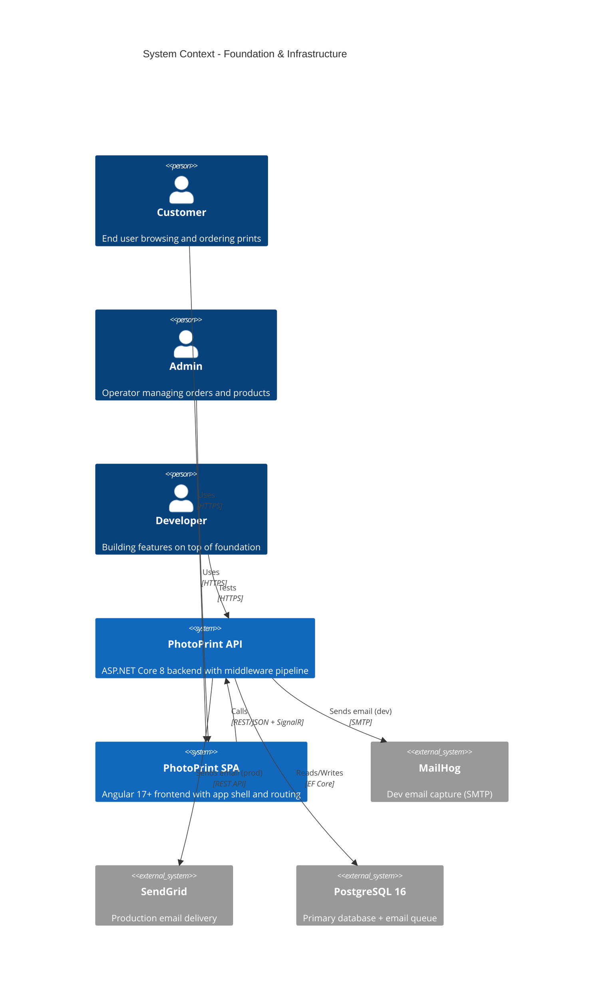

# Foundation & Infrastructure - System Context

## System Overview

This intent establishes the cross-cutting infrastructure layer for FotoTipar. It does not implement business features directly — instead, it provides the middleware pipeline, security posture, frontend app shell, and email delivery system that ALL subsequent features depend on.

## Context Diagram

## External Integrations

- **PostgreSQL 16**: Primary data store; also hosts the `EmailQueue` table for persistent retry
- **MailHog**: Development-only SMTP capture server for email testing (localhost:1025, UI on 8025)
- **SendGrid**: Production email delivery via REST API (free tier for MVP)

## High-Level Constraints

- Middleware pipeline order in `Program.cs` is critical (CORS → Security Headers → Rate Limiting → Correlation ID → Error Handler → Auth → Routing)
- All error messages returned to clients must be in Romanian
- Angular app must use standalone components (Angular 17+), no NgModules
- Email retry queue persisted to PostgreSQL (survives app restarts)
- No additional infrastructure beyond what Docker Compose already provides

## Key NFR Goals

- Middleware overhead < 1ms per request
- Health check responds within 100ms (even if DB is down — must report status, not hang)
- Rate limiting: 100 req/min public, 10 req/min auth endpoints
- CSP, HSTS, security headers on all responses
- Email delivery retry success > 95% within 3 attempts
