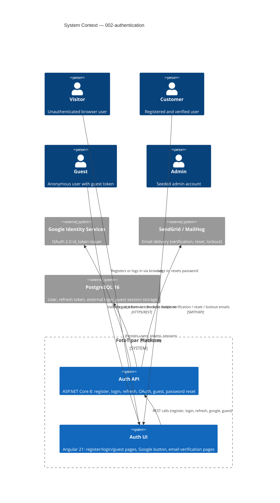

# Authentication — System Context

## System Overview

The Authentication subsystem is a set of ASP.NET Core 8 API endpoints and Angular 21 pages that control how users identify themselves to FotoTipar. It supports three modes: email+password (with email verification), Google OAuth, and guest checkout. All downstream features (upload, cart, checkout, orders) depend on this subsystem to know who is making requests.

## Context Diagram

## External Integrations

| System | Direction | Purpose | Protocol | Risk |
|--------|-----------|---------|----------|------|
| **Google Identity Services** | Inbound id_token → Outbound JWT | Validate Google OAuth, upsert user | HTTPS REST | Medium — Google API availability |
| **SendGrid / MailHog** | Outbound | Send verification, reset, lockout emails | SMTP / HTTP API | Medium — deliverability |
| **PostgreSQL 16** | Both | Persist all auth data | TCP / EF Core | Low — managed, local dev |

## Data Flows

### Inbound (into Auth API)
| Data | Source | Format | Validation |
|------|--------|--------|------------|
| Registration fields | Angular form | JSON | FluentValidation (email format, password strength, GDPR flag) |
| Login credentials | Angular form | JSON | FluentValidation; lockout checked before hash compare |
| Google `id_token` | Angular / Google SDK | JSON string | Google tokeninfo + aud check |
| Guest info (name, email, phone) | Angular form | JSON | FluentValidation (Romanian phone format) |
| Refresh token | HttpOnly cookie | Opaque UUID | SHA-256 hash lookup in DB |
| Reset token | Query string | UUID | SHA-256 hash lookup + expiry check |

### Outbound (from Auth API)
| Data | Consumer | Format | Notes |
|------|----------|--------|-------|
| `{accessToken, expiresIn}` | Angular app | JSON | JWT RS256, 15-min, stored in memory/sessionStorage |
| HttpOnly Secure cookie | Browser | Set-Cookie header | 30-day sliding refresh token; script-inaccessible |
| `{guestToken}` | Angular guest interceptor | JSON | Stored in localStorage; sent as X-Guest-Token header |
| Confirmation / reset email | User's inbox | HTML email | Rendered from Razor template via IEmailService |

## High-Level Constraints

- All auth endpoints must be covered by existing **rate limiting** and **security headers** middleware (bolt 002)
- Email sending must use the `IEmailService` abstraction from bolt 003 (MailKit dev / SendGrid prod)
- Angular pages must integrate into the existing **app shell** routing (bolt 004) — lazy-loaded under `/auth`
- Refresh token stored server-side (DB) so logout and password reset can revoke it — stateless JWT alone is insufficient
- Admin accounts are **never** created through any API endpoint — only via EF Core seed data

## Key NFR Goals

- No email enumeration on forgot-password or duplicate-email paths
- Token theft mitigation: HttpOnly cookie (XSS-safe), 15-min access token window
- Account lockout after 5 consecutive failures (15-min cooldown)
- Password hashing: PBKDF2-SHA256, 10 000 iterations (ASP.NET Identity default)
- GDPR consent captured and stored at registration time
