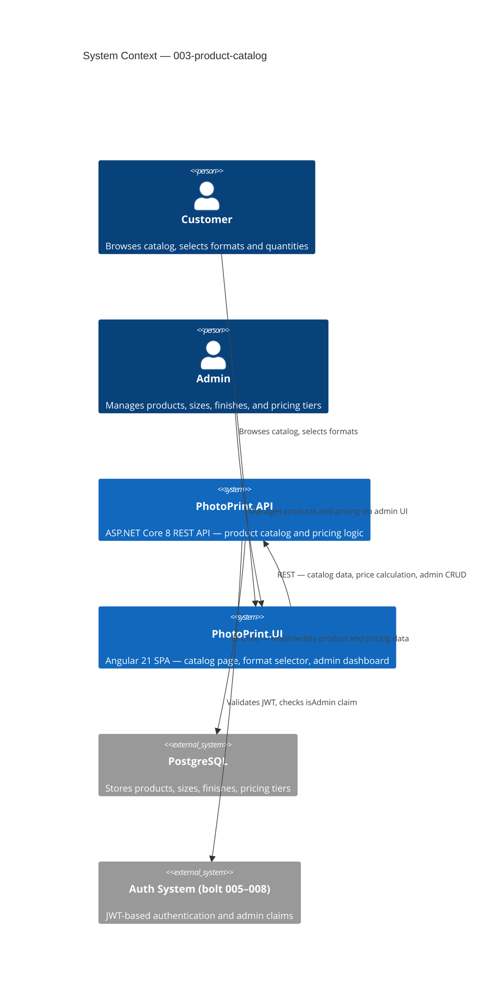

# Product Catalog & Pricing — System Context

## System Overview

We are building a product catalog and pricing system for the FotoTipar photo printing platform. It allows customers to browse available print formats, select sizes and finishes, and see accurate quantity-tiered prices. Admins manage the catalog and pricing through a protected API and Angular admin dashboard.

## Context Diagram

## Actors

- **Customer** (Human): Browses the product catalog, selects size/finish/quantity, sees live-calculated prices. Unauthenticated or authenticated.
- **Admin** (Human): Creates/edits/deletes products and pricing tiers. Must have `isAdmin = true` JWT claim.
- **PhotoPrint.UI** (System): Angular SPA consuming public catalog and protected admin API endpoints.
- **PhotoPrint.API** (System): Backend REST API. Single source of truth for product data and pricing.

## External Integrations

- **PostgreSQL**: All product, size, finish, and pricing tier data persisted via EF Core. Existing connection from prior bolts.
- **Auth System (bolts 005–008)**: JWT middleware validates tokens for admin endpoints. No new auth work required.

## Data Flows

### Inbound (to PhotoPrint.API)
- `GET /api/products` — public, no auth required
- `GET /api/products/{id}` — public, no auth required
- `POST /api/products/{id}/calculate-price` — public, `{ sizeId, quantity }` JSON body
- `POST/PUT/DELETE /api/admin/products/**` — requires valid JWT with `isAdmin = true`

### Outbound (from PhotoPrint.API)
- Product catalog JSON to Angular frontend (sizes, finishes, tier prices)
- Admin mutation results (created/updated/deleted product)

## High-Level Constraints

- Admin endpoints MUST reuse the existing JWT + `isAdmin` claim guard (no new auth plumbing)
- Pricing tiers stored as database rows (not JSON columns) for queryability
- Product schema must include a `productType` discriminator column for future extensibility
- Client-side price calculation: Angular computes final price from tier data — no extra HTTP call on quantity change

## Key NFR Goals

- Catalog endpoint p95 latency < 200ms
- Client-side tier calculation < 5ms
- Admin CRUD p95 latency < 300ms
