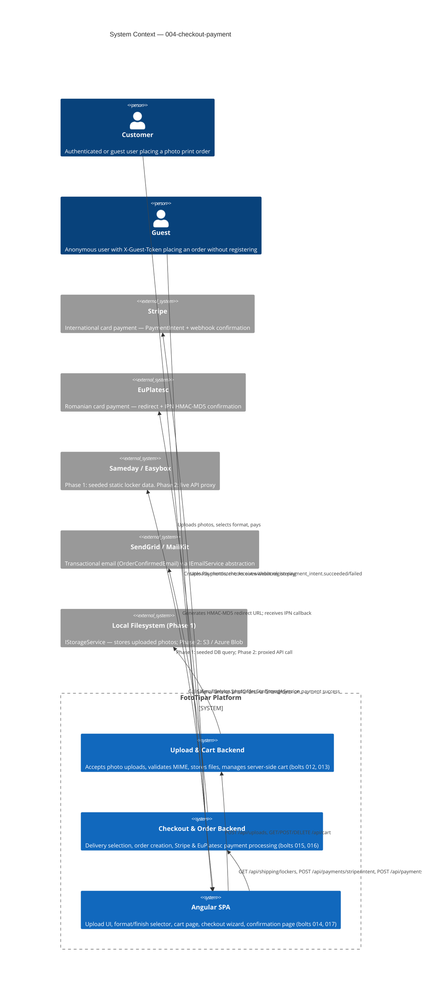

# Checkout & Payment — System Context

## System Overview

The checkout-payment intent adds the complete purchase funnel to FotoTipar: photo upload, cart management, delivery selection, and dual-processor payment (Stripe + EuPlatesc). It sits at the intersection of every platform capability — consuming auth, products, and email, and producing orders that downstream intent 005-order-management will operate on.

## Context Diagram

## Upstream Dependencies (consumed by this intent)

| System | Bolt | What We Consume |
|--------|------|----------------|
| Auth core + JWT | 005-auth-core | Bearer JWT validation; `UserId` claim on all upload/cart/payment endpoints |
| Guest sessions | 007-guest-sessions | `X-Guest-Token` validation; `GuestSessionId` claim for upload/cart |
| Product catalog | 009-product-catalog-core | `Product` entity (Id, FormatSize, Finish, pricing tiers) for cart line items and quality badge px thresholds |
| Angular app shell | 004-angular-app-shell | Route guards, `AuthInterceptor`, lazy-loaded route registration, `GuestTokenInterceptor` |
| Email infrastructure | 003-email-infrastructure | `IEmailService` — called on payment success; template delivery is separate (intent 006) |

## Downstream Dependents (what depends on this intent)

| System | Intent | What They Need |
|--------|--------|---------------|
| Order management | 005-order-management (planned) | `Orders` + `OrderItems` tables; `GET /api/orders`; `PATCH /api/orders/{id}/status`; `OrderStatus` enum |
| Email notifications | 006-email-notifications (planned) | `OrderConfirmedEmail` event shape; order data DTO |
| Admin panel | 007-admin (planned) | `PATCH /api/orders/{id}/status`; SignalR `new-order` hub event |

## External Integration Contracts

### Stripe
- **Direction**: Outbound (PaymentIntent creation) + Inbound (webhook)
- **Auth**: Bearer API key (server-side); `publishableKey` injected into Angular env
- **Webhook**: `Stripe-Signature` header verified via `EventUtility.ConstructEvent` before any processing
- **Events handled**: `payment_intent.succeeded`, `payment_intent.payment_failed`
- **Constraint**: Card data never touches FotoTipar server — Stripe Elements is entirely client-side

### EuPlatesc
- **Direction**: Outbound (redirect URL generation) + Inbound (IPN POST callback)
- **Auth**: HMAC-MD5 signature with merchant key (per EuPlatesc specification — cannot be upgraded)
- **IPN validation**: Amount in callback cross-checked against stored order amount; mismatch → reject
- **Constraint**: PCI compliance via hosted redirect; no card fields in FotoTipar

### Sameday / Easybox (Phase 1)
- **Direction**: None (static seeded data in DB)
- **Phase 2 plan**: `IShippingService` abstraction already stubbed; swap to live Sameday API without changing callers
- **Seed**: ~200 Romanian Easybox locker locations (city, address, lat/lng)

### Local Filesystem / IStorageService (Phase 1)
- **Direction**: Internal (write on upload, read on preview, delete on cleanup)
- **Phase 2 plan**: `IStorageService` abstraction allows S3/Azure Blob migration without changing callers
- **Path security**: Stored paths use UUID-generated names; no user-supplied strings ever reach the filesystem path

## Key NFR Goals (for Construction Agent context)

- **No card data on server** — Stripe Elements is client-side only; EuPlatesc uses hosted redirect
- **MIME validation by magic bytes** — first 8 bytes checked, not file extension or Content-Type header
- **Webhook idempotency** — both Stripe and EuPlatesc handlers are idempotent; duplicate delivery → 200 OK, no side effects
- **Cart merge atomicity** — `POST /api/cart/merge` executes in a single DB transaction
- **Upload path traversal prevention** — UUID filenames enforced; no original filename stored in path
- **Checkout state resilience** — Angular checkout survives page refresh via sessionStorage or cart-page redirect

## High-Level Constraints

- Order must be created **before** payment initiates (required by both Stripe and EuPlatesc — `orderId` needed in payment request)
- Product pricing is **snapshotted as JSON** on the Order at creation time (historical accuracy if prices change later)
- HEIC preview is handled **client-side** via `heic2any` — no server HEIC processing
- Sameday AWB is **manual in Phase 1** — admin enters AWB number; `IShippingService` stub prepared for Phase 2
- All UI text in **Romanian**; prices in **RON** with comma decimal separator (`XX,XX RON`)
