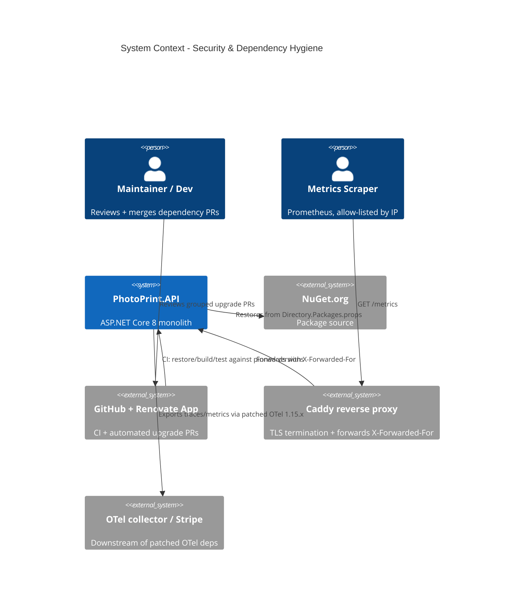

# Security & Dependency Hygiene - System Context

## System Overview

This intent operates on the **build-time dependency surface** and the **HTTP boot pipeline** of `PhotoPrint.API` — not on customer-facing runtime behaviour. It removes a known CVE, unifies package versions through Central Package Management, automates upgrades via Renovate, and makes the `/metrics` IP allow-list correct behind the production reverse proxy. The "actors" are mostly tooling and operators.

## Context Diagram

## External Integrations

- **NuGet.org**: package source; Central Package Management pins one version per package at restore.
- **GitHub + Renovate App**: grouped, scheduled upgrade PRs; vulnerability alerts labelled `security`.
- **Caddy reverse proxy**: terminates TLS and sets `X-Forwarded-For`; the `/metrics` allow-list must trust only its CIDR.
- **OpenTelemetry collector / Stripe**: downstream consumers of the patched OTel pipeline and unified Stripe.net SDK.

## High-Level Constraints

- .NET 8 LTS; single Docker image (Caddyfile + Dockerfile + docker-compose.prod.yml at root).
- Sequential ship order P01 → P02 → P03 → P05 (same `*.csproj` / `Program.cs` files).
- No customer-facing behaviour change.

## Key NFR Goals

- `dotnet list package --vulnerable` returns clean.
- Exactly one resolved version per package solution-wide.
- `/metrics` allow-list evaluates the real client IP (no spoofing via untrusted proxies).
