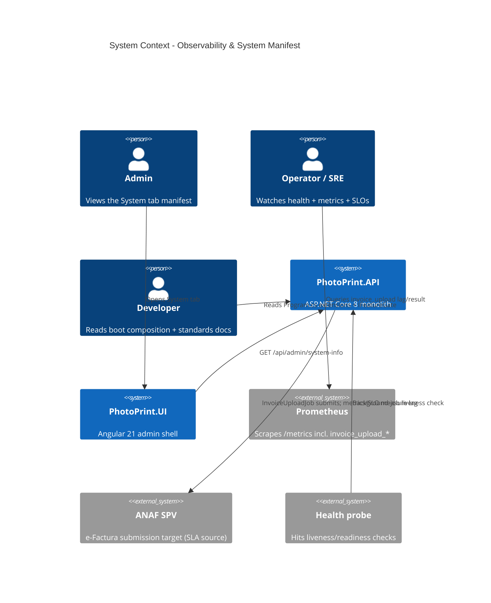

# Observability, Boot Composition & System Manifest - System Context

## System Overview

This intent makes `PhotoPrint.API` self-describing and operable: a readable boot composition, a typed feature-flag registry, an admin-only manifest endpoint that introspects what is wired, a background-job liveness check + ANAF metrics tied to the legal SLA, and trustworthy standards docs. Primary actors are the Admin (System tab), operators/SRE (health + metrics), and developers (boot + docs).

## Context Diagram

## External Integrations

- **Prometheus**: scrapes the new `invoice_upload_total{result}` + `invoice_upload_lag_seconds`.
- **ANAF SPV**: the 5-business-day legal SLA (ADR-024) drives the new SLO; `InvoiceUploadJob` liveness is monitored.
- **Health probe**: consumes the new background-job liveness check.
- **Admin UI**: renders the manifest from `GET /api/admin/system-info`.

## High-Level Constraints

- Internal dependency order P07 → P10 → P04 (manifest derived from `IFeatureGate.GetAll()`).
- `IFeatureGate` is boot-time only (no hot reload) — consistent with the bolt-046 deprioritization.
- P12 documents (does not implement) multi-replica readiness.

## Key NFR Goals

- Dead background job detected within 3× its scheduled interval.
- ANAF upload lag observable against the 5-business-day SLA.
- Manifest cached (~30s), admin-only, no secrets.
- Standards docs verifiably match installed dependencies.
