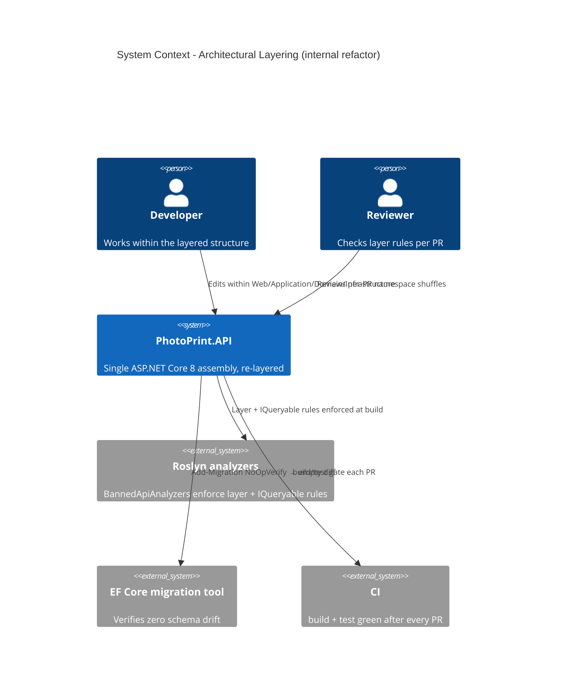

# Architectural Layering - System Context

## System Overview

A **pure internal refactor** of `PhotoPrint.API` — no external actors, no API surface change, no behaviour change. It reshapes the single assembly into Presentation / Application / Domain / Infrastructure layers, introduces the `Abstractions/` convention, locks the no-repository posture with an analyzer, and adds a handler-per-use-case pattern. The "actors" are the developers who work in the code and the tooling (compiler, analyzers, EF migration generator, CI) that enforce correctness.

## Context Diagram

## External Integrations

- **Roslyn analyzers** (`Microsoft.CodeAnalysis.BannedApiAnalyzers`): enforce `Domain/` may not reference EF Core/HttpClient, and no service returns `IQueryable<T>`.
- **EF Core migration tooling**: each refactor PR must produce an empty `Add-Migration` diff (zero schema drift).
- **CI**: `dotnet build && dotnet test` green after every PR — the non-negotiable safety gate.

## High-Level Constraints

- NO new csproj — folder + namespace layering inside one assembly (P22 ADR records why).
- Sequenced PRs: P22 → P21-PR1..PR5 → P23 → P24 → P25; each individually mergeable.
- Lockstep with intent 028 (test architecture) — every structural PR breaks ~25 test files otherwise.

## Key NFR Goals

- Zero behaviour change; 941/948 test baseline maintained after every PR.
- Zero EF migration drift.
- Use-case inventory is grep-able (`find Application -name '*Handler.cs'`).
- Layer violations blocked at PR (analyzer or review checklist).
