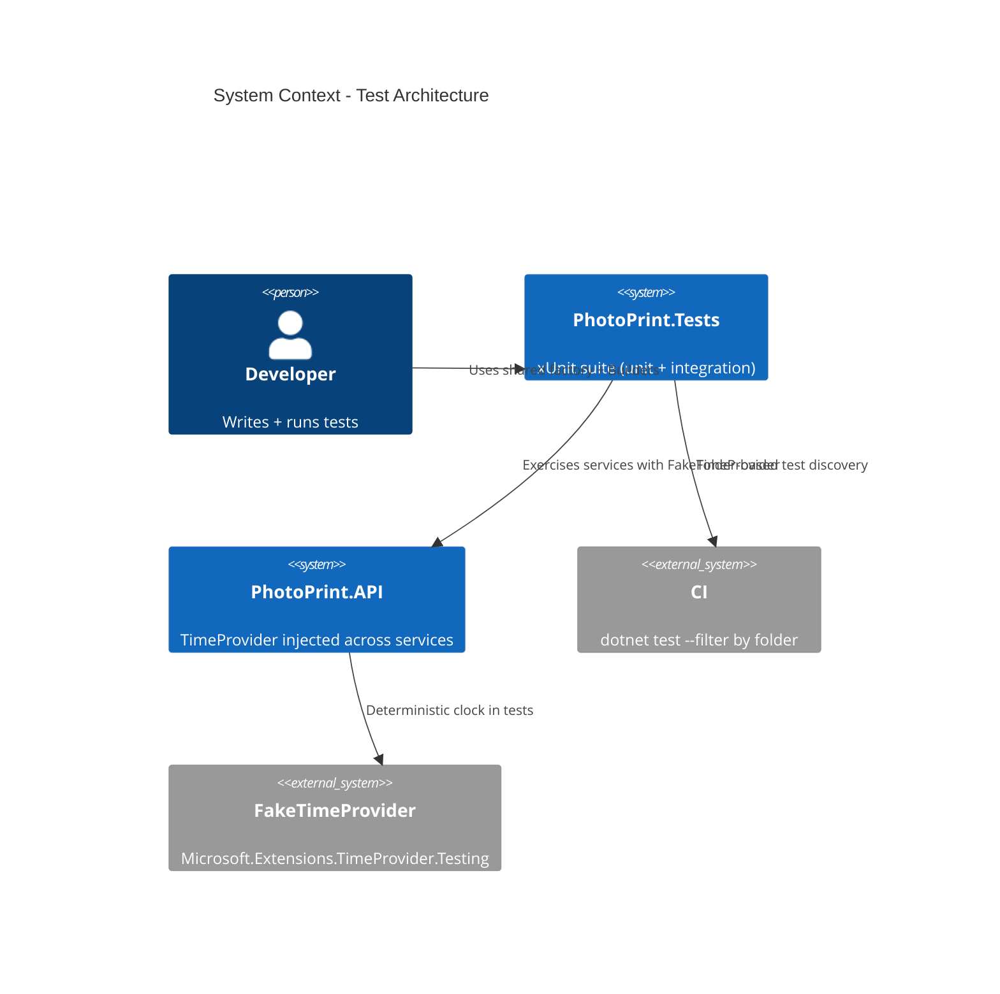

# Test Architecture - System Context

## System Overview

An internal refactor of the `PhotoPrint.Tests` project (and `TimeProvider` adoption in `PhotoPrint.API`). No external actors and no production behaviour change — the "actors" are developers and CI. It promotes a shared test-application-factory base, adds fluent Builders, reclassifies misnamed unit tests, and finishes the half-done `TimeProvider` migration so time-dependent logic is deterministically testable.

## Context Diagram

## External Integrations

- **FakeTimeProvider** (`Microsoft.Extensions.TimeProvider.Testing`): already referenced by newer test files; becomes the standard clock seam.
- **CI**: `dotnet test --filter` patterns updated for the new folder layout (Unit/Domain, Unit/Application, Integration/ServiceLevel).

## High-Level Constraints

- Lockstep with intent 027 — interleave PRs; do not write the factory base against the old folder shape then rewrite.
- Ship P28 (TimeProvider) before P27 (factory/builders) — TimeProvider adds constructor params that Builders then hide.

## Key NFR Goals

- Shared test config edited once (was 11 places).
- Zero DbContext-constructing tests left under `Unit/`.
- Deterministic time-based tests (no `Thread.Sleep`, no "within 5 seconds").
- No production behaviour change; test baseline maintained.
