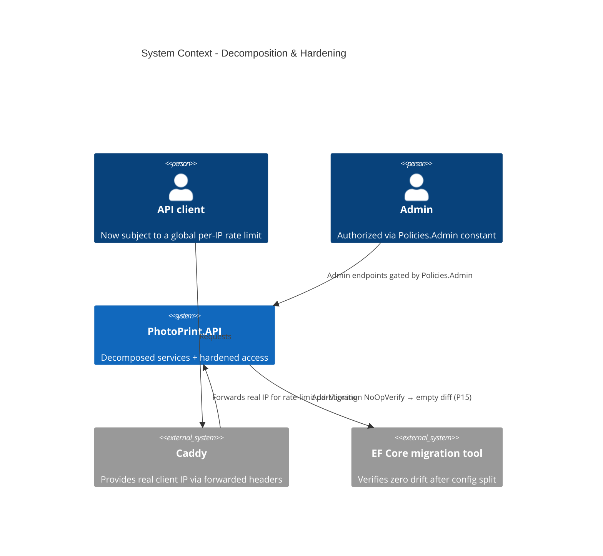

# God-Method Decomposition & Access Hardening - System Context

## System Overview

Mostly internal refactor of `PhotoPrint.API`, plus two security-hardening touches with externally-observable effects: a global per-IP rate limit on `/api/*` and a centralised admin authorization policy. The decompositions (AuthService split, webhook/order god-methods, per-entity EF config) change code shape only. Actors: API clients (rate-limited), admin users (policy-gated), developers.

## Context Diagram

## External Integrations

- **Caddy / forwarded headers** (intent 025 P05): supplies the real client IP the global limiter partitions on.
- **EF Core migration tool**: confirms the per-entity configuration split (P15) produces zero schema drift.

## High-Level Constraints

- Ships after intent 027 — decomposed files land in `Application/Auth/Services/`, `Application/Orders/Handlers/`, etc.
- P08 depends on intent 025 P05 (real client IP).
- P14 scopes to residuals (OrderPhotoQueryService + cleanup) — intent 027 P25/P11 already extract CreateFromCartAsync + post-Paid fan-out.

## Key NFR Goals

- No string-literal admin role anywhere; one `Policies.Admin` constant.
- Global per-IP rate limit that doesn't throttle legitimate admin bursts.
- AuthService split into 3 focused services; webhook/order god-methods gone.
- Zero schema drift from the EF config split.
