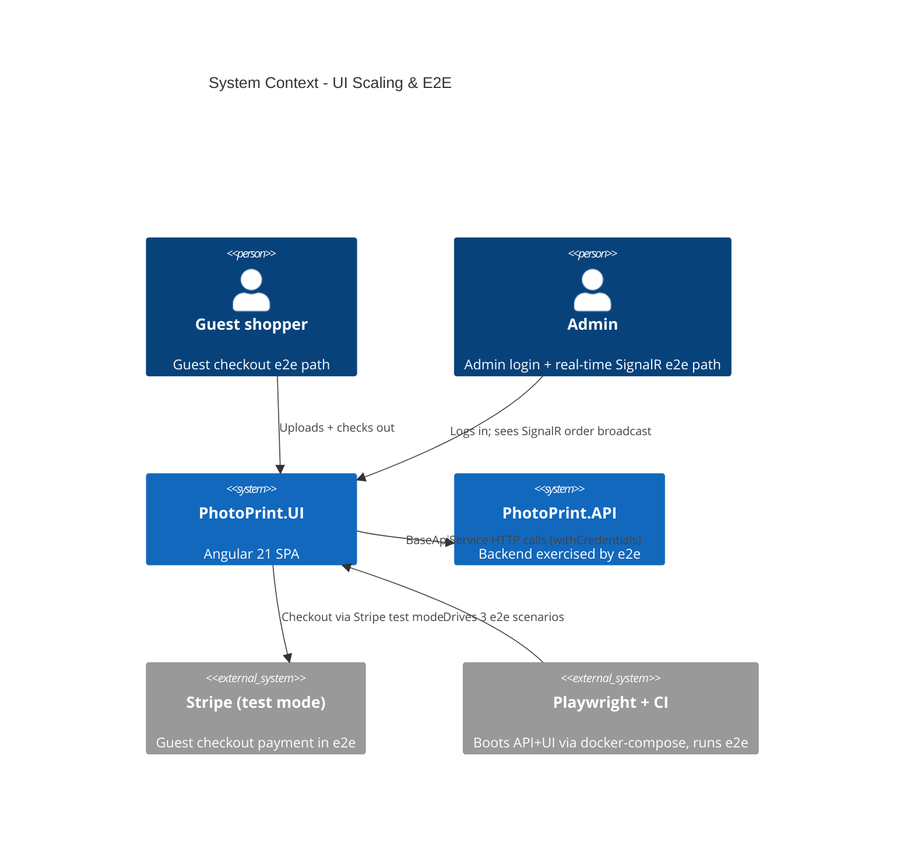

# UI Scaling & E2E - System Context

## System Overview

Frontend-focused work on `PhotoPrint.UI` plus CI quality gates. Adds a bundle-size budget and three Playwright e2e smoke tests on the real-money paths, breaks up the four largest Angular pages into smart/dumb components, and introduces a shared `BaseApiService`. Actors: end users (guest + admin) exercised by e2e, and developers/CI.

## Context Diagram

## External Integrations

- **Stripe (test mode)**: used by the guest-checkout e2e against a seeded test product.
- **Playwright + GitHub Actions**: boots API+UI (docker-compose) and runs the three e2e scenarios.
- **SignalR / Admin hub**: exercised by the real-time-order e2e.

## High-Level Constraints

- Independent of backend intents 027–029 — parallelisable on a second developer.
- Ship P18 (budget + e2e foundation) before P26 (page breakups).
- Playwright needs browsers cached in CI (~200MB); use the official action.

## Key NFR Goals

- Initial bundle < 500kB warn / < 750kB error; component style < 4kB.
- Three passing e2e on guest checkout, admin login, real-time SignalR.
- No page component > ~200 LOC; all services route through `BaseApiService`.
- No visual regression on the home page.
