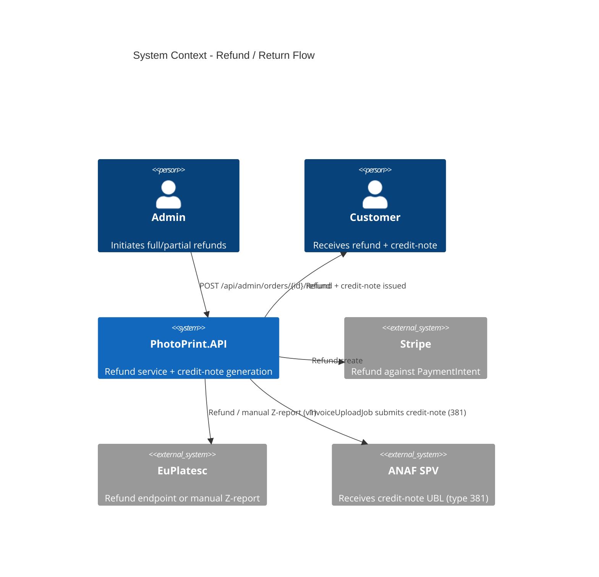

# Refund / Return Flow - System Context

## System Overview

A regulated customer-money feature: admin-initiated refunds (full + partial) that stay consistent across the FotoTipar DB, the payment gateway, and ANAF. Touches the order state machine, the invoice/credit-note model, both payment gateways, and the ANAF e-Factura pipeline. Actors: Admin (initiates), the original customer (receives the refund + credit-note), and external systems Stripe, EuPlatesc, and ANAF SPV.

## Context Diagram

## External Integrations

- **Stripe**: refund-create against the original PaymentIntent.
- **EuPlatesc**: documented refund endpoint, or a flagged manual Z-report path in admin for v1.
- **ANAF SPV**: receives the credit-note UBL (`cbc:InvoiceTypeCode` 381) via the existing `InvoiceUploadJob`.

## High-Level Constraints

- Best landed after intent 027 (layered shape: `Application/Refunds/`, `Infrastructure/Payments/`).
- Intersects bolt 039 (ANAF) and bolt 052 (archive retention): a refunded order must NOT auto-purge originals on the Shipped trigger; it SHOULD push the credit-note.
- Reuses bolt 038 `VatCalculator` for VAT reversal (ADR-019 rounding) — do not re-implement.

## Key NFR Goals

- DB / gateway / ANAF eventually consistent and reconcilable after a refund.
- Idempotent refunds (no double-refund at the gateway).
- Credit-note validates against the e-Factura schema for type 381.
- Admin-only; reuses `Policies.Admin` (intent 029 P08).
