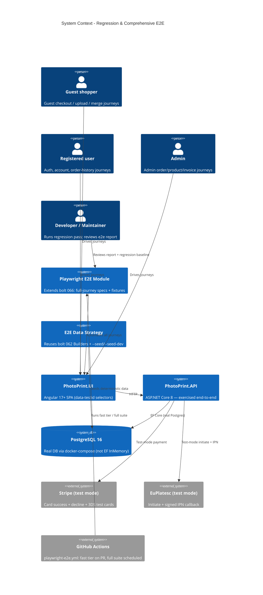

# Regression & Comprehensive E2E - System Context

## System Overview

A test-and-verification layer over the whole FotoTipar stack. It adds (1) a deterministic e2e data strategy reusing bolt 062's Builders and the existing `--seed`/`--seed-dev` modes, (2) a comprehensive Playwright e2e module that extends bolt 066's foundation to cover every major user journey through the real backend, and (3) a documented, executed regression-pass methodology. The "system under test" is the entire application booted via docker-compose (Angular UI + ASP.NET Core API + **real PostgreSQL**), exercised as a guest, a registered user, and an admin. No production behaviour changes; the deliverables are specs, fixtures, CI wiring, and a regression baseline.

## Context Diagram

## External Integrations

- **Stripe (test mode)**: drives card success, decline, and 3DS-required journeys with documented test cards. No live keys.
- **EuPlatesc (test mode)**: initiate + a signed test IPN callback to exercise the redirect-payment journey.
- **GitHub Actions / Playwright**: builds on bolt 066's `playwright-e2e.yml`; adds a fast PR tier and a scheduled full suite with trace/video/screenshot artifacts.
- **PostgreSQL 16 (docker-compose)**: the e2e module is the first layer to exercise the app against the real production-shaped DB, surfacing the InMemory-vs-Postgres parity gap (the `db-parity` review lens exists for it).

## Builds-On Dependencies (do not duplicate)

- **Bolt 066** (`intent 030`, ci-quality-gates): Playwright runner, `playwright-e2e.yml`, 3 smoke specs, docker-compose boot. This intent **extends** it — same harness, more coverage.
- **Bolt 062** (`intent 028`, test-infrastructure): shared `PhotoPrintTestApplicationFactory` base + fluent Builders. The e2e data strategy **reuses** the Builders.
- **Gated**: Bolts **047/048** (coupons) and **068/069** (refunds) — their journeys are authored here but stay skipped until those bolts ship.

## High-Level Constraints

- Extends bolt 066's single Playwright module — no second e2e framework.
- Reuses bolt 062's Builders + existing seed modes — no parallel data layer.
- Runs against real PostgreSQL via docker-compose.
- Coupon/refund specs gated (`should`, `test.fixme`) until their feature bolts ship.
- Phase-3 stabilization gate: completes before Phase 4 (environment triad). No new customer behaviour.

## Key NFR Goals

- Every major journey automated; gated coupon/refund specs authored but skipped.
- Deterministic: 3 consecutive green scheduled runs; zero fixed-sleep waits.
- Fast PR tier < ~8 min; full suite < ~25 min; trace/video/screenshot on failure.
- A dated regression baseline with every shipped intent checked and findings triaged into the backlog.
