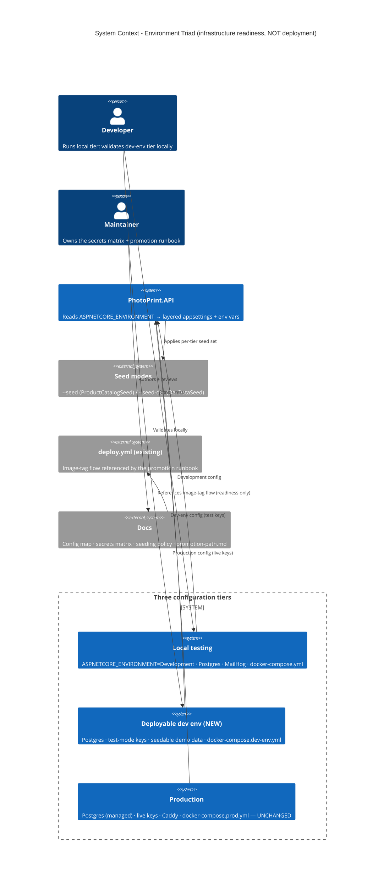

# Environment Triad - System Context

## System Overview

A configuration / infrastructure-readiness layer that teaches the application to run in **three** distinct, cleanly-separated tiers — **local testing**, a new **deployable dev environment** (the sandbox tier that does not yet exist), and **production** — without performing any deployment. The deliverables are: a third named `ASPNETCORE_ENVIRONMENT` + layered `appsettings`, a `docker-compose.dev-env.yml`, a per-tier config map, a secrets × tier matrix + `.env.dev-env.example`, a per-environment seeding policy reusing the existing seed classes, and a dev→prod promotion runbook written as readiness documentation. Everything is defined and validated **locally**; standing the dev tier up on a host is deferred to roadmap Phase 6. Production behaviour is unchanged.

## Context Diagram

## External Integrations

- **Existing seed entrypoints** (`--seed` / `--seed-dev`): reused, with a per-tier policy and a Production guard. No new seeder.
- **Existing `deploy.yml` image-tag flow**: *referenced* by the promotion runbook as the mechanism a future deployment would use — not invoked or modified here.
- **Existing secret-scanning (intent 018)**: the per-tier secrets strategy must remain compatible with the pre-commit hook + Gitleaks CI.
- **Payment/email/ANAF/Sameday sandboxes**: dev-env uses their **test** modes; the matrix records test-vs-live per tier.

## Builds-From Assets (extend, do not rewrite)

`docker-compose.yml` (local) · `docker-compose.prod.yml` (prod) · `Caddyfile` · `.github/workflows/deploy.yml` · `.env.example` · `appsettings.json` + `appsettings.Development.json` · `docs/DEPLOYMENT.md`.

## High-Level Constraints

- **Infrastructure readiness only — NOT deployment.** No provisioning, no cutover, no go-live. Dev-env is defined + validated locally; standing it up is Phase 6.
- Add a third tier *alongside* the two existing compose files; leave both behaviourally unchanged.
- Reuse existing seed classes + `--seed`/`--seed-dev`; honour ADR-006 (secrets via env vars only).
- Dev-env is Postgres-backed (prod-shaped); local runs Postgres via docker-compose too.
- No deployment-pressure language in any artifact.

## Key NFR Goals

- A third tier that boots locally with `ValidateOnStart` passing exactly like prod (no silent Development fallback).
- One config map + one secrets matrix as the single sources of truth for "what differs per tier".
- Per-tier seed policy with a Production guard on demo data; idempotent; one seeder.
- A promotion runbook that is repeatable readiness documentation, explicitly deferring execution to Phase 6.
- Production config/behaviour unchanged (regression-safe).
