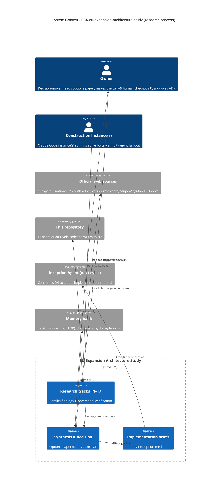

# EU Expansion — Architecture Study - System Context

## System Overview

This is a **research-only** intent. The "system" being built is a **knowledge-production
process**, not software: a multi-agent research job that answers the EU-expansion
fulfillment and site-architecture questions with evidence, composes coherent architecture
options, captures the owner's decision as an ADR, and authors implementation brief(s) that
feed the next inception cycle. **No production code is produced or changed.**

## Context Diagram

## Actors

- **Owner** (Human): Reads the options paper (D2), makes the architecture decision at the
  ⛔ human checkpoint, approves the ADR (D3). The research informs; the owner decides.
- **Construction instance(s)** (Human-driven AI): Claude Code instance(s) executing the
  spike bolts. Per the brief, each research story is itself executed via a multi-agent
  fan-out (parallel web researchers + adversarial verifier agents).
- **Inception Agent (next cycle)** (System/AI): Downstream consumer of the D4
  implementation brief(s); turns them into the real implementation intent(s).

## External Integrations

- **Official web sources**: europa.eu (OSS/VAT), national tax authorities, carrier rate
  cards (Sameday + cross-border carriers), Stripe docs, Angular 21 / .NET docs. **Sourcing
  standard**: official sources for regulatory claims; every claim dated; reject
  pre-2021/pre-OSS material.
- **This repository**: T7 (seam audit) reads code/templates/config to size the retrofit.
  **Read-only — no writes to production code.**
- **Memory bank**: `memory-bank/standards/decision-index.md` receives the ADR (D3);
  `docs/analysis/` and `docs/planning/` receive findings, the options paper, and briefs.

## High-Level Constraints

- Zero production-code changes; no translations; no deployment (Phase 6 is last).
- Multi-agent research method is mandatory (parallel per-track + adversarial verification +
  dedicated synthesis).
- Spike bolts are time-boxed; throwaway prototypes are archived/deleted, never merged.
- Owner-decides: the ADR (D3) is written only after the explicit human decision.

## Key NFR Goals

- **Evidence quality**: regulatory/tax claims sourced, dated, and adversarially verified.
- **Quantitative outputs**: real per-corridor parcel cost/time (T1); file/occurrence counts
  + top-10 spots (T7).
- **Coherence**: options are costed bundles, never a menu of independent picks.

## Data Flows

### Inbound
- Web research data (carrier rates, VAT/OSS rules, e-invoicing mandates, payment-method
  coverage, i18n library maturity) — cited and dated.
- Repository facts (hardcoded RO/RON/`ro-RO`, coupling seams) for T7.

### Outbound
- 7 per-track findings docs (D1) → `docs/analysis/eu-expansion/`.
- Options paper (D2) → `docs/analysis/eu-expansion-architecture-study.md`.
- ADR (D3) → `memory-bank/standards/decision-index.md`.
- Implementation brief(s) (D4) → `docs/planning/i18n-readiness-brief-<date>.md`.
