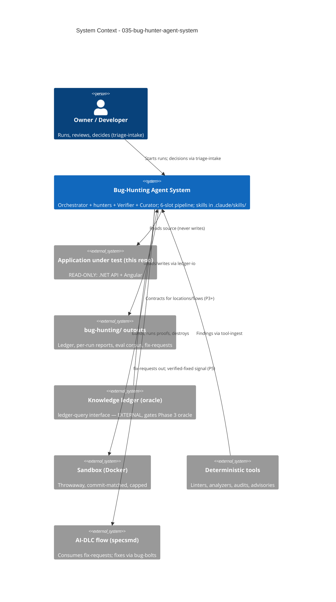

# System Context: Bug-Hunting Agent System

> Tooling intent — the "system" is the bug-hunting pipeline that *inspects* the
> photo-printing application. The application itself is strictly read-only territory.

## Actors

- **Owner / Developer** (Human): Starts runs, reads reports, and makes every
  judgment call through `triage-intake` (dismiss with reason, confirm, approve
  suppression patterns / fix proposals / self-closes / regression tests).
- **Orchestrator** (Agent-as-skill): Runs one complete pass over the six slots
  (Map → Hunt → Verify → Triage → Report → Learn) under scope, budget, and stopping
  conditions.
- **Hunters** (Agents-as-skills): `general-hunter` (P1), then specialists —
  `flow-tracer-agent`, `file-sweeper-agent`, `security-auditor-agent`,
  `dependency-audit-agent`, `config-auditor-agent`, `concurrency-auditor-agent`
  (conditional). Emit candidates only; never gate.
- **Verifier** (`bug-verifier`, agent-as-skill): The quality gate — disprove-first,
  dynamic confirmation in the sandbox, confidence assignment.
- **Curator** (`curator-agent`, P4): Learns from dismissals, reconciles the ledger,
  measures quality.
- **AI-DLC construction flow** (System): Consumes fix-requests (P5), fixes bugs via
  bug-bolts, signals "fix done"; receives `verified-fixed` only after the
  fix-verification gate re-proves the fix.

## External Systems

- **Application under test** (this repo: .NET 8 API + Angular frontend): READ-ONLY.
  No component may edit it (the single new-file exception: owner-approved regression
  tests, P5).
- **Knowledge ledger / knowledge builder** (`ledger-query` interface): the intent
  oracle `intent-lookup` reads from Phase 3. **Sibling system — now specified**:
  interface in `docs/agent-systems/integration-contract.md` (§2 envelope, §3 flow identity),
  build per `docs/agent-systems/knowledge-builder-build-guide.md`; sequencing gates bolt 091
  (contract §7, requirements D6).
- **Sandbox** (Docker Desktop on this host): throwaway container built per run from
  the owner-provided recipe (adapted from the repo's compose assets); commit-matched,
  network-locked, resource-capped, no production data.
- **Deterministic tools** (via `tool-ingest`): .NET analyzers/`dotnet test`, ESLint,
  type-checkers, gitleaks/hadolint/checkov, `npm audit` / NuGet audit, OSV/GitHub
  Advisory queries (live, at run time).
- **Git** (via `git-revision-tracking`): commit pinning, diff-based reconciliation,
  incremental scan scoping.
- **Issue tracker / CI** (Optional tier): GitHub Actions exists today; tracker
  adoption is an owner decision (`issue-sync`, `ci-gate`).
- **skill-creator skill** (construction-time): the mandated builder for every
  component.

## Data Flows

### Inbound
- Source code, configs, manifests, lockfiles (read-only) + the commit SHA.
- Deterministic tool output (linters, type-checkers, SAST, test logs, advisories).
- Knowledge-ledger contracts for a location/flow/symbol (P3+, tagged by
  kind/confidence/status; only `intent_contracts` are authority).
- Owner decisions with provenance + reasons (via `triage-intake`).
- AI-DLC's "fix done" signal for a `correlation_id` (P5).

### Internal (pipeline)
- Hunters → candidates `{hypothesis, category_guess, location, flow_position,
  evidence_snippet, source_hunter}` → dedup → Verify (confirm/disprove/score) →
  Triage (cluster, risk-order) → Report.
- Everything reads/writes the **ledger** through `ledger-io` (staging files +
  single-writer merge at run close; atomic IDs; `correlation_id` links).

### Outbound
- `bug-hunting/bug-ledger.json` + generated `bug-ledger.md` (persistent memory).
- `bug-hunting/reports/bug-report-run-NN-<timestamp>.md` — new file per run, floored
  (High/Medium in body, Low in appendix), three-audience records.
- `bug-hunting/fix-requests/` — idempotent fix-request records for AI-DLC, keyed by
  `correlation_id` (P5).
- `verified-fixed` signal (P5) — emitted only after the proving test passes in the
  sandbox.
- Proposed (never applied) patches; owner-approved regression tests into the test
  suite (P5). SARIF / tickets / CI statuses (Optional).

## Context Diagram

## Boundary Notes

- **The guide is the spec of record** (`docs/agent-systems/bug-hunter-build-guide.md`); this
  context summarizes it and never overrides it.
- The six slots are permanent from Phase 1; phases fill or extend slots at named
  seams — restructuring the pipeline is out of bounds.
- The knowledge builder system (producing the knowledge ledger) is a sibling project,
  not part of this intent; only its read interface is consumed here.
